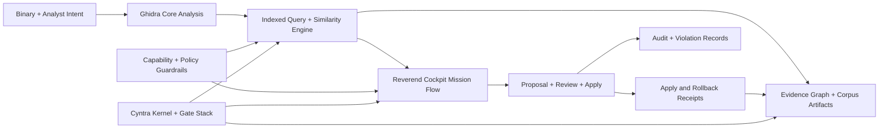

<p align="center">
  
</p>

<p align="center">
  <a href="https://github.com/backbay-labs/reverend/actions/workflows/eval.yaml"></a>
  
  
  
  
</p>

<h1 align="center">Reverend</h1>

<p align="center">
  <em>Ghidra, upgraded into an evidence-backed autonomous reverse engineering platform.</em>
</p>

<p align="center">
  <a href="#what-reverend-does">What Reverend Does</a>
  <span>&nbsp;&middot;&nbsp;</span>
  <a href="#technology-advances-shipped">Technology Advances Shipped</a>
  <span>&nbsp;&middot;&nbsp;</span>
  <a href="#architecture">Architecture</a>
  <span>&nbsp;&middot;&nbsp;</span>
  <a href="#run-locally">Run Locally</a>
</p>

<p align="center">
  
</p>

## What Reverend Does

Reverend keeps upstream Ghidra compatibility and adds the missing control plane for serious agent-assisted reversing:

- Policy-guarded agent execution (capabilities, scope limits, egress controls)
- Evidence-backed semantic query and triage workflows
- Proposal/review/apply lifecycle with receipts, audits, and rollback primitives
- Deterministic gate stack for CI + local operator confidence
- Kernel-native backlog/workcell orchestration for continuous autonomous delivery

## Technology Advances Shipped

| Area | What We Added | Key Implementation |
| --- | --- | --- |
| Security control plane | Capability tokens, policy modes (`OFFLINE`, `ALLOWLIST`, `CLOUD`), violation/audit event model | `ghidra.security.capability.*`, `ghidra.security.policy.*`, `ghidra.security.audit.*` |
| Proposal lifecycle | Typed proposals, review transitions, transaction context, apply/rollback receipts | `ghidra.security.proposal.*` |
| Query engine | Index-first semantic/similarity retrieval with bounded refinement and embedding-stage support | `Ghidra/Features/Reverend/.../query/LiveQueryServiceImpl.java` |
| Cockpit UX | Mission-to-proposal flow, evidence drilldown drawer, jump-to-evidence navigation | `Ghidra/Features/Reverend/.../cockpit/*` |
| Evidence fabric | Canonical evidence graph schema + migration docs + receipt-chain integrity | `docs/schemas/evidence-graph.schema.json`, `scripts/ml/receipt_store.py` |
| Kernel integrity | Completion anomaly guard, merge-conflict canonicalization, deterministic gate enforcement | `scripts/cyntra/cyntra.sh`, `scripts/cyntra/completion-anomaly-guard.py`, `scripts/cyntra/gates.sh` |

## Architecture



## Run Locally

### Prerequisites

- Java 21 (`java -version` and `javac -version`)
- Python 3.11+
- Gradle wrapper (`./gradlew`)

### Build + Validate

```bash
# Prepare dependencies/toolchain
./gradlew -I gradle/support/fetchDependencies.gradle
scripts/cyntra/preflight.sh

# Core security + Reverend module compile/test
./gradlew --no-daemon :Generic:compileJava :Generic:test --tests "ghidra.security.*"
./gradlew --no-daemon :Reverend:compileJava :Reverend:test --tests "ghidra.reverend.*"

# Deterministic gate stack
bash scripts/cyntra/gates.sh --mode=all

# Roadmap/evidence parity checks
scripts/cyntra/validate-roadmap-completion.sh

# Build distribution
./gradlew --no-daemon buildGhidra
```

## Autonomous Kernel Loop

```bash
scripts/cyntra/bootstrap.sh
scripts/cyntra/run-once.sh
scripts/cyntra/run-watch.sh
scripts/cyntra/cyntra.sh status
```

Operational runbook: `docs/cyntra-kernel-runbook.md`  
Operator workflow guide: `docs/operator-reviewer-runbook.md`

## Repository Map

- `Ghidra/` - Upstream-compatible platform code plus Reverend features/plugins
- `scripts/cyntra/` - Preflight, gates, backlog orchestration, dispatch wrappers
- `scripts/ml/` - Retrieval, receipt store, corpus sync, benchmarking helpers
- `eval/` - Smoke/soak/regression tooling and reports
- `docs/` - Architecture, roadmap, research, evidence, decisions
- `.beads/` - Epics/stories/dependencies for kernel scheduling

## Program Docs and Evidence

- `docs/deep-research-report.md`
- `docs/research/INDEX.md`
- `docs/e9-frontier-roadmap.md`
- `docs/e13-e19-frontier-ga-roadmap.md`
- `docs/audit-remediation-sota-operational-roadmap.md`
- `docs/exit-gate-report.md`
- `docs/go-no-go-decision.md`
