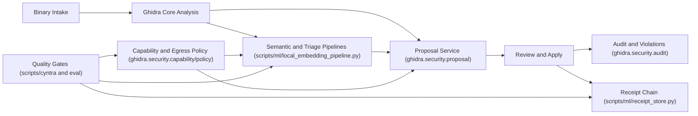

<p align="center">
  
</p>

<p align="center">
  <a href="https://github.com/backbay-labs/reverend/actions/workflows/eval.yaml"></a>
  
  
  
</p>

<h1 align="center">Reverend</h1>

<p align="center">
  <em>Evidence-backed reverse engineering on top of Ghidra.</em>
</p>

<p align="center">
  <a href="#why-reverend">Why Reverend</a>
  <span>&nbsp;&middot;&nbsp;</span>
  <a href="#architecture">Architecture</a>
  <span>&nbsp;&middot;&nbsp;</span>
  <a href="#run-locally">Run Locally</a>
  <span>&nbsp;&middot;&nbsp;</span>
  <a href="#implemented-subsystems">Implemented Subsystems</a>
</p>

<p align="center">
  
</p>

## Why Reverend

Stock Ghidra gives world-class interactive analysis. Reverend adds a **governed automation layer** so agentic workflows are testable, reviewable, and policy-enforced.

| Capability | Upstream Ghidra | Reverend |
| --- | --- | --- |
| Agent operation guardrails | Manual conventions | Capability-token enforcement + scope limits (`ghidra.security.capability.*`) |
| Network egress controls | External/proxy-only controls | Built-in policy modes: `OFFLINE`, `ALLOWLIST`, `CLOUD` (`ghidra.security.policy.*`) |
| Structured proposal lifecycle | Ad-hoc comments/scripts | Proposal state machine with review transitions (`ghidra.security.proposal.*`) |
| Security/audit event model | Generic logging | Typed audit + violation incident records (`ghidra.security.audit.*`) |
| Deterministic CI gate stack | Project-defined | Smoke/soak/regression + security compile/evidence gates (`scripts/cyntra/gates.sh`) |
| Receipt integrity primitives | N/A | Append-only hash-chain receipt store (`scripts/ml/receipt_store.py`) |

## Architecture



## Implemented Subsystems

### 1) Security Control Plane (Java)

- Capability tokens, scopes, expiry, mutation limits: `Ghidra/Framework/Generic/src/main/java/ghidra/security/capability/`
- Egress policy and endpoint/rate/payload enforcement: `Ghidra/Framework/Generic/src/main/java/ghidra/security/policy/`
- Audit events and violation incident records (in-memory + file-backed): `Ghidra/Framework/Generic/src/main/java/ghidra/security/audit/`

### 2) Proposal and Review Lifecycle (Java)

- Proposal model, deltas, reviews, lifecycle states: `Ghidra/Framework/Generic/src/main/java/ghidra/security/proposal/`
- Service orchestration for submit/review/apply transitions: `Ghidra/Framework/Generic/src/main/java/ghidra/security/proposal/ProposalService.java`

### 3) Retrieval, Triage, and Corpus Sync (Python)

- Local embedding/search/triage CLI and fixtures: `scripts/ml/local_embedding_pipeline.py`, `scripts/ml/fixtures/`
- Append-only receipt hash-chain integrity: `scripts/ml/receipt_store.py`
- Approved-only corpus sync worker with policy/provenance checks: `scripts/ml/corpus_sync_worker.py`

### 4) Evaluation + Release Gates

- Smoke/soak/regression harness: `eval/run_smoke.sh`, `eval/run_soak.sh`, `eval/scripts/`
- Threshold dashboard and baseline configs: `eval/scripts/mvp_gate_dashboard.py`, `eval/config/mvp_gate_thresholds.json`
- Kernel/CI gate runner (context, diff, Java, evidence integrity): `scripts/cyntra/gates.sh`

## Run Locally

### Prerequisites

- Python `>= 3.11`
- JDK `21` (`java` and `javac` both on 21)
- Gradle (or `./gradlew`)

### Build + Validate

```bash
# Fetch build dependencies
gradle -I gradle/support/fetchDependencies.gradle

# Strict env/context/toolchain preflight
scripts/cyntra/preflight.sh

# Compile + security module tests
./gradlew --no-daemon :Generic:compileJava
./gradlew --no-daemon :Generic:test --tests "ghidra.security.*"
python3 scripts/cyntra/check-junit-failures.py --results-dir Ghidra/Framework/Generic/build/test-results/test

# Full deterministic gate stack
CYNTRA_GATE_ISSUE_ID=1704 bash scripts/cyntra/gates.sh --mode=all

# Roadmap/evidence consistency validator
scripts/cyntra/validate-roadmap-completion.sh

# Build distribution
./gradlew --no-daemon buildGhidra
```

### Headless Smoke From Built Distribution

```bash
mkdir -p build/dist/_smoke
unzip -q -o build/dist/ghidra_*_mac_arm_64.zip -d build/dist/_smoke
build/dist/_smoke/ghidra_12.1_DEV/support/analyzeHeadless -help
```

## Optional: Cyntra Automation

If you want autonomous workcell execution over the bead backlog:

```bash
scripts/cyntra/bootstrap.sh
scripts/cyntra/run-once.sh
scripts/cyntra/run-watch.sh
scripts/cyntra/cyntra.sh status
```

Operational details: `docs/cyntra-kernel-runbook.md`.

## Key Evidence and Decision Docs

- Exit-gate report: `docs/exit-gate-report.md`
- Formal decision record: `docs/go-no-go-decision.md`
- Security signoff + abuse scenarios: `docs/security/`
- RC functional validation packet: `docs/evidence/rc-functional-validation/`

## Remotes

- `origin`: `git@github.com:backbay-labs/reverend.git`
- `upstream`: `git@github.com:NationalSecurityAgency/ghidra.git`

Reverend keeps upstream compatibility where practical while adding controlled autonomous-analysis primitives for team-scale reverse engineering.
