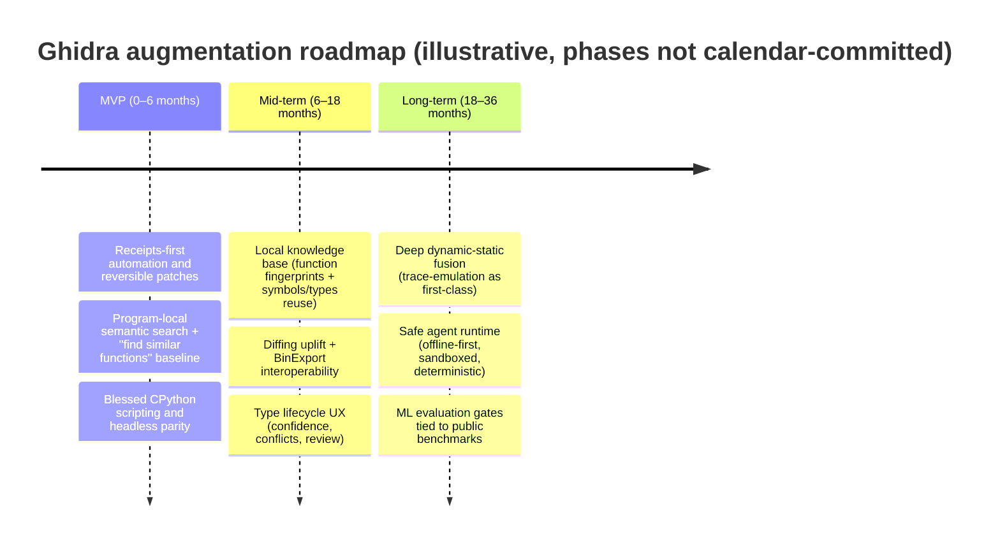
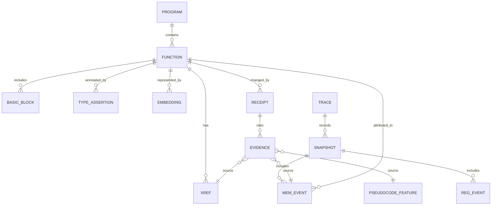

# State-of-the-Art Reverse Engineering Tools and a Rigorous Gap Analysis for Ghidra

> Draft note (2026-02-19): unresolved citation export artifacts were stripped from this file for readability.
> Source mapping and verification tracking now live in `docs/research/`, `docs/sources.md`, and `docs/claims-ledger.md`.

## Executive summary

Reverse engineering (RE) tooling has split into three partially overlapping strata: (a) **interactive disassemblers/decompilers** (Ghidra, IDA Pro/Hex-Rays, Binary Ninja, JEB, Hopper, radare2/Rizin+Cutter), (b) **automation-first binary analysis frameworks** (angr, BINSEC, Manticore, KLEE and related concolic engines), and (c) **cloud-scale triage and “automated reversing” platforms** (malware sandboxes and static analysis engines that aim to extract behavior/IOCs quickly at scale). 

In the last ~5 years (roughly 2021–early 2026), the most consequential “state-of-the-art” advances for RE workflows have been: (1) **learning-assisted decompilation and evaluation at scale** (e.g., neural/LLM-assisted decompilation systems and large paired corpora/benchmarks), (2) **type recovery progress** (including ML and deductive hybrids plus benchmarking work), (3) **binary function similarity/semantic search** using transformer-like models and architecture-neutral embeddings (now backed by new benchmarks), (4) **faster symbolic/concolic execution** via compilation-based approaches and hybrid instrumentation, (5) **better diffing and function matching plumbing** (open formats, exporters, and function IDs), and (6) a rapid rise of **LLM “copilots” and agentic plugins** for mainstream tools—often useful, but frequently lacking provenance, safety controls, and reproducibility. 

**Core finding:** Ghidra is unusually strong as a free, extensible SRE framework (decompiler + scripting + headless + multi-user server), but it still lags “best-in-class” commercial competitors and newer ecosystems in: (a) high-confidence *type recovery and type workflows*, (b) first-class *semantic search / binary similarity / library identification* at corpus scale, (c) *diffing quality and ergonomics* (especially patch diffing narratives and automation), (d) *collaboration UX* (review workflows, provenance/receipts, sharing without server friction), and (e) *safe ML integration* (offline models, audit trails, deterministic application of suggestions). 

Assumption (explicit): you did not specify a target domain (malware, embedded/IoT, vuln research, etc.) or constraints (air-gapped only, enterprise collaboration, etc.), so this report assumes **no special constraints** and highlights where requirements diverge (e.g., offline-only vs cloud). 

## Companion research docs

For claim-level references and deeper technical detail, use:
- `docs/research/INDEX.md` for topic map and cross-links.
- `docs/sources.md` for canonical external sources.
- `docs/claims-ledger.md` for high-risk claim verification status.

## Comparative survey of major reverse engineering tools

Ghidra, IDA Pro/Hex-Rays, and Binary Ninja are the three “general-purpose” interactive platforms most teams compare directly, while JEB and Hopper have stronger specialization (Android and Apple ecosystems, respectively), and radare2/Rizin+Cutter occupy the “powerful open toolkit” niche with different ergonomics. 

The table below emphasizes features that materially affect end-to-end RE workflows: decompilation quality, type workflows, debugging/dynamic fusion, diffing, collaboration, automation interfaces, and licensing/cost.

Pricing and plan details are point-in-time snapshots (as of 2026-02-19) and should be revalidated against vendor pages before decision-making.

| Tool | Licensing / cost | Key strengths (practical) | Common weaknesses / tradeoffs | Typical use cases |
|---|---|---|---|---|
| **Ghidra** | Apache 2.0 open source (free).  | Strong all-around: disassembly + decompiler + scripting; retargetable IR via SLEIGH→p-code; headless automation; built-in multi-user server/repository model; integrated debugger (since 10.0) with trace/time snapshots.  | UX friction (project creation/import/share); Python workflow friction from mixed runtimes (legacy Jython scripts plus newer CPython/PyGhidra paths); weaker “always-on” function matching/semantic search compared to Lumina/WARP ecosystems; diffing workflows can be less turnkey than dedicated bindiff stacks; limited/controversial trajectories for multi-IL views.  | General RE, malware analysis, patch analysis via Version Tracking, firmware reversing, scalable scripting pipelines via headless.  |
| **IDA Pro + Hex-Rays Decompiler** | Commercial subscription tiers; “Ultimate” listed “starting from” $8,599/year (pricing varies by plan/license type).  | Mature ecosystem and workflows: strong decompiler integration; rich decompiler internals (microcode view + maturity levels); strong library/function recognition (FLIRT) and cloud/on-prem metadata (Lumina, incl. private server); robust remote debugging modules; deobfuscation aids like gooMBA for MBA expressions.  | Cost; closed ecosystem; collaboration is not “native real-time multi-user editing” (often relies on addons or third-party collab plugins); some capabilities are gated by plan/modules/subscription.  | Professional vulnerability research, exploit dev, malware RE at scale, situations needing top-tier decompiler tuning and signature workflows.  |
| **Binary Ninja** | Proprietary; listed $299 (Personal), $1,499 (Commercial), $2,999 (Ultimate) plus renewal/support.  | Modern IL-centric design (LLIL/MLIL/HLIL), strong API and analysis primitives; built-in debugger (open-source plugin, shipped with product); emerging function matching system (WARP) and integrated BinExport support in recent releases; enterprise server supports shared projects and private WARP library.  | Cost; certain collaboration features require enterprise server/edition; smaller breadth of “out-of-the-box” file-format exotica vs long-established ecosystems (varies by target).  | Fast interactive RE, automation-heavy analysis, workflows that benefit from multiple IL layers and API-driven refactors.  |
| **radare2** (CLI framework) | Primarily LGPLv3 (project notes plugins may vary). | Powerful Unix-y toolkit; scriptable via r2pipe (multiple languages); good for automation, quick inspection, and “toolbox” workflows; can be paired with GUIs (Iaito).  | Steeper learning curve; analysis ergonomics often depend on user skill and chosen front-end; ecosystem fragmentation (radare2 vs forks/adjacent frameworks).  | CLI-first RE, automation pipelines, CTF/exploit workflows, integration into other tooling via r2pipe.  |
| **Rizin + Cutter** | Cutter GPL-3.0; Rizin has LGPL/GPL components.  | Cutter offers a UX-forward GUI “powered by Rizin”; open-source and actively developed; terminal + GUI integration; good for teams wanting a FOSS GUI with a RE engine underneath.  | Licensing (GPL for Cutter) can matter for some orgs; feature parity and “polish” vary versus top commercial suites depending on domain.  | FOSS GUI-based RE, multi-platform analysis, analysts who prefer a modern GUI over pure CLI radare2 usage.  |
| **Hopper** | Proprietary EULA; permanent license model and update plan details in vendor docs; demo disables debugger and limits sessions.  | Strong Apple ecosystem focus; polished UI; disassembler + decompiler + debugger positioning; offers binary patching mechanics (hex/assemble/script).  | Narrower ecosystem and team scale than “big three”; scope and automation depth can depend on target; pricing is not as transparent in static pages and may vary.  | macOS/iOS reversing, application analysis, smaller projects where a Mac-native workflow is a priority.  |
| **JEB** | Commercial subscription (example list prices: Android yearly $1,200/user; Pro yearly $2,000/user; Pro Floating $4,000/seat; OEM/server options).  | Strong Android pipeline (DEX/APK), modular back-end for pipelines; supports static + dynamic analysis for Android modules; scripting/refactoring operations emphasized.  | Cost; best value when your workload matches its module strengths (Android in particular). | Android app reversing, large APK triage, mixed-format reversing where JEB modules apply.  |
| **Hex-Rays Lumina / function metadata services** | Lumina can be public or self-hosted (private Lumina is an add-on); uses hashes + metadata rather than “entire byte patterns.”  | Dramatically improves function recognition and shared knowledge reuse across teams (names/types/comments), especially in organizations that maintain private servers.  | Adoption depends on org infrastructure and process; not a complete RE solution by itself.  | Team-based reversing with knowledge reuse; “make the database smarter over time.”  |
| **Cloud triage / automated analysis platforms** (examples: VirusTotal, ANY.RUN, ReversingLabs Titanium, Intezer) | Proprietary SaaS (pricing varies); emphasize ingestion and analysis at scale.  | Fast static/dynamic triage, sandbox execution, reputation/context, automated extraction, and scale-out processing—often a complement to interactive RE.  | Data governance concerns; “deep RE” still typically requires local interactive toolchains; results can be opaque depending on vendor.  | SOC triage, malware detonation and behavior capture, large-volume file analysis prior to deeper reversing.  |

A key comparative insight: **IDA and Binary Ninja have first-class “knowledge reuse” primitives** (Lumina; WARP/private enterprise services) designed explicitly to make reversing faster across large corpora, while Ghidra’s analogs (Function ID databases, version tracking, and shared repositories) exist but are less unified into a single continuously-learning workflow. 

## Recent academic and industry advances in binary analysis

This section highlights the most relevant developments for “insanely powerful” RE workflows: improvements in decompilation, type recovery, symbolic execution, fuzzing/harness generation, binary similarity/semantic search, diffing, deobfuscation, and static–dynamic fusion. 

**Decompilation and evaluation at scale.** Neural/LLM-assisted decompilation has accelerated, with research showing approaches that (a) translate decompiler output into higher-level code representations and (b) attempt to recover semantics beyond “pretty pseudocode.” For example, NDSS work on retargetable neural decompilation argues for decoupling decompilation from a single output language (“beyond C”), while more recent lines (e.g., IDIOMS) treat deterministic decompiler output as model input and predict refined code + user-defined types jointly.  A major bottleneck—high-quality paired binary↔source datasets—has been addressed by large-scale benchmarks and corpora such as **Decompile-Bench**, which assembles million-scale binary–source function pairs and provides evaluation subsets intended to reduce leakage. 

**Type recovery and type-centric reasoning.** Type recovery remains a central “hard problem” because binaries often lack explicit type information. In the last ~5 years, there has been notable progress via learning-based and hybrid approaches, including fine-grained type recovery (e.g., StateFormer), learning-based recovery for specialized targets (e.g., WebAssembly-focused SnowWhite), and more recent work focused on practical type reconstruction and evaluation/benchmarking (e.g., TRex; comparative benchmarking studies).  The existence of dedicated benchmarking efforts for binary type inference is itself an advance because it pushes the field from “demos” toward measurable progress—and directly informs what RE tools can credibly automate. 

**Symbolic execution and concolic performance.** A sustained limiter for symbolic execution has been speed and path explosion. Recent directions emphasize compilation-based or hybrid instrumentation to gain performance. SymCC (compiler-based concolic execution) demonstrates orders-of-magnitude performance improvements over interpreter-heavy approaches, and SymQEMU extends compilation-based ideas to binaries (without source). SymFusion explores hybrid instrumentation strategies that target scalability goals in concolic execution.  In practice, frameworks like angr (binary analysis and symbolic/concolic analysis) and BINSEC (binary-level security analysis with symbolic execution, SMT, abstract interpretation) remain staples for automation-first workflows, increasingly used alongside interactive RE GUIs. 

**Fuzzing-guided analysis and harness generation.** Coverage-guided fuzzing infrastructure has matured further, and its integration with RE workflows is increasingly about reducing the “harness tax.” libFuzzer is explicitly designed as an in-process, coverage-guided evolutionary fuzzer driven by a target entrypoint, while AFL++ expands coverage-guided fuzzing and supports multiple “binary-only fuzzing” modes (e.g., QEMU mode, Frida mode, persistent mode).  At the industrial scale, OSS-Fuzz combines modern fuzzing with distributed execution for open source, shaping expectations about repeatable, automated discovery pipelines.  Recently, LLM-based methods explicitly targeting harness generation have appeared (e.g., HarnessAgent; knowledge-driven driver generation papers), reflecting a broader trend: use ML to draft harnesses, then validate/repair them with program analysis and execution feedback. 

**Neural/embedding-based semantic search and binary similarity.** Binary function similarity detection (BFSD) has seen a surge in transformer-like models and architecture-neutral embeddings, motivated by use cases like patch diffing, library/component identification, and vulnerability search across firmware fleets. Representative recent work includes transformer-based cross-architecture similarity models (e.g., CRABS-former) and architecture-neutral embedding approaches (e.g., VexIR2Vec), along with systems targeting software composition analysis in binaries (e.g., BinaryAI).  The field has also matured toward **benchmarks that better reflect real needs**, including REFuSe-Bench (for BFSD realism), BinBench (benchmark for binary function models), and BinCodex (multi-level dataset for similarity tasks).  For RE tool builders, the practical implication is that “semantic search in binaries” is no longer speculative: there is a rapidly expanding menu of models, datasets, and evaluation methodologies to integrate responsibly. 

**Binary diffing and function matching plumbing.** Diffing continues to evolve from “graph matching in a GUI” into a broader ecosystem: open-source BinDiff and BinExport formalize disassembly export formats (Protocol Buffers) and tool interoperability, and Binary Ninja’s recent releases emphasize function matching (WARP) and shipping BinExport compatibility.  On the Ghidra side, Version Tracking is explicitly designed to correlate programs and port markup/annotations using correlators, and Ghidra’s Function ID (.fidb) aims at library identification through metadata databases.  The comparative trend is towards **standardized interchange + cheap “baseline matching”**, then optional heavier similarity models when needed. 

**Obfuscation and (de)virtualization.** Control-flow flattening and VM-based obfuscation remain practically important for malware and protected software, and recent work explores synthesis- and trace-informed approaches to recover structure. For example, “Trace-Informed Program Synthesis” approaches for deobfuscation reflect a shift from purely static pattern matching to combining execution evidence with synthesis. On virtualization obfuscation, research continues to propose methods for extracting VM semantics (e.g., “chosen-instruction” style attacks against commercial VM obfuscators) and systems aiming to extract virtual instructions to support devirtualization. 

**Dynamic–static fusion.** Modern workflows increasingly blend static decompilation with runtime evidence: debuggers, traces, emulation snapshots, and synchronization between tools. Ghidra’s debugger trace/time model records snapshots and allows navigation through recorded states, while ecosystem plugins like ret-sync focus on synchronizing a debugger session with disassembler views—a concrete, widely used pattern for fusing dynamic addresses/states with static context.  Emulation frameworks like Qiling and Unicorn increasingly serve as bridges: they provide controllable execution environments used for testing, fuzzing, and “micro-execution” confirmation tasks. 

## Ecosystem: plugins, agentic systems, corpora/benchmarks, and firmware/IoT tooling

The RE ecosystem is now a “stack”: core disassembler/decompiler + automation APIs + exporters + collaboration/knowledge services + ML assistants + specialized firmware tooling. The practical gap between tools often comes down to how well they integrate these layers, not whether they have a decompiler. 

**Notable plugins and integrations.**  
Ghidra has multiple paths to modern Python and external tooling integration: PyGhidra (formerly Pyhidra) provides CPython access to the Ghidra API via JPype and includes a plugin for using CPython from the UI; Ghidra Bridge and related RPC bridges allow using “real” Python libraries while interacting with Ghidra’s JVM world; and Ghidrathon adds Python 3 scripting using Jep, explicitly motivated by the limitations of Jython/Python 2.7 in native Ghidra scripting. 

Tool-to-tool fusion plugins illustrate what “alien-tech feel” can look like pragmatically: ret-sync synchronizes debugger state (WinDbg/GDB/LLDB/etc.) with IDA/Ghidra/Binary Ninja; this is an explicit static–dynamic fusion pattern that many teams replicate internally.

**Agentic / autopilot systems and LLM copilots.**  
There is now a growing constellation of LLM-driven assistants for mainstream tools: examples include GhidrAssist (LLM integration for Ghidra), GptHidra and GhidraChatGPT (function explanation/assistance), IDA agent plugins (e.g., ida_copilot; MCP bridges), and Binary Ninja LLM plugins (BinAssist).  These systems vary widely in maturity and safety posture, but they demonstrate user demand for “intent-level” interactions: summarization, renaming, vulnerability hints, and autopilot workflows. 

**Corpora, datasets, and benchmarks.**  
The last few years have seen a step-change in publicly discussed benchmarks for binary analysis tasks: Decompile-Bench targets large-scale binary↔source function pairs for decompilation evaluation; REFuSe-Bench targets more realistic binary function similarity evaluation; BinBench and BinCodex provide broader benchmarking for binary function models/similarity tasks; and newer benchmark efforts exist for deobfuscation evaluation.  The emergence of these benchmarks matters directly for tool roadmaps: you can now build an integration (e.g., semantic search, ML type inference) and validate it against an external yardstick rather than “demo satisfaction.” 

**Firmware/embedded/IoT tooling and workflows.**  
Firmware RE commonly requires extraction + emulation + component identification + vulnerability search. Binwalk focuses on firmware analysis/extraction; Firmadyne and FirmAE emphasize Linux-based firmware emulation and dynamic analysis at scale; EMBA targets end-to-end firmware analysis including extraction, static + emulation-based dynamic analysis, SBOM generation, and reporting; and FACT provides a unified interface that emphasizes browsable/searchable/comparable results.  These are often used alongside interactive tools like Ghidra/IDA/Binary Ninja after “pipeline steps” reduce the search space to security-critical components. 

## Concrete gaps and pain points relative to Ghidra

Ghidra’s baseline capability set is unusually broad for a free tool (decompiler, headless automation, scripting, server-backed shared projects, debugger/trace). The gaps below are not “missing basics,” but missing *compounding capabilities*—the ones that make RE feel superhuman at scale. 

**Workflow and UX friction.**  
Ghidra’s workflow can impose friction around project lifecycle (create project → import → analyze), and sharing is often framed as requiring a server/repository setup. These are acknowledged pain points in the project’s own issue discussions (e.g., calls for easier creation/sharing and complaints about the “lengthy process” to open/analyze).  Improving first-run ergonomics matters disproportionately because it affects whether “advanced automation and collaboration” features get adopted consistently. 

**Type recovery depth and type workflows.**  
While Ghidra supports data types and has ongoing improvements, the state of the art in type recovery has advanced rapidly (StateFormer, TRex, specialized ML type recovery systems, and benchmarking). These advances point to a gap: RE tools need not only type inference algorithms, but also *type lifecycle UX* (confidence, propagation, conflicts, corp-wide reuse).  Competing ecosystems emphasize knowledge reuse services (e.g., Lumina metadata sharing; WARP services in enterprise servers) that, while not “type recovery papers,” operationalize the idea of shared semantic structure. 

**Function identification, knowledge reuse, and semantic search at scale.**  
Ghidra’s Function ID (.fidb) supports library identification through metadata databases, but “enterprise-grade” knowledge reuse is more integrated in other ecosystems: IDA’s FLIRT + Lumina combine signature recognition and shared metadata (public or private, self-hosted), and Binary Ninja is explicitly investing in first-class function matching (WARP) and private function ID libraries via enterprise servers.  Meanwhile, academic progress in binary similarity and embeddings (e.g., CRABS-former, architecture-neutral embeddings, and new benchmarks) suggests a near-term opportunity: integrate semantic search as a first-class capability rather than a bolt-on experiment. 

**Diffing and patch analysis ergonomics.**  
Ghidra Version Tracking provides correlators and a markup-porting workflow designed to carry understanding from one binary to another, but dedicated diffing ecosystems (BinDiff + BinExport format; Diaphora in IDA) have built deep muscle memory and interchange formats that reduce friction for researchers.  The gap is less about “having a diff feature” and more about: default correlator quality, automation APIs for large batch diffing, and presenting results as an analyst-friendly narrative (“what changed and why it matters”). 

**Dynamic–static fusion and “time travel.”**  
Ghidra’s debugger has a trace/time model with recorded snapshots and navigation through time, which is powerful, but it is not yet universally experienced as a seamless “always-on” fusion layer across the whole analysis.  The ecosystem demonstrates demand for synchronization patterns (e.g., ret-sync) and combined symbolic execution UIs (e.g., MUI combining Manticore and Binary Ninja) that turn dynamic evidence into interactive static annotations. 

**Scripting language ergonomics and modern Python ecosystem access.**  
Ghidra now supports both legacy Jython workflows and CPython 3 via PyGhidra, but teams still report friction in dependency management, environment setup, and workflow consistency across GUI/headless modes.  The “missing capability” isn’t merely Python 3—it is a *first-class supported automation story* that covers dependency management, reproducibility, headless use, and secure/offline deployment. 

**Collaboration, provenance, and review workflows.**  
Ghidra supports shared projects through a server-backed repository model (check-out/check-in, merging), but the collaboration UX is not designed around modern review concepts like “proposed change sets,” automated checks, and provenance receipts for every automated rename/type application.  Competing ecosystems have different angles—Binary Ninja enterprise server focuses on shared projects and synced type archives; IDA leans on shared metadata (Lumina) and third-party co-edit plugins like IDArling. 

**ML integration safety and determinism.**  
The ecosystem’s rapid expansion of LLM plugins shows demand, but most community plugins are not designed as safety-critical systems: they may send code to remote providers, lack strong audit trails, and produce non-deterministic edits. This is a gap for Ghidra *as a platform*: it needs standardized integration patterns (offline models, receipts, policies, sandboxing) rather than ad-hoc prompt panels. 

## Prioritized roadmap to make Ghidra “feel like alien cyber tech”

The roadmap below is organized by phase and explicitly targets compounding effects: reusable knowledge, semantic navigation, safe automation, and collaboration that scales beyond a single analyst. It assumes a dedicated team (mix of core dev + UI + applied research + security engineering). 

### Roadmap table with effort, risk, and impact

| Phase | Feature bundle | Impact | Effort | Risk | Why it matters (and what it builds on) |
|---|---|---:|---:|---:|---|
| MVP | **“Receipts-first automation” layer**: every automated rename/type/comment change is a reversible patch with evidence (xrefs, constants, control/dataflow cues, trace evidence). | Very high | Medium | Medium | Addresses trust gap in both manual scripts and LLM assistants; aligns with collaboration/versioning model in shared projects.  |
| MVP | **First-class semantic search over the current program** (strings, imports, p-code features, callgraph motifs) + “find similar functions” (local-only baseline). | High | Medium | Medium | Mirrors industry momentum: function matching and similarity are central (WARP, Lumina; BFSD research). Start local to avoid privacy risks.  |
| MVP | **Modern Python story**: blessed CPython integration (package/env management, headless parity, CI-friendly) bundling/standardizing PyGhidra/Ghidrathon/Ghidra Bridge integration patterns. | High | Medium | Medium | Removes a persistent adoption barrier tied to Jython/Python 2.7 constraints; enables fast integration with Python 3 security tooling.  |
| Mid-term | **Corpus-scale knowledge base**: optional local server that stores function fingerprints, recovered symbols/types, and analyst-approved annotations; integrate with Function ID and/or new similarity engines. | Very high | High | Medium–High | Builds a “Lumina/WARP-like” experience for Ghidra users; compounding returns across large portfolios.  |
| Mid-term | **Diffing uplift**: improved correlators + batch diff pipelines + narrative patch reports; native BinExport IO for interoperability with BinDiff ecosystem. | High | Medium–High | Medium | Bridges Ghidra Version Tracking with dominant diff ecosystems and open formats (BinExport protobuf).  |
| Mid-term | **Type lifecycle UX**: confidence, conflicts, propagation views, “type PRs,” and hooks for external type inference engines (e.g., research prototypes). | Very high | High | High | Aligns with academic progress and benchmarking focus; makes type recovery adoptable in real teams.  |
| Long-term | **Dynamic-static unification**: treat traces/emulation as first-class data sources for the code model; build a “taint-to-story” and “IO intent” pipeline tied to snapshots. | Very high | Very high | High | Turns the debugger trace/time model into a pervasive understanding layer and reduces guesswork in decompilation.  |
| Long-term | **Safe ML/agent runtime**: standardized “agent sandbox” (offline models supported), policy controls, deterministic application, and benchmark-driven evaluation gates. | Very high | Very high | High | Moves from ad-hoc LLM plugins toward a reliable, secure, auditable automation platform.  |

### Mermaid timeline roadmap



The roadmap intentionally front-loads “trust infrastructure” (receipts + reversible changes) because it is the prerequisite for safe agentic automation, whether rules-based or LLM-based. 

## Recommended architectures, data models, and integration patterns

A recurring mistake in “AI for RE” efforts is bolting text generation onto the UI, rather than building a durable *analysis data plane* that supports search, matching, collaboration, and auditable automation. The architecture below treats ML as optional “advisors” that must produce receipts, not as authoritative actors. 

### Knowledge graph and receipts as first-class citizens

A practical approach is to build an internal knowledge graph (KG) that models artifacts (functions, blocks, symbols, types, strings, imports), relationships (calls, xrefs, dataflow edges, trace reads/writes), and annotations (labels/comments/type assertions) with provenance links to evidence. Ghidra already has many primitives (p-code IR; decompiler-driven analysis; trace snapshots), but they are not unified into a single explicit analysis graph optimized for search/matching/audit. 



This ER sketch captures the central “alien-tech” requirement: **every automated action is explainable** by linking it to evidence (xrefs, trace events, p-code/decompiler features). 

### Embeddings and similarity as an internal service, not a UI trick

Binary Ninja’s WARP and IDA’s Lumina demonstrate two different paths to knowledge reuse: deterministic function GUID matching (WARP) and shared metadata keyed by hashes (Lumina). Both patterns can inspire Ghidra: implement a baseline deterministic fingerprinting layer and allow heavier learned similarity models as optional backends.  Research and benchmarks (CRABS-former, BinBench, REFuSe-Bench, etc.) suggest you can validate embedding models systematically rather than relying on anecdotes. 

### Integration patterns: local vs cloud, sandboxing, and interoperability

A defensible integration strategy separates concerns:

* **Local-first core**: parsing, disassembly, decompilation, indexing, embeddings (optionally), and receipts/provenance should work offline to satisfy sensitive workflows. The feasibility of fully local analysis is a selling point for some commercial tools (e.g., decompilers running locally/air-gapped) and is also consistent with Ghidra’s default posture.   
* **Optional services**: knowledge base servers (team-shared), private metadata servers (Lumina-like), or enterprise collaboration servers (Binary Ninja model) can be layered on without making the core dependent on cloud connectivity.   
* **Sandboxed ext/ML execution**: treat plugins/agents as potentially untrusted; constrain network egress, require explicit policy, store secrets securely, and require deterministic “apply” steps that can be reviewed. Community LLM plugins often demonstrate features, but they also demonstrate why a standardized security model is needed.   
* **Interoperability-first formats**: native import/export of formats like BinExport (protobuf) and support for intermediate representations (e.g., GTIRB via plugins) makes Ghidra part of a larger toolchain rather than a silo. 

```mermaid
flowchart LR
    A[Binary / Firmware] --> B[Importer + Loader]
    B --> C[Disassembly + IR (p-code)]
    C --> D[Decompiler + Type System]
    D --> E[Index + Knowledge Graph]
    E --> F[Semantic Search + Similarity Service]
    E --> G[Diffing / Version Tracking]
    H[Debugger / Traces / Emulation] --> E
    I[Agents / ML Advisors] -->|propose changes| J[Receipt Builder]
    J --> K[Review + Apply (reversible)]
    K --> E
```

This flowchart highlights the key shift: ML/agents do not mutate analysis state directly; they propose changes that must be converted into receipts and reviewed/applied in a controlled way. 

## Security, privacy, and legal considerations

This section is informational and does not constitute legal advice. For operational or compliance decisions, consult qualified counsel in the relevant jurisdiction.

Powerful RE tooling sits at the intersection of sensitive IP, malware handling, and laws/contracts that vary by jurisdiction. A roadmap that ignores these constraints usually fails in enterprise adoption. 

**Anti-circumvention and reverse engineering legality.**  
In the US, DMCA §1201 prohibits circumvention of technological protection measures and trafficking in circumvention tools, with a complex landscape of statutory exceptions and periodic exemptions adopted through the Librarian of Congress rulemaking process (Federal Register publications and the Copyright Office recommendation documents).  In the EU, Directive 2009/24/EC Article 6 explicitly addresses decompilation for interoperability under specific conditions, which is often cited as a legal basis for certain reverse engineering activities. 

**CFAA and “good-faith” security research posture.**  
US enforcement posture matters for tooling that supports vulnerability research. The US Department of Justice announced revised charging policy guidance for CFAA cases in 2022, indicating constraints around prosecuting good-faith security research (policy details and interpretations vary; counsel is required for high-stakes decisions). 

**Data privacy, cloud services, and exfiltration risk.**  
If an RE tool integrates cloud services (LLMs, sandboxes, metadata servers), it must assume that binaries, decompiled code, strings, and symbols can contain sensitive data. Cloud sandboxes and analysis platforms are explicitly designed for submitting artifacts for analysis, which can conflict with internal restrictions (e.g., proprietary firmware, regulated code).  A safe design includes offline-first operation, strict egress controls, transparent artifact redaction (strings/paths), and organization-controlled servers when sharing metadata (analogous to “private Lumina” or enterprise collaboration servers). 

**Licensing and plugin supply chain.**  
Ghidra’s Apache 2.0 licensing encourages extension, but plugins can introduce GPL contamination or security risk depending on how they are distributed and executed. The RE ecosystem includes GPL-licensed cores and GUIs (e.g., Cutter GPL-3.0; radare2 and related toolchains often LGPL/GPL), which can matter for redistribution or embedding in commercial products. 

**Recommended mitigations (tooling design).**  
A practical mitigation strategy is: (1) implement **policy modes** (offline-only; allow-listed endpoints; “no code leaves machine”), (2) require **receipts/provenance** for all automation and agent actions (to support audit and rollback), (3) isolate plugins/agents in a **sandboxed execution environment** with explicit permissions, and (4) provide a **secure secrets store** for API keys and credentials alongside clear UX about what data is sent where. 
