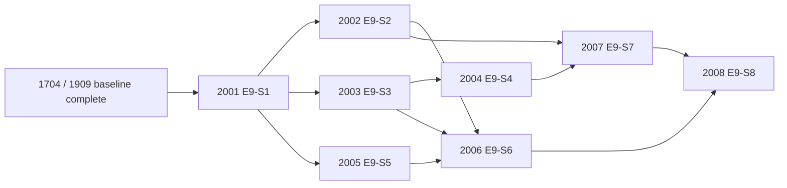
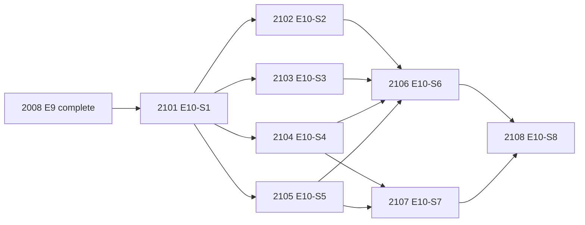
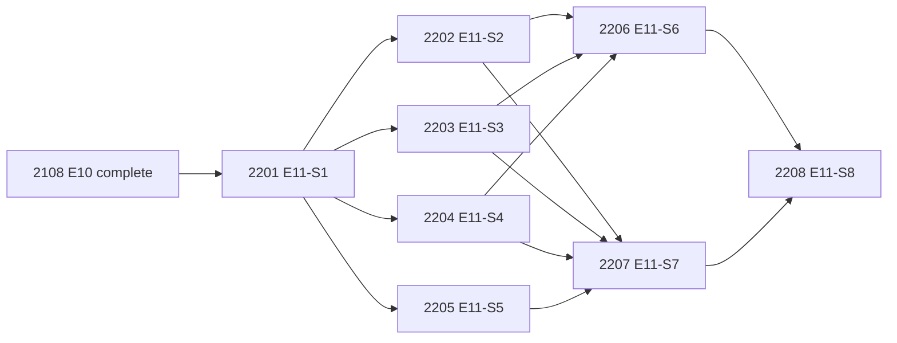
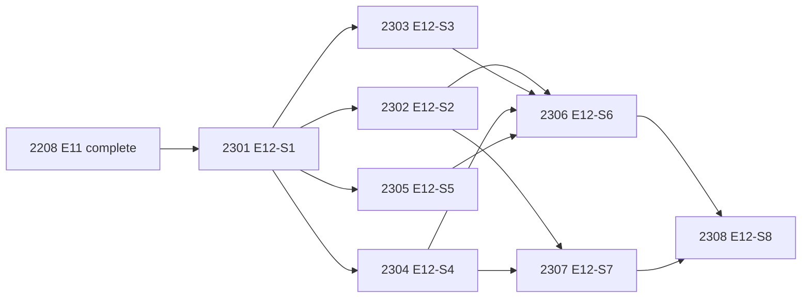

# E9/E10/E11/E12 Frontier Roadmap: SOTA Buildout to Native Real-Target Lift

As-of: 2026-02-22  
Scope: Extend Reverend beyond RC guardrails into frontier capabilities, productize those capabilities into operator-visible workflows, execute SOTA expansion on diff/deobf/symex/fuzz/firmware lift, then harden native real-target integrations.

## 1) Why E9 Exists

E1-E8 and R1-R2 delivered a production-safe RC baseline (receipts, policy controls, deterministic gates, validation evidence).  
E9 is the next implementation wave to close the remaining gap to "alien-tech" workflows:

1. Whole-artifact mapping and intent-level querying.
2. Evidence-backed auto-annotation at scale.
3. Dynamic-static fusion and deterministic mission crews.
4. Corpus learning + spec extraction for compounding analyst velocity.

## 2) Research Alignment

| E9 Story | Capability | Primary Research References |
|---|---|---|
| E9-S1 | Whole-program knowledge graph + index | `docs/deep-research-report.md`, `docs/research/analysis-data-plane-spec.md`, `docs/research/ghidra-internals-architecture.md` |
| E9-S2 | Intent + similarity retrieval | `docs/research/binary-similarity-semantic-search.md`, `docs/research/evaluation-harness.md` |
| E9-S3 | Evidence-backed auto-annotation | `docs/research/ai-assisted-reverse-engineering.md`, `docs/research/dynamic-static-evidence-model.md`, `docs/research/collaboration-review-design.md` |
| E9-S4 | Type recovery + propagation lifecycle | `docs/research/decompilation-type-recovery.md`, `docs/research/type-lifecycle-ux.md` |
| E9-S5 | Dynamic-static fusion overlays | `docs/research/symbolic-execution-fuzzing-dynamic.md`, `docs/research/dynamic-static-evidence-model.md` |
| E9-S6 | Deterministic autopilot crews | `docs/research/ai-assisted-reverse-engineering.md`, `docs/research/diffing-matching-deobfuscation.md`, `docs/research/malware-analysis-anti-analysis.md` |
| E9-S7 | Cross-binary learning/codebook | `docs/research/corpus-kb-architecture.md`, `docs/research/analysis-data-plane-spec.md`, `docs/research/agent-runtime-security-spec.md` |
| E9-S8 | Spec extraction + PR-grade review packs | `docs/research/collaboration-review-design.md`, `docs/research/analysis-data-plane-spec.md`, `docs/research/evaluation-harness.md` |

## 3) E9 Bead Plan (Execution Snapshot)

| Bead ID | Story | Current Status | Lane | Output |
|---|---|---|---|---|
| `2001` | E9-S1 Knowledge Graph Foundation | `done` | Backend/Data | Graph schema + ingest/index service |
| `2002` | E9-S2 Intent + Similarity Retrieval | `done` | ML/Backend | Ranked intent/similarity query API |
| `2003` | E9-S3 Evidence-Backed Auto-Annotation | `done` | Backend/Security | Proposals with receipts, confidence, alternatives |
| `2004` | E9-S4 Type Recovery + Propagation | `done` | ML/Backend | Inference + lifecycle + propagation/conflict handling |
| `2005` | E9-S5 Dynamic-Static Fusion | `done` | Debugger/Data | Trace overlays and runtime-attributed evidence |
| `2006` | E9-S6 Deterministic Autopilot Crews | `done` | ML/Plugin | Triage/protocol/diff/deobf mission pipelines |
| `2007` | E9-S7 Cross-Binary Learning Codebook | `done` | Backend/Security | Approved-artifact reuse and transfer suggestions |
| `2008` | E9-S8 Spec Extraction + Review Packets | `done` | Plugin/Docs | Exportable schemas/spec artifacts + review workflow |

## 4) Dependency Graph



## 5) E9 Dispatch Waves (Parallel by Design)

1. Wave 0: `2001`
2. Wave 1 (parallel): `2002`, `2003`, `2005`
3. Wave 2 (parallel): `2004`, `2006`
4. Wave 3: `2007`
5. Wave 4: `2008`

Kernel readiness commands:

```bash
scripts/cyntra/preflight.sh
scripts/cyntra/cyntra.sh status
```

## 6) E10 Productization Wave (Execution Complete)

E9 delivered core primitives. E10 focuses on making them analyst-visible in Ghidra and proving lift on real-world binary slices.

| E10 Story | Bead ID | Current Status | Lane | Primary Outcome |
|---|---|---|---|---|
| E10-S1 Semantic Query Cockpit Panel | `2101` | `done` | Plugin/UI | Operator cockpit for intent queries + similarity navigation |
| E10-S2 Mission Hotspot Map | `2102` | `done` | Backend/ML | Ranked auth/network/crypto/protocol hotspot mapping |
| E10-S3 Proposal Review Inbox | `2103` | `done` | Plugin/Collab | Accept/reject/revert workflow with evidence and rollback |
| E10-S4 Corpus Retrieval Hardening | `2104` | `done` | Backend/Data | Non-toy corpus index/retrieval with SLA evidence |
| E10-S5 Multi-Source Trace Adapters | `2105` | `done` | Debugger/Data | Unified trace evidence ingestion from multiple sources |
| E10-S6 Mission Orchestrator | `2106` | `done` | ML/Plugin | Deterministic mission runs with artifact packs |
| E10-S7 Real-World Benchmark Lift Suite | `2107` | `done` | Eval/Research | Lift metrics vs baseline on representative binaries |
| E10-S8 GA Readiness Packet | `2108` | `done` | Release/Validation | GA decision packet and reproducible demo workflow |

### E10 Dependency Graph



### E10 Dispatch Waves

1. Wave 0: `2101`
2. Wave 1 (parallel): `2102`, `2103`, `2104`, `2105`
3. Wave 2 (parallel): `2106`, `2107`
4. Wave 3: `2108`

## 7) E11 SOTA Expansion Wave (Execution Complete)

E11 turns E10 productization into deep technical lift on still-open SOTA fronts called out in the deep research report: diffing quality, deobfuscation, symbolic + fuzz evidence fusion, firmware verticalization, and multi-analyst branch/merge workflows.

| E11 Story | Bead ID | Current Status | Lane | Primary Outcome |
|---|---|---|---|---|
| E11-S1 Semantic Diff Narrative Engine | `2201` | `done` | Backend/Plugin | Evidence-backed semantic diff and impact narratives |
| E11-S2 Deobfuscation Detector/Transform Pack | `2202` | `done` | ML/Backend | Deterministic obfuscation detection + reversible transforms |
| E11-S3 Symbolic Evidence Bridge | `2203` | `done` | Debugger/Data | Counterexample/path-constraint overlays in static views |
| E11-S4 Fuzz Harness + Coverage Sync | `2204` | `done` | Eval/ML | Harness generation and coverage/crash feedback into analysis |
| E11-S5 Firmware Vertical Pipeline | `2205` | `done` | Pipeline/Data | Reproducible firmware ingest/component-attribution/triage |
| E11-S6 Branch/Merge Review Topology | `2206` | `done` | Plugin/Collab | Multi-analyst proposal branching, merge, and conflict workflows |
| E11-S7 Adversarial Lift Benchmark | `2207` | `done` | Eval/Research | Red-team style scorecard for practical analyst lift |
| E11-S8 Frontier-v2 Decision Packet | `2208` | `done` | Release/Validation | Final packet, rollout playbook, and residual risk register |

### E11 Dependency Graph



### E11 Dispatch Waves

1. Wave 0: `2201`
2. Wave 1 (parallel): `2202`, `2203`, `2204`, `2205`
3. Wave 2 (parallel): `2206`, `2207`
4. Wave 3: `2208`

## 8) E12 Native SOTA Core Wave (Queued)

E12 moves from feature breadth to native depth: tighter p-code graph extraction, hybrid symbolic+vector retrieval, cockpit v2 UX, stronger interprocedural typing, multi-source runtime overlays, deterministic mission DAG execution, and real-target benchmark scorecards.

| E12 Story | Bead ID | Current Status | Lane | Primary Outcome |
|---|---|---|---|---|
| E12-S1 P-code/CFG/SSA Graph Extractor | `2301` | `done` | Backend/Data | Persistent function knowledge graph with deterministic IDs |
| E12-S2 Hybrid Retrieval + Symbolic Rerank | `2302` | `open` | ML/Backend | Corpus retrieval with vector + constraint-aware scoring |
| E12-S3 Cockpit v2 Graph + Evidence Panel | `2303` | `open` | Plugin/UI | Query cockpit with graph facets and evidence drilldown |
| E12-S4 Type Inference v2 Propagation Engine | `2304` | `open` | ML/Type | Interprocedural type propagation with conflict proofs |
| E12-S5 Dynamic Adapter + Timeline Overlay | `2305` | `open` | Debugger/Data | Unified runtime ingest and static timeline overlays |
| E12-S6 Mission DAG Runner + Signed Packs | `2306` | `open` | Orchestration | Deterministic stage DAG and signed artifact packs |
| E12-S7 Pullback Governance + Merge Policies | `2307` | `open` | Backend/Collab | Reviewer-governed transfer/merge policy scoring |
| E12-S8 Real-Target Lift + GA3 Packet | `2308` | `open` | Release/Validation | Full benchmark campaign and decision packet |

### E12 Dependency Graph



### E12 Dispatch Waves

1. Wave 0: `2301`
2. Wave 1 (parallel): `2302`, `2303`, `2304`, `2305`
3. Wave 2 (parallel): `2306`, `2307`
4. Wave 3: `2308`

## 9) E13-E19 GA Expansion Program (Seeded)

E13-E19 extends the frontier roadmap from capability demos to production-grade depth:
real-target benchmark GA, native pluginization, decompiler-native type intelligence,
dynamic/symbolic/taint evidence fabric, corpus platform GA, zero-trust runtime controls,
and patch/exploitability workbench operations.

| Epic | Bead ID | Current Status | Program Focus |
|---|---|---|---|
| E13 Real-Target Benchmark Program GA | `2400` | `blocked` | Corpus/provenance, calibration, human-time benchmarks, signed release packs |
| E14 Native Reverend Pluginization | `2500` | `blocked` | Ghidra-native service contracts, cockpit v2, transaction-safe apply/revert |
| E15 Decompiler-Native Type/Structure Intelligence | `2600` | `blocked` | SSA/alias extraction, struct/vtable inference, propagation and type benchmarks |
| E16 Dynamic/Symbolic/Taint Evidence Fabric | `2700` | `blocked` | Trace/taint/constraint/coverage ingestion, temporal API, deterministic replay |
| E17 Corpus Platform GA + Team Scale | `2800` | `blocked` | CAS integrity, sharding, tenancy hardening, load/soak validation |
| E18 Zero-Trust Agent Runtime | `2900` | `blocked` | OS sandboxing, short-lived creds, DLP, attestation, posture automation |
| E19 Patching + Exploitability Workbench | `3000` | `blocked` | Rewrite interop, exploitability scoring, PoC replay, remediation decision packets |

Detailed per-story technical requirements, artifact contracts, and dependency spine:
- `docs/e13-e19-frontier-ga-roadmap.md`
