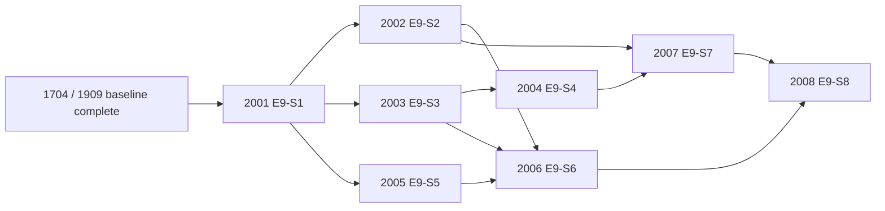

# E9 Frontier Roadmap: SOTA Reverse Engineering Buildout

As-of: 2026-02-21  
Scope: Extend Reverend beyond RC guardrails into frontier capabilities from the research corpus.

## 1) Why E9 Exists

E1-E8 and R1-R2 delivered a production-safe RC baseline (receipts, policy controls, deterministic gates, validation evidence).  
E9 is the next implementation wave to close the remaining gap to "alien-tech" workflows:

1. Whole-artifact mapping and intent-level querying.
2. Evidence-backed auto-annotation at scale.
3. Dynamic-static fusion and deterministic mission crews.
4. Corpus learning + spec extraction for compounding analyst velocity.

## 2) Research Alignment

| E9 Story | Capability | Primary Research References |
|---|---|---|
| E9-S1 | Whole-program knowledge graph + index | `docs/deep-research-report.md`, `docs/research/analysis-data-plane-spec.md`, `docs/research/ghidra-internals-architecture.md` |
| E9-S2 | Intent + similarity retrieval | `docs/research/binary-similarity-semantic-search.md`, `docs/research/evaluation-harness.md` |
| E9-S3 | Evidence-backed auto-annotation | `docs/research/ai-assisted-reverse-engineering.md`, `docs/research/dynamic-static-evidence-model.md`, `docs/research/collaboration-review-design.md` |
| E9-S4 | Type recovery + propagation lifecycle | `docs/research/decompilation-type-recovery.md`, `docs/research/type-lifecycle-ux.md` |
| E9-S5 | Dynamic-static fusion overlays | `docs/research/symbolic-execution-fuzzing-dynamic.md`, `docs/research/dynamic-static-evidence-model.md` |
| E9-S6 | Deterministic autopilot crews | `docs/research/ai-assisted-reverse-engineering.md`, `docs/research/diffing-matching-deobfuscation.md`, `docs/research/malware-analysis-anti-analysis.md` |
| E9-S7 | Cross-binary learning/codebook | `docs/research/corpus-kb-architecture.md`, `docs/research/analysis-data-plane-spec.md`, `docs/research/agent-runtime-security-spec.md` |
| E9-S8 | Spec extraction + PR-grade review packs | `docs/research/collaboration-review-design.md`, `docs/research/analysis-data-plane-spec.md`, `docs/research/evaluation-harness.md` |

## 3) Bead Plan (Executable)

| Bead ID | Story | Status Seed | Lane | Output |
|---|---|---|---|---|
| `2001` | E9-S1 Knowledge Graph Foundation | `ready` | Backend/Data | Graph schema + ingest/index service |
| `2002` | E9-S2 Intent + Similarity Retrieval | `open` | ML/Backend | Ranked intent/similarity query API |
| `2003` | E9-S3 Evidence-Backed Auto-Annotation | `open` | Backend/Security | Proposals with receipts, confidence, alternatives |
| `2004` | E9-S4 Type Recovery + Propagation | `open` | ML/Backend | Inference + lifecycle + propagation/conflict handling |
| `2005` | E9-S5 Dynamic-Static Fusion | `open` | Debugger/Data | Trace overlays and runtime-attributed evidence |
| `2006` | E9-S6 Deterministic Autopilot Crews | `open` | ML/Plugin | Triage/protocol/diff/deobf mission pipelines |
| `2007` | E9-S7 Cross-Binary Learning Codebook | `open` | Backend/Security | Approved-artifact reuse and transfer suggestions |
| `2008` | E9-S8 Spec Extraction + Review Packets | `open` | Plugin/Docs | Exportable schemas/spec artifacts + review workflow |

## 4) Dependency Graph



## 5) Dispatch Waves (Parallel by Design)

1. Wave 0: `2001`
2. Wave 1 (parallel): `2002`, `2003`, `2005`
3. Wave 2 (parallel): `2004`, `2006`
4. Wave 3: `2007`
5. Wave 4: `2008`

Kernel readiness commands:

```bash
scripts/cyntra/preflight.sh
scripts/cyntra/cyntra.sh status
```
