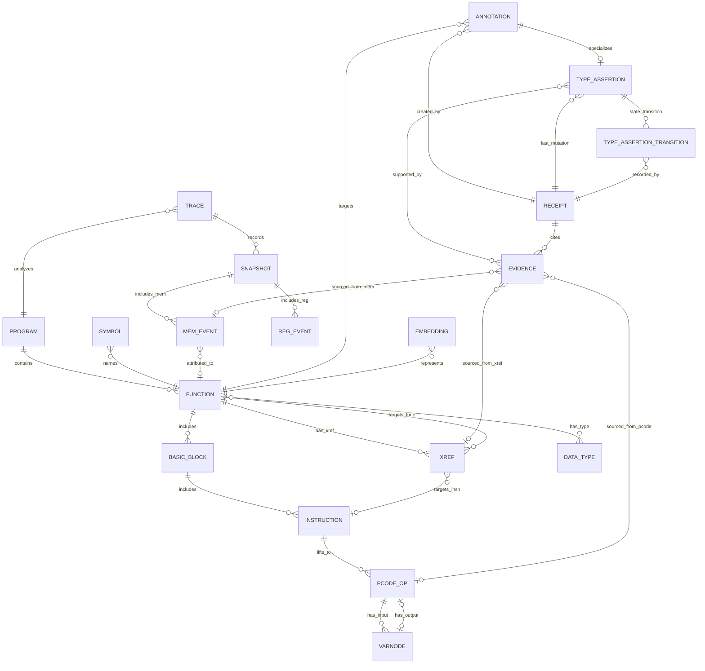

# Analysis Data Plane: Implementation Specification

Concrete implementation specification for the analysis data plane -- a unified relational + graph schema that models all artifacts, relationships, annotations, and provenance in a Ghidra-augmented reverse engineering workflow. This spec covers schema design, query model, provenance linkage, indexing strategy, scale targets, storage backend options, and migration plan.

Verification note: sizing estimates and benchmark numbers in this document are derived from Ghidra source analysis, published pgvector/DuckDB benchmarks, and industry data as of 2026-02-19. Revalidate before committing to hardware procurement or SLA commitments.

---

## 1. Schema Design

### 1.1 Entity Types

The data plane models 20 core entity types organized into four layers: **program structure**, **dynamic analysis**, **annotation/provenance**, and **embeddings/search**.

#### Program Structure Layer

| Entity | Description | Primary Key | Estimated Rows (per 1M-function corpus) |
|---|---|---|---|
| **Program** | A single analyzed binary (ELF, PE, Mach-O, etc.) | `program_id` (UUID) | ~1K-10K |
| **Function** | A function within a program | `function_id` (UUID) | 1M |
| **BasicBlock** | A basic block within a function | `block_id` (UUID) | ~10M (avg 10 blocks/function) |
| **Instruction** | A single machine instruction | `instruction_id` (UUID) | ~100M (avg 10 insns/block) |
| **PcodeOp** | A single p-code operation (lifted from instruction) | `pcode_op_id` (UUID) | ~300M (avg 3 p-code ops/insn) |
| **Varnode** | A (space, offset, size) storage location in p-code | `varnode_id` (UUID) | ~600M (avg 2 varnodes/op) |
| **DataType** | A resolved data type (struct, enum, typedef, pointer, etc.) | `datatype_id` (UUID) | ~100K |
| **Symbol** | A named symbol (function name, label, global var) | `symbol_id` (UUID) | ~2M |
| **Xref** | A cross-reference (call, data, read, write, jump) | `xref_id` (UUID) | ~50M |

#### Dynamic Analysis Layer

| Entity | Description | Primary Key | Estimated Rows |
|---|---|---|---|
| **Trace** | A debugger/emulator trace session | `trace_id` (UUID) | ~100 per program |
| **Snapshot** | A point-in-time state within a trace | `snapshot_id` (UUID) | ~10K per trace |
| **MemEvent** | A memory read/write event in a snapshot | `mem_event_id` (UUID) | ~1M per trace |
| **RegEvent** | A register state change in a snapshot | `reg_event_id` (UUID) | ~500K per trace |

#### Annotation and Provenance Layer

| Entity | Description | Primary Key | Estimated Rows |
|---|---|---|---|
| **Annotation** | A human or machine-generated annotation (comment, type assertion, rename) | `annotation_id` (UUID) | ~5M |
| **Receipt** | An auditable record of a state change | `receipt_id` (UUID) | ~10M |
| **Evidence** | A link from a receipt to supporting data | `evidence_id` (UUID) | ~30M |
| **TypeAssertion** | Lifecycle-aware materialization of `annotation_type='type_assertion'` | `assertion_id` (UUID) | ~3M |
| **TypeAssertionTransition** | Server-validated state transition history for type assertions | `transition_id` (UUID) | ~15M |

#### Embedding and Search Layer

| Entity | Description | Primary Key | Estimated Rows |
|---|---|---|---|
| **Embedding** | A vector representation of a function or block | `embedding_id` (UUID) | ~1M (one per function) |

### 1.2 Relationship Types

```
Program -[CONTAINS]-> Function          (1:N)
Function -[INCLUDES]-> BasicBlock       (1:N)
BasicBlock -[INCLUDES]-> Instruction    (1:N, ordered by address)
Instruction -[LIFTS_TO]-> PcodeOp       (1:N, ordered by seqnum)
PcodeOp -[HAS_INPUT]-> Varnode          (1:N, ordered by slot index)
PcodeOp -[HAS_OUTPUT]-> Varnode         (1:1, nullable)

Function -[CALLS]-> Function            (N:M, via Xref with type=CALL)
Function -[HAS_XREF]-> Xref            (1:N)
Xref -[TARGETS]-> Function|Instruction  (N:1)

Function -[HAS_TYPE]-> DataType         (N:M, return type + param types)
Symbol -[NAMES]-> Function|Instruction  (N:1)
DataType -[CONTAINS_FIELD]-> DataType   (1:N, for structs/unions)

Trace -[ANALYZES]-> Program             (N:1)
Trace -[RECORDS]-> Snapshot             (1:N, ordered by snap number)
Snapshot -[INCLUDES_MEM]-> MemEvent     (1:N)
Snapshot -[INCLUDES_REG]-> RegEvent     (1:N)
MemEvent -[ATTRIBUTED_TO]-> Function    (N:1, nullable)

Annotation -[TARGETS]-> Function|BasicBlock|Instruction|DataType|Symbol  (N:1)
Annotation -[CREATED_BY]-> Receipt      (N:1)
Receipt -[CITES]-> Evidence             (1:N)
Evidence -[SOURCED_FROM]-> Xref|MemEvent|RegEvent|PcodeOp|Embedding  (N:1)
Annotation -[SPECIALIZES]-> TypeAssertion (1:0..1 when annotation_type='type_assertion')
TypeAssertion -[LATEST_MUTATION]-> Receipt (N:1)
TypeAssertion -[SUPPORTED_BY]-> Evidence (N:M, via type_assertion_evidence_link)
TypeAssertion -[STATE_TRANSITION]-> TypeAssertionTransition (1:N)

Embedding -[REPRESENTS]-> Function      (N:1, multiple models/versions)
```

### 1.3 Mermaid ER Diagram



### 1.4 SQL DDL Sketches

#### Core Program Structure Tables

```sql
-- Programs
CREATE TABLE program (
    program_id       UUID PRIMARY KEY DEFAULT gen_random_uuid(),
    name             TEXT NOT NULL,
    sha256           BYTEA NOT NULL,            -- 32 bytes, binary hash
    architecture     TEXT NOT NULL,              -- e.g., 'x86:LE:64:default'
    compiler_spec    TEXT,                       -- e.g., 'gcc', 'windows'
    format           TEXT NOT NULL,              -- 'ELF', 'PE', 'MachO', 'raw'
    file_size        BIGINT NOT NULL,
    import_time      TIMESTAMPTZ NOT NULL DEFAULT now(),
    metadata         JSONB DEFAULT '{}'::jsonb,  -- loader info, sections, etc.
    UNIQUE (sha256)
);

-- Functions
CREATE TABLE function (
    function_id      UUID PRIMARY KEY DEFAULT gen_random_uuid(),
    program_id       UUID NOT NULL REFERENCES program(program_id) ON DELETE CASCADE,
    entry_address    BIGINT NOT NULL,           -- virtual address
    name             TEXT,                       -- current best name (nullable if unnamed)
    body_size        INTEGER NOT NULL,           -- bytes
    block_count      INTEGER NOT NULL DEFAULT 0,
    instruction_count INTEGER NOT NULL DEFAULT 0,
    is_thunk         BOOLEAN NOT NULL DEFAULT FALSE,
    is_external      BOOLEAN NOT NULL DEFAULT FALSE,
    calling_convention TEXT,
    decompiled_c     TEXT,                       -- cached decompilation (nullable)
    metadata         JSONB DEFAULT '{}'::jsonb,
    UNIQUE (program_id, entry_address)
);

-- Basic blocks
CREATE TABLE basic_block (
    block_id         UUID PRIMARY KEY DEFAULT gen_random_uuid(),
    function_id      UUID NOT NULL REFERENCES function(function_id) ON DELETE CASCADE,
    start_address    BIGINT NOT NULL,
    end_address      BIGINT NOT NULL,
    block_index      INTEGER NOT NULL,           -- index within function's CFG
    instruction_count INTEGER NOT NULL DEFAULT 0,
    UNIQUE (function_id, start_address)
);

-- Instructions
CREATE TABLE instruction (
    instruction_id   UUID PRIMARY KEY DEFAULT gen_random_uuid(),
    block_id         UUID NOT NULL REFERENCES basic_block(block_id) ON DELETE CASCADE,
    address          BIGINT NOT NULL,
    length           SMALLINT NOT NULL,
    mnemonic         TEXT NOT NULL,
    operands         TEXT,                        -- disassembly operand string
    bytes            BYTEA NOT NULL,              -- raw instruction bytes
    flow_type        TEXT,                        -- 'FALL_THROUGH', 'JUMP', 'CALL', 'RETURN'
    UNIQUE (block_id, address)
);

-- P-code operations
CREATE TABLE pcode_op (
    pcode_op_id      UUID PRIMARY KEY DEFAULT gen_random_uuid(),
    instruction_id   UUID NOT NULL REFERENCES instruction(instruction_id) ON DELETE CASCADE,
    seqnum           INTEGER NOT NULL,            -- ordering within instruction
    opcode           SMALLINT NOT NULL,           -- PcodeOp.INT_ADD, etc. (0-74)
    opcode_name      TEXT NOT NULL,               -- human-readable: 'INT_ADD'
    UNIQUE (instruction_id, seqnum)
);

-- Varnodes
CREATE TABLE varnode (
    varnode_id       UUID PRIMARY KEY DEFAULT gen_random_uuid(),
    pcode_op_id      UUID NOT NULL REFERENCES pcode_op(pcode_op_id) ON DELETE CASCADE,
    slot             SMALLINT NOT NULL,           -- -1 for output, 0..N for inputs
    space            TEXT NOT NULL,               -- 'ram', 'register', 'const', 'unique'
    offset           BIGINT NOT NULL,
    size             SMALLINT NOT NULL,
    UNIQUE (pcode_op_id, slot)
);

-- Cross-references
CREATE TABLE xref (
    xref_id          UUID PRIMARY KEY DEFAULT gen_random_uuid(),
    program_id       UUID NOT NULL REFERENCES program(program_id) ON DELETE CASCADE,
    from_address     BIGINT NOT NULL,
    to_address       BIGINT NOT NULL,
    xref_type        TEXT NOT NULL,               -- 'CALL', 'JUMP', 'DATA_READ', 'DATA_WRITE', 'PARAM'
    from_function_id UUID REFERENCES function(function_id),
    to_function_id   UUID REFERENCES function(function_id),
    is_computed      BOOLEAN NOT NULL DEFAULT FALSE
);

-- Data types
CREATE TABLE data_type (
    datatype_id      UUID PRIMARY KEY DEFAULT gen_random_uuid(),
    program_id       UUID REFERENCES program(program_id),  -- NULL = shared/archive type
    category_path    TEXT NOT NULL,                -- e.g., '/MyProject/Structs'
    name             TEXT NOT NULL,
    kind             TEXT NOT NULL,                -- 'struct', 'union', 'enum', 'pointer',
                                                   -- 'typedef', 'array', 'function_def', 'builtin'
    size             INTEGER,                      -- bytes, NULL for unsized
    definition       JSONB,                        -- full type definition (fields, enum values, etc.)
    source_archive   TEXT,                         -- origin archive name, if any
    UNIQUE (program_id, category_path, name)
);

-- Symbols
CREATE TABLE symbol (
    symbol_id        UUID PRIMARY KEY DEFAULT gen_random_uuid(),
    program_id       UUID NOT NULL REFERENCES program(program_id) ON DELETE CASCADE,
    name             TEXT NOT NULL,
    address          BIGINT NOT NULL,
    symbol_type      TEXT NOT NULL,                -- 'FUNCTION', 'LABEL', 'GLOBAL', 'PARAM', 'LOCAL'
    namespace        TEXT,
    source           TEXT NOT NULL DEFAULT 'USER', -- 'USER', 'IMPORTED', 'ANALYSIS', 'DEFAULT'
    is_primary       BOOLEAN NOT NULL DEFAULT TRUE,
    function_id      UUID REFERENCES function(function_id)
);
```

#### Dynamic Analysis Tables

```sql
-- Traces
CREATE TABLE trace (
    trace_id         UUID PRIMARY KEY DEFAULT gen_random_uuid(),
    program_id       UUID NOT NULL REFERENCES program(program_id) ON DELETE CASCADE,
    name             TEXT,
    debugger         TEXT,                         -- 'GDB', 'LLDB', 'emulator'
    platform         TEXT,                         -- target platform
    created_at       TIMESTAMPTZ NOT NULL DEFAULT now(),
    metadata         JSONB DEFAULT '{}'::jsonb
);

-- Snapshots (time points within a trace)
CREATE TABLE snapshot (
    snapshot_id      UUID PRIMARY KEY DEFAULT gen_random_uuid(),
    trace_id         UUID NOT NULL REFERENCES trace(trace_id) ON DELETE CASCADE,
    snap_number      BIGINT NOT NULL,              -- monotonic within trace
    description      TEXT,
    timestamp        TIMESTAMPTZ,
    UNIQUE (trace_id, snap_number)
);

-- Memory events
CREATE TABLE mem_event (
    mem_event_id     UUID PRIMARY KEY DEFAULT gen_random_uuid(),
    snapshot_id      UUID NOT NULL REFERENCES snapshot(snapshot_id) ON DELETE CASCADE,
    address          BIGINT NOT NULL,
    size             INTEGER NOT NULL,
    access_type      TEXT NOT NULL,                -- 'READ', 'WRITE'
    value            BYTEA,                        -- value read/written
    function_id      UUID REFERENCES function(function_id),
    instruction_address BIGINT
);

-- Register events
CREATE TABLE reg_event (
    reg_event_id     UUID PRIMARY KEY DEFAULT gen_random_uuid(),
    snapshot_id      UUID NOT NULL REFERENCES snapshot(snapshot_id) ON DELETE CASCADE,
    register_name    TEXT NOT NULL,
    value            BYTEA NOT NULL,
    size             SMALLINT NOT NULL
);
```

#### Annotation and Provenance Tables

```sql
-- Annotations (human or machine-generated metadata)
CREATE TABLE annotation (
    annotation_id    UUID PRIMARY KEY DEFAULT gen_random_uuid(),
    program_id       UUID NOT NULL REFERENCES program(program_id) ON DELETE CASCADE,
    target_type      TEXT NOT NULL,                -- 'function', 'instruction', 'basic_block',
                                                   -- 'data_type', 'symbol'
    target_id        UUID NOT NULL,                -- FK to the target entity
    annotation_type  TEXT NOT NULL,                -- 'comment', 'type_assertion', 'rename',
                                                   -- 'tag', 'summary'
    content          JSONB NOT NULL,               -- structured annotation payload
    confidence       REAL,                         -- 0.0-1.0, NULL for human annotations
    is_active        BOOLEAN NOT NULL DEFAULT TRUE, -- FALSE = superseded/reverted
    created_at       TIMESTAMPTZ NOT NULL DEFAULT now(),
    receipt_id       UUID REFERENCES receipt(receipt_id)
);

-- Receipts (auditable change records)
CREATE TABLE receipt (
    receipt_id       UUID PRIMARY KEY DEFAULT gen_random_uuid(),
    timestamp        TIMESTAMPTZ NOT NULL DEFAULT now(),
    chain_sequence   BIGINT NOT NULL,             -- monotonic receipt sequence (per program)
    chain_prev_receipt_id UUID REFERENCES receipt(receipt_id),
    chain_prev_hash  BYTEA,                       -- previous chain hash (SHA-256)
    chain_hash       BYTEA NOT NULL,              -- hash of canonical receipt (SHA-256)
    actor            TEXT NOT NULL,                -- 'user:alice', 'agent:renamer-v2', 'analyzer:fid'
    actor_type       TEXT NOT NULL,                -- 'human', 'agent', 'analyzer', 'system'
    action           TEXT NOT NULL,                -- 'rename', 'retype', 'comment', 'create',
                                                   -- 'delete', 'merge', 'revert'
    target_type      TEXT NOT NULL,                -- 'function', 'data_type', 'symbol', etc.
    target_id        UUID NOT NULL,
    program_id       UUID NOT NULL REFERENCES program(program_id) ON DELETE CASCADE,
    old_value        JSONB,                        -- previous state (for undo)
    new_value        JSONB NOT NULL,               -- new state
    model_id         TEXT,                         -- ML model identifier, if applicable
    model_version    TEXT,                         -- model version string
    prompt_hash      TEXT,                         -- SHA-256 of prompt, if LLM-generated
    confidence       REAL,                         -- model confidence, if applicable
    is_reverted      BOOLEAN NOT NULL DEFAULT FALSE,
    reverted_by      UUID REFERENCES receipt(receipt_id),
    metadata         JSONB DEFAULT '{}'::jsonb
);

-- Evidence (links receipts to supporting data)
CREATE TABLE evidence (
    evidence_id      UUID PRIMARY KEY DEFAULT gen_random_uuid(),
    receipt_id       UUID NOT NULL REFERENCES receipt(receipt_id) ON DELETE CASCADE,
    evidence_type    TEXT NOT NULL,                -- 'xref', 'mem_event', 'reg_event',
                                                   -- 'pcode_feature', 'embedding_similarity',
                                                   -- 'string_match', 'trace_observation'
    source_type      TEXT NOT NULL,                -- entity type of the source
    source_id        UUID NOT NULL,                -- FK to the source entity
    relevance        REAL,                         -- 0.0-1.0 relevance score
    description      TEXT,                         -- human-readable explanation
    metadata         JSONB DEFAULT '{}'::jsonb     -- additional structured evidence data
);

-- Type assertion lifecycle states
CREATE TYPE type_assertion_lifecycle_state AS ENUM (
    'INFERRED',
    'PROPOSED',
    'UNDER_REVIEW',
    'ACCEPTED',
    'PROPAGATED',
    'DEPRECATED',
    'REJECTED'
);

-- Type assertions (specialized lifecycle-aware annotations)
CREATE TABLE type_assertion (
    assertion_id      UUID PRIMARY KEY DEFAULT gen_random_uuid(),
    annotation_id     UUID NOT NULL UNIQUE REFERENCES annotation(annotation_id) ON DELETE CASCADE,
    program_id        UUID NOT NULL REFERENCES program(program_id) ON DELETE CASCADE,
    target_type       TEXT NOT NULL,               -- 'function', 'data_type', 'symbol', 'variable', etc.
    target_id         UUID NOT NULL,
    target_scope      TEXT NOT NULL,               -- 'VARIABLE', 'PARAMETER', 'RETURN_TYPE', 'GLOBAL', 'STRUCT_FIELD'
    datatype_id       UUID REFERENCES data_type(datatype_id),
    asserted_type     JSONB NOT NULL,              -- canonical serialized type payload
    source_type       TEXT NOT NULL,               -- 'DWARF', 'ANALYST', 'ML_MODEL', 'CONSTRAINT_SOLVER', etc.
    source_id         TEXT NOT NULL,               -- model name, username, or tool identifier
    source_version    TEXT,
    confidence        REAL NOT NULL CHECK (confidence >= 0.0 AND confidence <= 1.0),
    lifecycle_state   type_assertion_lifecycle_state NOT NULL,
    previous_assertion_id UUID REFERENCES type_assertion(assertion_id),
    created_receipt_id UUID NOT NULL REFERENCES receipt(receipt_id),
    last_receipt_id   UUID NOT NULL REFERENCES receipt(receipt_id),
    created_at        TIMESTAMPTZ NOT NULL DEFAULT now(),
    updated_at        TIMESTAMPTZ NOT NULL DEFAULT now()
);

-- Allowed lifecycle transitions; enforced by trigger on type_assertion writes
CREATE TABLE type_assertion_lifecycle_rule (
    from_state        type_assertion_lifecycle_state NOT NULL,
    to_state          type_assertion_lifecycle_state NOT NULL,
    PRIMARY KEY (from_state, to_state),
    CHECK (from_state <> to_state)
);

INSERT INTO type_assertion_lifecycle_rule (from_state, to_state) VALUES
    ('INFERRED', 'PROPOSED'),
    ('INFERRED', 'REJECTED'),
    ('PROPOSED', 'UNDER_REVIEW'),
    ('PROPOSED', 'REJECTED'),
    ('UNDER_REVIEW', 'PROPOSED'),
    ('UNDER_REVIEW', 'ACCEPTED'),
    ('UNDER_REVIEW', 'REJECTED'),
    ('ACCEPTED', 'PROPAGATED'),
    ('ACCEPTED', 'REJECTED'),
    ('PROPAGATED', 'UNDER_REVIEW'),
    ('PROPAGATED', 'DEPRECATED'),
    ('PROPAGATED', 'REJECTED'),
    ('DEPRECATED', 'REJECTED');

-- History of lifecycle transitions for audit/review workflows
CREATE TABLE type_assertion_transition (
    transition_id     UUID PRIMARY KEY DEFAULT gen_random_uuid(),
    assertion_id      UUID NOT NULL REFERENCES type_assertion(assertion_id) ON DELETE CASCADE,
    from_state        type_assertion_lifecycle_state NOT NULL,
    to_state          type_assertion_lifecycle_state NOT NULL,
    receipt_id        UUID NOT NULL REFERENCES receipt(receipt_id),
    reason            TEXT,
    changed_at        TIMESTAMPTZ NOT NULL DEFAULT now(),
    CHECK (from_state <> to_state)
);

-- Direct links from assertions to supporting evidence rows
CREATE TABLE type_assertion_evidence_link (
    assertion_id      UUID NOT NULL REFERENCES type_assertion(assertion_id) ON DELETE CASCADE,
    evidence_id       UUID NOT NULL REFERENCES evidence(evidence_id) ON DELETE RESTRICT,
    link_role         TEXT NOT NULL DEFAULT 'supporting',
    PRIMARY KEY (assertion_id, evidence_id)
);

CREATE OR REPLACE FUNCTION validate_type_assertion_transition()
RETURNS trigger
LANGUAGE plpgsql
AS $$
BEGIN
    IF TG_OP = 'INSERT' THEN
        IF NEW.lifecycle_state NOT IN ('INFERRED', 'PROPOSED') THEN
            RAISE EXCEPTION
                'type_assertion initial state must be INFERRED or PROPOSED, got %',
                NEW.lifecycle_state;
        END IF;
        RETURN NEW;
    END IF;

    IF NEW.lifecycle_state = OLD.lifecycle_state THEN
        RETURN NEW;
    END IF;

    IF NEW.last_receipt_id = OLD.last_receipt_id THEN
        RAISE EXCEPTION
            'state transition % -> % requires a new last_receipt_id',
            OLD.lifecycle_state, NEW.lifecycle_state;
    END IF;

    IF NOT EXISTS (
        SELECT 1
        FROM type_assertion_lifecycle_rule r
        WHERE r.from_state = OLD.lifecycle_state
          AND r.to_state = NEW.lifecycle_state
    ) THEN
        RAISE EXCEPTION
            'invalid type_assertion lifecycle transition % -> %',
            OLD.lifecycle_state, NEW.lifecycle_state;
    END IF;

    INSERT INTO type_assertion_transition (assertion_id, from_state, to_state, receipt_id)
    VALUES (OLD.assertion_id, OLD.lifecycle_state, NEW.lifecycle_state, NEW.last_receipt_id);

    RETURN NEW;
END;
$$;

CREATE TRIGGER trg_type_assertion_validate_transition
BEFORE INSERT OR UPDATE OF lifecycle_state ON type_assertion
FOR EACH ROW EXECUTE FUNCTION validate_type_assertion_transition();
```

#### Embedding and Search Tables

```sql
-- Embeddings (requires pgvector extension)
-- CREATE EXTENSION IF NOT EXISTS vector;

CREATE TABLE embedding (
    embedding_id     UUID PRIMARY KEY DEFAULT gen_random_uuid(),
    function_id      UUID NOT NULL REFERENCES function(function_id) ON DELETE CASCADE,
    model_name       TEXT NOT NULL,                -- 'bsim-v1', 'jTrans-768', 'safe-256'
    model_version    TEXT NOT NULL,
    dimensions       INTEGER NOT NULL,
    vector           vector(768),                  -- pgvector type; size varies by model
    fid_hash         BYTEA,                        -- deterministic FID hash for fast exact match
    warp_guid        UUID,                         -- WARP-compatible function GUID
    created_at       TIMESTAMPTZ NOT NULL DEFAULT now(),
    metadata         JSONB DEFAULT '{}'::jsonb,
    UNIQUE (function_id, model_name, model_version)
);

-- For models with different dimensions, use separate columns or a JSONB vector:
-- The 768-dim vector column above is for the primary model.
-- Additional model vectors can be stored in separate tables or as JSONB arrays.
```

#### CFG Edge Table (Graph Structure)

```sql
-- Control flow graph edges (for graph traversal queries)
CREATE TABLE cfg_edge (
    edge_id          UUID PRIMARY KEY DEFAULT gen_random_uuid(),
    function_id      UUID NOT NULL REFERENCES function(function_id) ON DELETE CASCADE,
    from_block_id    UUID NOT NULL REFERENCES basic_block(block_id) ON DELETE CASCADE,
    to_block_id      UUID NOT NULL REFERENCES basic_block(block_id) ON DELETE CASCADE,
    edge_type        TEXT NOT NULL,                -- 'FALL_THROUGH', 'JUMP_TRUE', 'JUMP_FALSE',
                                                   -- 'SWITCH_CASE', 'CALL', 'RETURN'
    UNIQUE (from_block_id, to_block_id, edge_type)
);

-- Call graph edges (function-to-function)
CREATE TABLE call_edge (
    edge_id          UUID PRIMARY KEY DEFAULT gen_random_uuid(),
    program_id       UUID NOT NULL REFERENCES program(program_id) ON DELETE CASCADE,
    caller_id        UUID NOT NULL REFERENCES function(function_id) ON DELETE CASCADE,
    callee_id        UUID NOT NULL REFERENCES function(function_id) ON DELETE CASCADE,
    call_site_address BIGINT NOT NULL,
    is_indirect      BOOLEAN NOT NULL DEFAULT FALSE,
    call_count       INTEGER DEFAULT 1,            -- from trace data, if available
    UNIQUE (caller_id, callee_id, call_site_address)
);
```

---

## 2. Query Model

### 2.1 Query Categories and Requirements

The data plane must support five categories of queries with distinct performance profiles:

#### Category 1: Function Similarity Search

**Use cases:** "Find functions similar to this one across the corpus," "identify library functions in a stripped binary," "find variants of a vulnerability across firmware images."

**Required queries:**

```sql
-- Vector similarity search (pgvector cosine distance)
-- Target: <100ms for single-binary, <1s for 1M-function corpus
SELECT f.function_id, f.name, f.program_id,
       1 - (e.vector <=> :query_vector) AS similarity
FROM embedding e
JOIN function f ON e.function_id = f.function_id
WHERE e.model_name = :model_name
  AND 1 - (e.vector <=> :query_vector) > :min_similarity
ORDER BY e.vector <=> :query_vector
LIMIT :top_k;

-- Deterministic FID hash lookup (exact match, sub-millisecond)
SELECT f.function_id, f.name, f.program_id
FROM embedding e
JOIN function f ON e.function_id = f.function_id
WHERE e.fid_hash = :hash;

-- WARP GUID lookup
SELECT f.function_id, f.name, f.program_id
FROM embedding e
JOIN function f ON e.function_id = f.function_id
WHERE e.warp_guid = :guid;

-- Combined: deterministic first, then vector fallback
-- (application-level two-phase query)
```

#### Category 2: Evidence Chain Traversal

**Use cases:** "Why was this function renamed?", "trace the provenance of this type annotation back to source evidence," "show all changes made by agent X."

**Required queries:**

```sql
-- Get the full provenance chain for an annotation
SELECT r.receipt_id, r.timestamp, r.actor, r.action,
       r.old_value, r.new_value, r.confidence,
       e.evidence_type, e.source_type, e.source_id, e.description
FROM annotation a
JOIN receipt r ON a.receipt_id = r.receipt_id
JOIN evidence ev ON r.receipt_id = ev.receipt_id
WHERE a.target_id = :function_id
  AND a.annotation_type = 'rename'
ORDER BY r.timestamp DESC;

-- Recursive revert chain: find all reverts of a receipt
WITH RECURSIVE revert_chain AS (
    SELECT receipt_id, reverted_by, 0 AS depth
    FROM receipt WHERE receipt_id = :original_receipt_id
    UNION ALL
    SELECT r.receipt_id, r.reverted_by, rc.depth + 1
    FROM receipt r
    JOIN revert_chain rc ON r.receipt_id = rc.reverted_by
)
SELECT * FROM revert_chain;

-- All changes by a specific agent to a specific program
SELECT r.*, array_agg(ev.evidence_type) AS evidence_types
FROM receipt r
LEFT JOIN evidence ev ON r.receipt_id = ev.receipt_id
WHERE r.actor = :agent_id
  AND r.program_id = :program_id
GROUP BY r.receipt_id
ORDER BY r.timestamp DESC;
```

#### Category 3: Temporal Queries

**Use cases:** "What was the state of this function at snapshot N?", "show all annotations that existed before this analysis run," "reconstruct the function name history."

**Required queries:**

```sql
-- State of function annotations at a point in time
SELECT a.*
FROM annotation a
JOIN receipt r ON a.receipt_id = r.receipt_id
WHERE a.target_id = :function_id
  AND r.timestamp <= :point_in_time
  AND a.is_active = TRUE
  AND NOT EXISTS (
      SELECT 1 FROM annotation a2
      JOIN receipt r2 ON a2.receipt_id = r2.receipt_id
      WHERE a2.target_id = a.target_id
        AND a2.annotation_type = a.annotation_type
        AND r2.timestamp > r.timestamp
        AND r2.timestamp <= :point_in_time
  )
ORDER BY r.timestamp DESC;

-- Function name history (all renames over time)
SELECT r.timestamp, r.actor, r.old_value->>'name' AS old_name,
       r.new_value->>'name' AS new_name, r.confidence
FROM receipt r
WHERE r.target_id = :function_id
  AND r.action = 'rename'
ORDER BY r.timestamp ASC;

-- Trace-temporal: memory state at snapshot N
SELECT me.address, me.value, me.access_type, me.function_id
FROM mem_event me
JOIN snapshot s ON me.snapshot_id = s.snapshot_id
WHERE s.trace_id = :trace_id
  AND s.snap_number <= :snap_number
ORDER BY s.snap_number DESC, me.address;
```

#### Category 4: Cross-Program Queries

**Use cases:** "Find all programs containing a function similar to CVE-2024-XXXX," "show shared library usage across a firmware corpus," "find all binaries built with the same compiler."

**Required queries:**

```sql
-- Cross-program vector similarity search
SELECT p.name AS program_name, f.name AS function_name,
       1 - (e.vector <=> :query_vector) AS similarity
FROM embedding e
JOIN function f ON e.function_id = f.function_id
JOIN program p ON f.program_id = p.program_id
WHERE e.model_name = :model_name
ORDER BY e.vector <=> :query_vector
LIMIT :top_k;

-- Shared functions across programs (by FID hash)
SELECT e.fid_hash, count(DISTINCT f.program_id) AS program_count,
       array_agg(DISTINCT p.name) AS programs,
       array_agg(DISTINCT f.name) AS function_names
FROM embedding e
JOIN function f ON e.function_id = f.function_id
JOIN program p ON f.program_id = p.program_id
WHERE e.fid_hash IS NOT NULL
GROUP BY e.fid_hash
HAVING count(DISTINCT f.program_id) > 1
ORDER BY program_count DESC;

-- Programs sharing a call graph pattern (functions calling the same set of callees)
SELECT f.program_id, count(*) AS shared_callees
FROM call_edge ce
JOIN function f ON ce.caller_id = f.function_id
WHERE ce.callee_id IN (
    SELECT callee_id FROM call_edge WHERE caller_id = :reference_function_id
)
GROUP BY f.program_id
ORDER BY shared_callees DESC;
```

#### Category 5: Structural Graph Queries

**Use cases:** "Find all functions reachable from this function within N call levels," "get the dominator tree for a function's CFG," "find data flow paths between two variables."

For graph traversal queries that exceed SQL's ergonomic limits, two approaches are supported:

**Approach A: SQL recursive CTEs (works with plain PostgreSQL)**

```sql
-- Call graph reachability (N-hop callee expansion)
WITH RECURSIVE callees AS (
    SELECT callee_id AS function_id, 1 AS depth
    FROM call_edge WHERE caller_id = :root_function_id
    UNION ALL
    SELECT ce.callee_id, c.depth + 1
    FROM call_edge ce
    JOIN callees c ON ce.caller_id = c.function_id
    WHERE c.depth < :max_depth
)
SELECT DISTINCT f.function_id, f.name, c.depth
FROM callees c
JOIN function f ON c.function_id = f.function_id
ORDER BY c.depth, f.name;
```

**Approach B: Cypher via Apache AGE (if graph extension installed)**

```sql
-- Same query in Cypher (more natural for graph patterns)
SELECT * FROM cypher('analysis_graph', $$
    MATCH (root:Function {function_id: $root_id})-[:CALLS*1..5]->(callee:Function)
    RETURN callee.function_id, callee.name, length(path) AS depth
    ORDER BY depth
$$) AS (function_id agtype, name agtype, depth agtype);
```

### 2.2 Query Language Strategy

**Primary: SQL (PostgreSQL).** All queries are expressible in SQL with recursive CTEs. This avoids introducing a separate graph query engine for the majority of use cases. PostgreSQL's query planner handles the join patterns efficiently with proper indexing.

**Optional: Cypher via Apache AGE.** For deep graph traversal patterns (call graph analysis, data flow path finding, neighborhood expansion), Cypher provides a more ergonomic syntax. Apache AGE runs as a PostgreSQL extension, so it does not require a separate database. The decision to install AGE is optional and does not affect the relational schema.

**API layer: typed query builders.** The application layer should expose a typed query API (Java for Ghidra integration, Python for scripting) that generates parameterized SQL. This avoids SQL injection, enables query plan caching, and provides IDE-friendly autocomplete. No custom DSL -- the API is thin sugar over SQL.

---

## 3. Provenance Linkage

### 3.1 Receipt Schema

Every mutation to analysis state produces a Receipt. Receipts are append-only (insert-only) -- they are never updated or deleted. Reverting a change creates a new Receipt with `action = 'revert'` that references the original.

```
Receipt {
    id:             UUID                    -- primary key
    timestamp:      timestamptz             -- wall-clock time of action
    actor:          text                    -- 'user:alice', 'agent:renamer-v2',
                                            -- 'analyzer:fid', 'system:auto-analysis'
    actor_type:     enum('human','agent',   -- actor category
                         'analyzer','system')
    action:         enum('rename','retype', -- what happened
                         'comment','create',
                         'delete','merge',
                         'revert','approve',
                         'reject','tag')
    target_type:    text                    -- entity type being changed
    target_id:      UUID                    -- entity being changed
    program_id:     UUID                    -- owning program
    old_value:      jsonb                   -- previous state (enables undo)
    new_value:      jsonb                   -- new state
    model_id:       text | null             -- e.g., 'jTrans-768-v2.1'
    model_version:  text | null             -- e.g., '2.1.0'
    prompt_hash:    text | null             -- SHA-256 of LLM prompt (for reproducibility)
    confidence:     real | null             -- model confidence [0.0, 1.0]
    evidence:       [Evidence]              -- linked evidence (via evidence table)
    is_reverted:    boolean                 -- whether this receipt has been undone
    reverted_by:    UUID | null             -- receipt that reverted this one
    metadata:       jsonb                   -- extensible payload
}
```

**Receipt invariants:**

1. Every annotation has exactly one creating receipt.
2. Every receipt has zero or more evidence links.
3. Receipts for agent/analyzer actions MUST include `model_id` and at least one evidence link.
4. Receipts for human actions MAY omit `model_id` and evidence.
5. `old_value` enables mechanical undo: applying `old_value` reverses the action.
6. `prompt_hash` enables reproducibility audits: given the same prompt + model, the output should be deterministic (within model tolerances).

### 3.2 Evidence Schema

Evidence links a receipt to the specific data that justifies the action.

```
Evidence {
    id:             UUID
    receipt_id:     UUID                    -- owning receipt
    evidence_type:  enum(                   -- what kind of evidence
        'xref',                             -- a cross-reference motivated this
        'mem_event',                        -- a trace memory observation
        'reg_event',                        -- a trace register observation
        'pcode_feature',                    -- a p-code pattern/feature
        'embedding_similarity',             -- a similarity match result
        'string_match',                     -- a string/constant match
        'trace_observation',                -- a dynamic behavior observation
        'type_signature',                   -- a type signature match
        'external_reference',               -- external DB/API lookup result
        'human_assertion'                   -- explicit human justification
    )
    source_type:    text                    -- entity table name
    source_id:      UUID                    -- FK to the source row
    relevance:      real | null             -- [0.0, 1.0] relevance weight
    description:    text | null             -- human-readable explanation
    metadata:       jsonb                   -- structured evidence payload:
                                            --   for 'embedding_similarity':
                                            --     { similarity: 0.92, model: '...', matched_func: '...' }
                                            --   for 'xref':
                                            --     { xref_type: 'CALL', from: '0x401000', to: '0x402000' }
                                            --   for 'pcode_feature':
                                            --     { opcode_pattern: [7, 1, 11], description: 'call+copy+add' }
}
```

### 3.3 Type Assertion Lifecycle Schema

Type assertions are persisted in a dedicated table so the system can enforce lifecycle semantics without requiring JSON payload parsing in write paths.

```
TypeAssertion {
    assertion_id:     UUID
    annotation_id:    UUID                    -- points to annotation row with annotation_type='type_assertion'
    program_id:       UUID
    target_type:      text
    target_id:        UUID
    target_scope:     enum('VARIABLE','PARAMETER','RETURN_TYPE','GLOBAL','STRUCT_FIELD')
    datatype_id:      UUID | null             -- resolved datatype row, when available
    asserted_type:    jsonb                   -- canonical serialized type payload
    source_type:      enum('DWARF','ANALYST','ML_MODEL','CONSTRAINT_SOLVER','HEURISTIC','GHIDRA_DEFAULT')
    source_id:        text                    -- model/tool/user identity
    source_version:   text | null
    confidence:       real                    -- [0.0, 1.0]
    lifecycle_state:  enum('INFERRED','PROPOSED','UNDER_REVIEW','ACCEPTED','PROPAGATED','DEPRECATED','REJECTED')
    previous_assertion_id: UUID | null
    created_receipt_id: UUID                  -- receipt that created this assertion
    last_receipt_id: UUID                     -- receipt that last changed this assertion
    evidence_links:   [Evidence]              -- via type_assertion_evidence_link
}

TypeAssertionTransition {
    transition_id:    UUID
    assertion_id:     UUID
    from_state:       type_assertion_lifecycle_state
    to_state:         type_assertion_lifecycle_state
    receipt_id:       UUID                    -- receipt documenting the transition
    reason:           text | null
    changed_at:       timestamptz
}
```

**Type assertion invariants:**

1. `target_type + target_id + target_scope`, `source_type + source_id`, `confidence`, and `lifecycle_state` are mandatory persisted fields.
2. Every type assertion MUST have a `created_receipt_id`; every lifecycle mutation MUST update `last_receipt_id`.
3. Lifecycle transitions are validated server-side by `trg_type_assertion_validate_transition` against `type_assertion_lifecycle_rule`.
4. Type assertions link to evidence through `type_assertion_evidence_link(assertion_id, evidence_id)` and thus retain direct links to receipt-backed evidence records.

### 3.4 Provenance Query Patterns

**"Why was function X renamed to Y?"**

```sql
SELECT r.timestamp, r.actor, r.action, r.confidence,
       r.old_value->>'name' AS was_called,
       r.new_value->>'name' AS now_called,
       ev.evidence_type, ev.description,
       ev.metadata AS evidence_detail
FROM receipt r
JOIN evidence ev ON r.receipt_id = ev.receipt_id
WHERE r.target_id = :function_id
  AND r.action = 'rename'
ORDER BY r.timestamp DESC;
```

**"What is the current lifecycle state and provenance for type assertion T?"**

```sql
SELECT ta.assertion_id,
       ta.lifecycle_state,
       ta.confidence,
       ta.source_type,
       ta.source_id,
       ta.last_receipt_id,
       r.actor,
       r.timestamp,
       ev.evidence_id,
       ev.evidence_type,
       ev.description
FROM type_assertion ta
JOIN receipt r ON r.receipt_id = ta.last_receipt_id
LEFT JOIN type_assertion_evidence_link tael ON tael.assertion_id = ta.assertion_id
LEFT JOIN evidence ev ON ev.evidence_id = tael.evidence_id
WHERE ta.assertion_id = :assertion_id
ORDER BY ev.evidence_id;
```

**"What is the complete provenance chain for annotation Z?"**

```sql
-- Annotation -> Receipt -> Evidence -> Source entities
SELECT
    a.annotation_type,
    a.content,
    r.actor,
    r.timestamp,
    r.confidence,
    ev.evidence_type,
    ev.description,
    ev.metadata,
    -- Resolve source entity depending on evidence type
    CASE ev.source_type
        WHEN 'xref' THEN (SELECT json_build_object('from', x.from_address, 'to', x.to_address, 'type', x.xref_type) FROM xref x WHERE x.xref_id = ev.source_id)
        WHEN 'mem_event' THEN (SELECT json_build_object('address', me.address, 'value', encode(me.value, 'hex')) FROM mem_event me WHERE me.mem_event_id = ev.source_id)
        ELSE NULL
    END AS source_detail
FROM annotation a
JOIN receipt r ON a.receipt_id = r.receipt_id
JOIN evidence ev ON r.receipt_id = ev.receipt_id
WHERE a.annotation_id = :annotation_id;
```

---

## 4. Indexing Strategy

### 4.1 B-tree Indexes (Relational Lookups)

```sql
-- Primary lookup paths
CREATE INDEX idx_function_program ON function(program_id);
CREATE INDEX idx_function_entry ON function(program_id, entry_address);
CREATE INDEX idx_function_name ON function(name) WHERE name IS NOT NULL;

CREATE INDEX idx_basic_block_function ON basic_block(function_id);
CREATE INDEX idx_instruction_block ON instruction(block_id);
CREATE INDEX idx_instruction_address ON instruction(address);

CREATE INDEX idx_pcode_op_instruction ON pcode_op(instruction_id);
CREATE INDEX idx_varnode_pcode_op ON varnode(pcode_op_id);

CREATE INDEX idx_xref_program ON xref(program_id);
CREATE INDEX idx_xref_from ON xref(from_address);
CREATE INDEX idx_xref_to ON xref(to_address);
CREATE INDEX idx_xref_from_func ON xref(from_function_id);
CREATE INDEX idx_xref_to_func ON xref(to_function_id);

CREATE INDEX idx_symbol_program ON symbol(program_id);
CREATE INDEX idx_symbol_address ON symbol(program_id, address);
CREATE INDEX idx_symbol_name ON symbol(name);

CREATE INDEX idx_call_edge_caller ON call_edge(caller_id);
CREATE INDEX idx_call_edge_callee ON call_edge(callee_id);
CREATE INDEX idx_call_edge_program ON call_edge(program_id);
CREATE INDEX idx_cfg_edge_function ON cfg_edge(function_id);
CREATE INDEX idx_cfg_edge_from ON cfg_edge(from_block_id);

-- Provenance indexes
CREATE INDEX idx_receipt_target ON receipt(target_id);
CREATE INDEX idx_receipt_program ON receipt(program_id);
CREATE INDEX idx_receipt_actor ON receipt(actor);
CREATE INDEX idx_receipt_timestamp ON receipt(timestamp);
CREATE INDEX idx_receipt_action ON receipt(program_id, action);

CREATE INDEX idx_evidence_receipt ON evidence(receipt_id);
CREATE INDEX idx_evidence_source ON evidence(source_type, source_id);

CREATE INDEX idx_annotation_target ON annotation(target_id);
CREATE INDEX idx_annotation_program ON annotation(program_id);
CREATE INDEX idx_annotation_type ON annotation(program_id, annotation_type);
CREATE INDEX idx_type_assertion_target ON type_assertion(program_id, target_type, target_id, target_scope);
CREATE INDEX idx_type_assertion_state ON type_assertion(program_id, lifecycle_state);
CREATE INDEX idx_type_assertion_source ON type_assertion(source_type, source_id);
CREATE INDEX idx_type_assertion_last_receipt ON type_assertion(last_receipt_id);
CREATE INDEX idx_type_assertion_transition_assertion ON type_assertion_transition(assertion_id, changed_at);
CREATE INDEX idx_type_assertion_transition_receipt ON type_assertion_transition(receipt_id);
CREATE INDEX idx_type_assertion_evidence_assertion ON type_assertion_evidence_link(assertion_id);
CREATE INDEX idx_type_assertion_evidence_evidence ON type_assertion_evidence_link(evidence_id);

-- Dynamic analysis indexes
CREATE INDEX idx_snapshot_trace ON snapshot(trace_id, snap_number);
CREATE INDEX idx_mem_event_snapshot ON mem_event(snapshot_id);
CREATE INDEX idx_mem_event_address ON mem_event(address);
CREATE INDEX idx_reg_event_snapshot ON reg_event(snapshot_id);
```

### 4.2 Vector Indexes (Similarity Search)

```sql
-- HNSW index for embedding similarity search (pgvector)
-- Parameters tuned for 1M vectors, 768 dimensions
CREATE INDEX idx_embedding_vector_hnsw ON embedding
    USING hnsw (vector vector_cosine_ops)
    WITH (m = 16, ef_construction = 200);

-- Separate index per model if multiple models are used
-- (queries always filter on model_name, so partial indexes help)
CREATE INDEX idx_embedding_vector_bsim ON embedding
    USING hnsw (vector vector_cosine_ops)
    WITH (m = 16, ef_construction = 200)
    WHERE model_name = 'bsim-v1';

-- Deterministic hash indexes (exact match, very fast)
CREATE INDEX idx_embedding_fid_hash ON embedding(fid_hash) WHERE fid_hash IS NOT NULL;
CREATE INDEX idx_embedding_warp_guid ON embedding(warp_guid) WHERE warp_guid IS NOT NULL;
CREATE INDEX idx_embedding_model ON embedding(function_id, model_name, model_version);
```

### 4.3 Full-Text Indexes (String and Comment Search)

```sql
-- GIN indexes for full-text search on decompiled code and comments
CREATE INDEX idx_function_decompiled_fts ON function
    USING gin (to_tsvector('english', coalesce(decompiled_c, '')));

-- JSONB GIN indexes for annotation content search
CREATE INDEX idx_annotation_content ON annotation USING gin (content);

-- Symbol name trigram index (fuzzy matching)
-- Requires: CREATE EXTENSION IF NOT EXISTS pg_trgm;
CREATE INDEX idx_symbol_name_trgm ON symbol USING gin (name gin_trgm_ops);
CREATE INDEX idx_function_name_trgm ON function USING gin (name gin_trgm_ops)
    WHERE name IS NOT NULL;
```

### 4.4 Index Sizing Estimates

Estimates for a corpus of 10K binaries with 1M total functions:

| Index | Rows | Estimated Size | Notes |
|---|---|---|---|
| `function` B-tree indexes | 1M | ~80 MB total | UUID PKs + program_id FK |
| `basic_block` B-tree indexes | 10M | ~800 MB total | |
| `instruction` B-tree indexes | 100M | ~8 GB total | Address indexes dominate |
| `pcode_op` + `varnode` B-tree | 900M | ~72 GB total | **Largest relational index set** |
| `xref` B-tree indexes | 50M | ~4 GB total | |
| `embedding` HNSW (768-dim) | 1M | ~6 GB | m=16, ~6 KB per vector with graph links |
| `embedding` FID hash index | 1M | ~40 MB | B-tree on BYTEA |
| `receipt` B-tree indexes | 10M | ~800 MB total | |
| `evidence` B-tree indexes | 30M | ~2.4 GB total | |
| Full-text GIN indexes | 1M + 5M | ~2 GB total | Functions + annotations |
| **Total index overhead** | | **~96 GB** | |

**Table data estimates (row storage):**

| Table | Rows | Avg Row Size | Total Size |
|---|---|---|---|
| `function` | 1M | ~500 B | ~500 MB |
| `basic_block` | 10M | ~100 B | ~1 GB |
| `instruction` | 100M | ~150 B | ~15 GB |
| `pcode_op` | 300M | ~80 B | ~24 GB |
| `varnode` | 600M | ~60 B | ~36 GB |
| `xref` | 50M | ~100 B | ~5 GB |
| `embedding` (768-dim) | 1M | ~3.1 KB | ~3.1 GB |
| `receipt` | 10M | ~500 B | ~5 GB |
| `evidence` | 30M | ~200 B | ~6 GB |
| Other tables | ~20M | ~200 B | ~4 GB |
| **Total data** | | | **~100 GB** |

**Combined storage: ~200 GB for a 1M-function corpus (10K binaries).**

For a single-binary session (10K functions), the entire data plane fits in ~200 MB including indexes, well within a laptop's RAM.

---

## 5. Scale and Performance Targets

### 5.1 Scale Tiers

| Tier | Description | Functions | Programs | Concurrent Users | Latency Target |
|---|---|---|---|---|---|
| **Single-binary** | Interactive RE session | 1K-100K | 1 | 1 | <100ms for any query |
| **Project-scale** | Multi-binary analysis | 100K-1M | 10-100 | 1-3 | <500ms for search, <100ms for lookups |
| **Corpus-scale** | Firmware/malware corpus | 1M-100M | 1K-100K | 1-10 batch | <5s for similarity search, <1s for lookups |
| **Team-scale** | Shared analysis server | 1M-10M | 100-10K | 10-50 | <1s for search, <200ms for lookups |

### 5.2 Performance Targets by Query Category

| Query Category | Single-binary | Project-scale | Corpus-scale | Team-scale |
|---|---|---|---|---|
| FID/WARP exact match | <1ms | <5ms | <10ms | <10ms |
| Vector similarity (top-10) | <10ms | <100ms | <3s | <1s |
| Evidence chain traversal | <10ms | <50ms | <200ms | <100ms |
| Temporal point-in-time | <20ms | <100ms | <500ms | <200ms |
| Cross-program similarity | N/A | <500ms | <5s | <2s |
| Call graph N-hop (depth=5) | <50ms | <200ms | <2s | <500ms |
| Full-text search | <50ms | <200ms | <2s | <500ms |

### 5.3 Memory and Disk Budgets

| Tier | RAM Budget | Disk Budget | Notes |
|---|---|---|---|
| Single-binary | 256 MB | 500 MB | Entire data plane in memory |
| Project-scale | 2 GB | 10 GB | HNSW index in memory, data on disk |
| Corpus-scale | 16-64 GB | 500 GB - 2 TB | HNSW index requires significant RAM |
| Team-scale | 32-128 GB | 1-5 TB | PostgreSQL shared buffers + connection overhead |

**Critical constraint: HNSW memory.** The HNSW index must reside in memory for fast search. At 768 dimensions, each vector consumes ~6 KB in the HNSW graph (vector bytes + neighbor list). For 1M functions, this is ~6 GB. For 100M functions, this is ~600 GB -- requiring either dimensionality reduction, IVF-based indexing (lower recall but less memory), or distributed vector search.

**Mitigation strategies for large corpora:**

1. **Dimensionality reduction**: PCA or autoencoders to reduce 768-dim to 128-dim or 256-dim vectors. Reduces HNSW memory by 3-6x at modest recall cost.
2. **IVF+PQ indexing**: pgvector supports IVF-FLAT as an alternative to HNSW. Uses ~10x less memory at the cost of lower recall (~90% vs ~99%).
3. **Tiered storage**: Keep only recent/active program embeddings in HNSW; archive older embeddings to flat tables for batch search.
4. **Sharding**: Partition the embedding table by program or by date, with HNSW indexes per partition.

### 5.4 Benchmark Methodology

Performance should be validated using this methodology:

1. **Synthetic corpus generation**: Use Ghidra's headless analyzer to import and analyze binaries from known test sets (Coreutils, OpenSSL, BusyBox across multiple compiler/optimization combinations). Target: 10K/100K/1M function checkpoints.

2. **Query microbenchmarks**: For each query category, run 1000 random queries with `EXPLAIN ANALYZE` and record p50/p95/p99 latency. Vary parameters (top-k, depth, time range) across the expected range.

3. **Ingestion benchmarks**: Measure time to import a binary of size S (1MB, 10MB, 100MB) including decompilation, p-code extraction, embedding generation, and index updates. Target: 1K functions/second for import without embeddings, 100 functions/second with embeddings.

4. **Concurrency benchmarks**: Run N concurrent query streams (N = 1, 5, 10, 50) against a corpus-scale dataset and measure latency degradation. Target: <2x latency increase at 10 concurrent users.

5. **Memory profiling**: Measure RSS (resident set size) of the PostgreSQL process at each corpus size checkpoint. Verify HNSW index memory matches estimates.

---

## 6. Storage Backend Options

### 6.1 Option A: Extend Ghidra's DBHandle (In-Process)

**Approach:** Build the data plane schema on top of Ghidra's existing custom object database (`DBHandle` + `BufferMgr` + `Table`). Every Ghidra Program already uses this framework.

**Advantages:**
- Zero external dependencies. No database server to install or manage.
- Transactional consistency with Ghidra's existing undo/redo system.
- Works in headless, GUI, and shared-server modes without configuration.
- Versioning and merge support already exists (check-out/check-in model).

**Disadvantages:**
- No SQL query language. All queries must be hand-coded as B-tree traversals using Ghidra's `Table.findRecords()` / `RecordIterator` API.
- No vector indexing. Similarity search would require a separate embedded library (e.g., JVector, usearch-jni) bolted onto the side.
- No full-text search. String search is linear scan or manual inverted index.
- Schema evolution is manual (no `ALTER TABLE` equivalent).
- Single-writer concurrency model limits team-scale use.
- Tight coupling to Ghidra's internal version means DB format changes with each Ghidra release.

**Verdict:** Not recommended as the primary data plane storage. The query limitations are too severe for the search, provenance, and cross-program query requirements. However, DBHandle remains the right storage for Ghidra's primary Program/Trace data -- the data plane should index alongside it, not replace it.

### 6.2 Option B: PostgreSQL + pgvector + Apache AGE

**Approach:** External PostgreSQL database with pgvector extension for vector similarity and optional Apache AGE extension for Cypher graph queries.

**Advantages:**
- Full SQL query language with excellent query planner and index support.
- pgvector provides production-grade HNSW and IVF vector indexing. pgvectorscale benchmarks show 471 QPS at 99% recall on 50M vectors.
- Apache AGE adds Cypher support without a separate database.
- Mature concurrency: MVCC, connection pooling, row-level locking.
- Team-scale deployment is a well-understood operational pattern.
- Full-text search (tsvector), JSONB indexing, trigram fuzzy matching built in.
- Extensive ecosystem: monitoring (pg_stat_statements), backups (pg_basebackup, pgBackRest), replication.

**Disadvantages:**
- External dependency: requires a running PostgreSQL server (even if local).
- HNSW index memory overhead scales with corpus size. Memory budgets must be planned.
- Apache AGE is less mature than Neo4j for complex graph patterns.
- Network round-trip latency for queries (mitigated by local socket connections).
- Schema migration requires discipline (use Flyway/Liquibase or raw SQL migrations).

**Sizing reference (pgvector):**
- 1M vectors at 768 dimensions: ~6 GB HNSW index, ~3 GB vector data.
- Query latency at 1M scale: <10ms for top-10 cosine similarity (HNSW, ef_search=100).
- Ingestion rate: ~5K vectors/second with concurrent HNSW index maintenance.

**Verdict: Recommended for project-scale and above.** PostgreSQL is the best fit for the data plane's query requirements. It handles relational, vector, graph, and full-text queries in a single system with strong consistency and operational maturity.

### 6.3 Option C: SQLite + sqlite-vec

**Approach:** Embedded SQLite database with the sqlite-vec extension (successor to sqlite-vss) for vector search.

**Advantages:**
- Zero-server, single-file deployment. Perfect for local-first and air-gapped environments.
- Embedded in the application process -- no network overhead.
- Works on every platform Ghidra supports.
- SQLite's WAL mode provides decent read concurrency.

**Disadvantages:**
- sqlite-vec is experimental and less performant than pgvector for large corpora.
- Single-writer model. Only one connection can write at a time. Not suitable for team-scale.
- No recursive CTEs with the depth/performance of PostgreSQL's implementation.
- No equivalent to Apache AGE for graph queries.
- No full-text search with the sophistication of PostgreSQL's tsvector/GIN.
- HNSW index persistence is experimental in sqlite-vec.

**Sizing reference:**
- Suitable for up to ~100K functions (single-binary to small-project scale).
- Vector search latency: ~50-200ms for top-10 at 100K scale, degrading beyond that.
- Total database size for single-binary (10K functions): ~50 MB.

**Verdict: Recommended for single-binary / offline tier only.** SQLite is the right choice for a local-first embedded index that works without any server. It should serve as the "offline mode" backend that syncs to PostgreSQL when available.

### 6.4 Option D: DuckDB

**Approach:** DuckDB as an embedded analytical database with the vss extension for vector search.

**Advantages:**
- Embedded, single-file, zero-server like SQLite but with columnar storage optimized for analytical queries.
- The vss extension provides HNSW indexes via the usearch library.
- Excellent for batch analytics (aggregate queries across a corpus).
- Fast CSV/Parquet import for bulk data ingestion.
- Growing ecosystem with Python and Java bindings.

**Disadvantages:**
- The vss extension is explicitly experimental ("proof of concept" per DuckDB docs).
- HNSW index persistence requires an experimental flag (`hnsw_enable_experimental_persistence`).
- Columnar storage is optimized for analytical queries, not OLTP point lookups. Individual receipt/annotation insertions are slower than PostgreSQL.
- Single-writer model (same as SQLite).
- No graph query extension equivalent to Apache AGE.
- Less mature Java integration than PostgreSQL (JDBC driver exists but ecosystem is smaller).

**Sizing reference:**
- Columnar compression means data is 2-5x smaller than PostgreSQL for the same dataset.
- Analytical queries (aggregations across millions of rows) are 10-100x faster than PostgreSQL.
- Point lookups are 2-5x slower than PostgreSQL.

**Verdict: Useful as a secondary analytical engine, not as the primary data plane.** DuckDB excels at batch analytics (e.g., "compute statistics across the entire corpus"), but its OLTP performance and vector search maturity are insufficient for the interactive query workload. Consider DuckDB as an export/analysis target rather than the primary store.

### 6.5 Recommended Architecture

A two-tier architecture combining the strengths of each backend:

```
+----------------------------------------------------------+
|                     Application Layer                     |
|   (Ghidra Plugin / Python Script / Headless Pipeline)     |
+----------------------------------------------------------+
          |                              |
          v                              v
+--------------------+      +-------------------------+
|  Tier 1: SQLite    |      |  Tier 2: PostgreSQL     |
|  (embedded, local) |      |  + pgvector + AGE       |
|                    |      |  (server, shared)        |
| - Single-binary    | sync |                          |
|   session data     |----->| - Corpus-scale storage    |
| - Offline mode     |<-----| - Team-scale concurrency  |
| - Local cache      |      | - Vector similarity       |
| - Low-latency      |      | - Graph traversal         |
|   lookups          |      | - Full-text search        |
+--------------------+      +-------------------------+
```

**Tier 1 (SQLite, always available):**
- Stores the current session's data plane (single binary or small project).
- Provides <10ms latency for all interactive queries.
- Works offline / air-gapped.
- Syncs to Tier 2 when connected.

**Tier 2 (PostgreSQL, optional):**
- Stores the full corpus.
- Provides cross-program queries, team-scale concurrency, and vector similarity at scale.
- Runs locally (laptop PostgreSQL) or as a shared server.
- Tier 1 clients sync their local data to Tier 2 and pull relevant results back.

**Sync protocol:** Unidirectional for writes (SQLite -> PostgreSQL), bidirectional for reads. Receipts and annotations are append-only, so conflict resolution is simple: later timestamp wins for the same target, or both are preserved with different receipt IDs. Embeddings are computed once per (function, model_version) pair, so they are idempotent to sync.

---

## 7. Migration Plan

### 7.1 Phased Migration from Ghidra's Current DB

The migration preserves Ghidra's existing DBHandle-based storage as the source of truth for Program/Trace data, and incrementally builds the data plane as a shadow index.

#### Phase 1: Shadow Index (Months 1-6)

**Goal:** Build a read-only index alongside Ghidra's existing database. No changes to Ghidra's write path.

**Implementation:**

1. **Index Builder Analyzer.** Implement a Ghidra `Analyzer` (registered at `DATA_TYPE_PROPAGATION` priority, i.e., runs last) that extracts data from the current program and writes it to the data plane database.

    ```
    Event: Auto-analysis completes on a program
    Action: IndexBuilderAnalyzer.added() fires
        -> Reads all functions, blocks, instructions, xrefs from Program API
        -> Writes to SQLite (local) or PostgreSQL (if configured)
        -> Generates embeddings for all functions (using DecompInterface)
        -> Writes receipts for the initial import
    ```

2. **Incremental Update Listener.** Register a `DomainObjectListener` on the Program that captures changes (function added/renamed, data type changed, comment added) and writes corresponding receipts + index updates.

3. **Search UI Panel.** Implement a Ghidra Plugin with a dockable panel providing similarity search, provenance queries, and cross-reference exploration -- all reading from the data plane index, not from Ghidra's DB directly.

4. **Headless Integration.** Extend the headless analyzer workflow to include data plane indexing as a post-analysis step:

    ```bash
    analyzeHeadless /project MyProject \
        -import /binaries/*.exe \
        -postScript DataPlaneIndexer.java \
        -scriptPath /reverend/scripts
    ```

**Deliverables:**
- SQLite-backed local data plane for single-binary sessions.
- Optional PostgreSQL backend for corpus-scale.
- Read-only query API (Java + Python).
- Receipt generation for initial import and incremental updates.
- Similarity search UI in Ghidra.

**What does NOT change:**
- Ghidra's DBHandle remains the primary storage for Programs and Traces.
- No modifications to Ghidra's core write path.
- Users who do not opt in see no behavior changes.

#### Phase 2: Query API and Provenance (Months 6-12)

**Goal:** Make the data plane the authoritative source for provenance queries and expose a stable query API.

**Implementation:**

1. **Provenance-First Writes.** Modify the annotation/rename/retype workflow so that all mutations go through the Receipt system:

    ```
    User renames function "FUN_401000" to "process_packet"
        -> Create Receipt { actor: 'user:alice', action: 'rename', ... }
        -> Write receipt to data plane
        -> Apply rename to Ghidra Program via standard API
        -> Update data plane index
    ```

2. **Agent Integration.** Define the contract for ML agents:

    ```
    Agent produces a proposed annotation
        -> Agent calls DataPlane.proposeChange(target, new_value, evidence[])
        -> System creates Receipt with actor_type='agent', confidence, model_id
        -> Receipt enters 'proposed' state (not yet applied)
        -> Human reviews and approves/rejects
        -> On approval: apply to Ghidra Program + data plane
        -> On rejection: create rejection Receipt
    ```

3. **Query Service.** Expose the data plane as a Ghidra Service (`DataPlaneService`) that plugins can consume:

    ```java
    public interface DataPlaneService {
        // Similarity
        List<SimilarFunction> findSimilar(Function f, int topK, double minSimilarity);
        Optional<Function> lookupByFidHash(byte[] hash);

        // Provenance
        List<Receipt> getProvenance(UUID targetId);
        List<Receipt> getChangeHistory(UUID targetId, Instant since);

        // Cross-program
        List<CrossProgramMatch> searchCorpus(Function f, int topK);

        // Temporal
        AnnotationSnapshot getStateAt(UUID targetId, Instant pointInTime);
    }
    ```

4. **Stable Migration Tooling.** Implement `DataPlaneMigrator` with versioned schema migrations (Flyway-style numbered SQL scripts). Schema version is stored in a `schema_version` table.

**Deliverables:**
- Receipt-first mutation workflow for all annotation types.
- Agent proposal/review/approval pipeline.
- `DataPlaneService` API registered as a Ghidra service.
- Schema migration framework.
- Python scripting bindings for all query categories.

#### Phase 3: Primary Storage Migration (Months 12-24)

**Goal:** For data plane entities (annotations, receipts, embeddings, cross-program data), the data plane database becomes the primary store. Ghidra's DBHandle continues to own program structure (functions, blocks, instructions) and trace data.

**Implementation:**

1. **Annotation Migration.** Move comments, type assertions, and custom annotations out of Ghidra's Program properties into the data plane. Ghidra's UI reads annotations from the `DataPlaneService` instead of from `Program.getListing().getComment()`.

2. **Embedding Storage.** BSim signatures and custom embeddings are stored exclusively in the data plane. The existing BSim database backends (H2, PostgreSQL, Elasticsearch) are replaced by the data plane's embedding table with pgvector indexes.

3. **Cross-Program Registry.** The data plane becomes the authoritative registry for cross-program relationships: shared functions, library identification, vulnerability matches. This replaces ad-hoc BSim queries with a unified query surface.

4. **Ghidra Server Integration.** For shared projects, the data plane PostgreSQL instance runs alongside (or replaces) the Ghidra Server's file-based versioning for annotation/provenance data. Program structure remains in Ghidra Server's existing versioned file format.

**Deliverables:**
- Annotations served from data plane (with fallback to Ghidra DB for legacy).
- Unified embedding storage replacing BSim's separate backends.
- Cross-program registry with corpus-scale query support.
- Ghidra Server interop for team-scale deployment.

### 7.2 Migration Risks and Mitigations

| Risk | Impact | Mitigation |
|---|---|---|
| Data plane out of sync with Ghidra DB | Stale search results, incorrect provenance | Event-driven incremental sync + periodic full reconciliation job |
| Performance regression during indexing | Slower auto-analysis | Run indexing asynchronously after analysis completes; do not block the analysis pipeline |
| Schema changes break existing data | Data loss on upgrade | Numbered migration scripts + rollback scripts; test on copy before production |
| SQLite concurrent write contention | Lost updates in multi-tab Ghidra | WAL mode + retry with backoff; single-writer queue for local data plane |
| pgvector HNSW memory exhaustion | OOM on large corpora | Monitor RSS; use IVF-FLAT for corpora >10M functions; partition by program group |
| Ghidra version upgrade changes internal API | Index builder breaks | Abstract Ghidra API behind an adapter layer; pin to Ghidra release + test matrix |

### 7.3 Compatibility Matrix

| Ghidra Version | Phase 1 (Shadow Index) | Phase 2 (Query API) | Phase 3 (Primary) |
|---|---|---|---|
| 11.x (current) | Full support | Full support | Partial (annotation migration requires API additions) |
| 12.x (future) | Full support | Full support | Full support (with Ghidra-side plugin API additions) |

---

## References

- [pgvector HNSW benchmarks (Crunchy Data)](https://www.crunchydata.com/blog/hnsw-indexes-with-postgres-and-pgvector)
- [pgvectorscale benchmarks (AWS)](https://aws.amazon.com/blogs/database/accelerate-hnsw-indexing-and-searching-with-pgvector-on-amazon-aurora-postgresql-compatible-edition-and-amazon-rds-for-postgresql/)
- [DuckDB VSS extension documentation](https://duckdb.org/docs/stable/core_extensions/vss)
- [Apache AGE - PostgreSQL graph extension](https://age.apache.org/overview/)
- [Apache AGE performance best practices (Microsoft)](https://learn.microsoft.com/en-us/azure/postgresql/azure-ai/generative-ai-age-performance)
- [ProvSQL - PostgreSQL provenance extension](https://github.com/PierreSenellart/provsql)
- [sqlite-vec (successor to sqlite-vss)](https://github.com/asg017/sqlite-vss)
- [HNSW index memory overhead analysis](https://tech-champion.com/database/the-vector-hangover-hnsw-index-memory-bloat-in-production-rag/)
- [pgvector 2026 guide (Instaclustr)](https://www.instaclustr.com/education/vector-database/pgvector-key-features-tutorial-and-pros-and-cons-2026-guide/)
- Ghidra internals analysis: `docs/research/ghidra-internals-architecture.md`
- Binary similarity survey: `docs/research/binary-similarity-semantic-search.md`
- Deep research report: `docs/deep-research-report.md`
