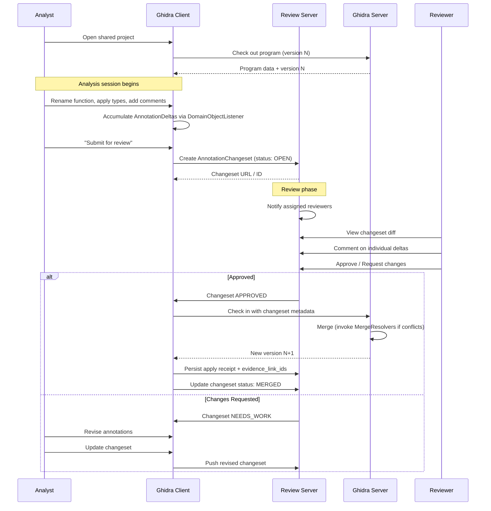
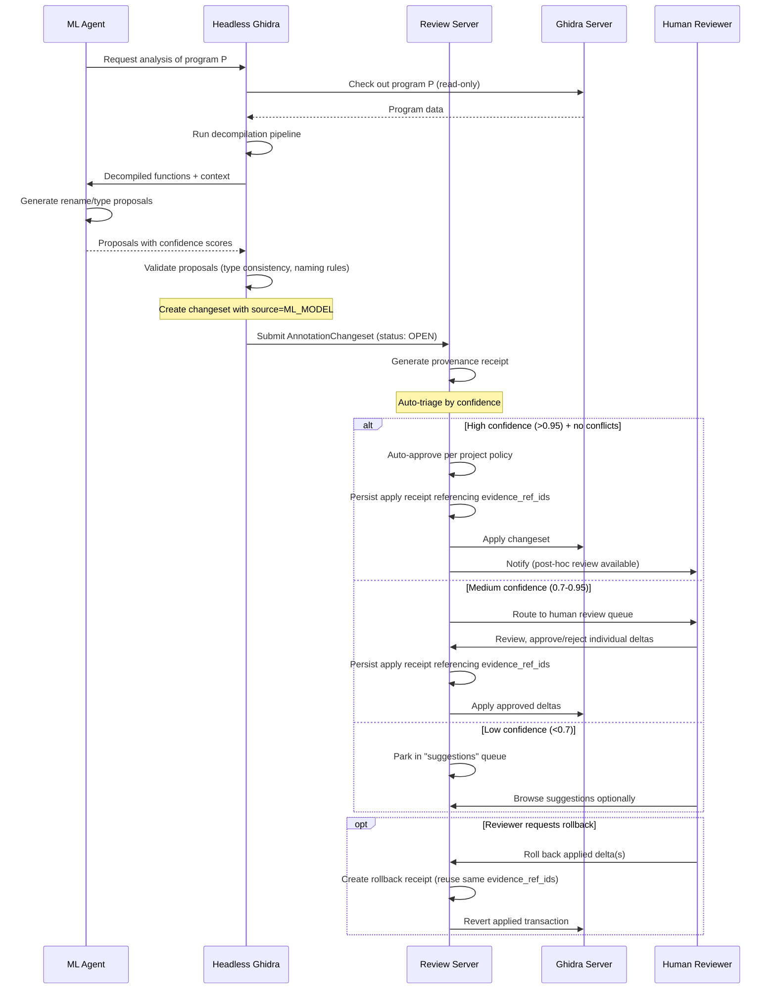
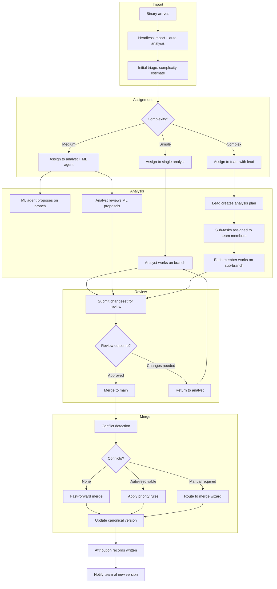

# Collaboration and Review Workflows for Reverse Engineering

This document designs a modern collaboration layer for Ghidra-based reverse engineering, drawing on the existing Ghidra Server merge framework, Binary Ninja Enterprise's snapshot model, and software engineering review practices. It covers changeset review, branching/merge semantics, conflict UX, attribution, workflow orchestration, and concrete Ghidra API extension points.

Verification note: Ghidra class paths and interface signatures in this document were verified against the repository checkout (2026-02-19). Re-verify if the upstream tree changes.

---

## 1. PR-Like Annotation Review Model

### The Problem

Ghidra Server's check-out/check-in model is the RE equivalent of CVS: you lock, edit, and push. There is no "propose and review" step. Every check-in is immediately canonical. This means:

- No pre-merge review of function renames, type applications, or comments
- No structured way for a senior analyst to approve a junior's annotations
- No mechanism for an ML agent to "propose" changes that a human must accept
- No changeset-scoped discussion or sign-off

### Changeset Structure for RE Annotations

An RE changeset is fundamentally different from a source code diff. Source diffs operate on lines of text. RE changesets operate on **typed artifacts bound to addresses**. We define an `AnnotationChangeset` as an ordered collection of `AnnotationDelta` records:

```
AnnotationChangeset {
  id:            UUID
  parent_version: int          // Ghidra version this is based on
  author:        AnalystIdentity
  created_at:    Timestamp
  title:         String        // "Renamed crypto functions in libssl"
  description:   String        // Markdown body
  status:        DRAFT | OPEN | APPROVED | MERGED | REJECTED
  deltas:        AnnotationDelta[]
  reviews:       Review[]
  evidence_refs: Map<UUID, EvidenceRef> // Canonical evidence refs keyed by stable ID
}

AnnotationDelta {
  delta_id:      UUID
  artifact_type: SYMBOL | DATA_TYPE | COMMENT | FUNCTION_SIG | MEMORY_REF | BOOKMARK | EQUATE
  address:       Address       // Ghidra Address (space + offset)
  scope:         AddressRange? // For range-scoped changes (e.g., function body)
  old_value:     ArtifactValue // Serialized previous state (null for additions)
  new_value:     ArtifactValue // Serialized new state (null for deletions)
  confidence:    float         // 0.0-1.0, relevant for ML-proposed changes
  source:        HUMAN | ML_MODEL | IMPORT | SCRIPT
  rationale:     String?       // "Matches known OpenSSL 1.1.1 pattern"
  evidence_link_ids: UUID[]    // Stable evidence_ref_id list for this proposal
}
```

### How Changesets Map to Ghidra's Transaction System

Ghidra already tracks changes through its transaction system. Every modification to a `Program` occurs within a transaction (`program.startTransaction()` / `program.endTransaction()`). The `ProgramChangeSet` interface (at `Ghidra/Framework/SoftwareModeling/src/main/java/ghidra/program/model/listing/ProgramChangeSet.java`) aggregates changes across multiple sub-interfaces:

| ProgramChangeSet Sub-Interface | What It Tracks |
|---|---|
| `AddressChangeSet` | Memory byte changes, code unit changes |
| `RegisterChangeSet` | Register context value changes |
| `DataTypeChangeSet` | Added/changed/removed data types |
| `ProgramTreeChangeSet` | Program tree (folder) changes |
| `SymbolChangeSet` | Symbol additions/changes/removals |
| `FunctionTagChangeSet` | Function tag changes |

The mapping from Ghidra transactions to our `AnnotationChangeset` model:

1. **Capture phase**: A `DomainObjectListener` (interface at `Ghidra/Framework/Project/src/main/java/ghidra/framework/model/DomainObjectListener.java`) is registered on the `Program`. It receives `DomainObjectChangedEvent` records for every modification.

2. **Accumulation phase**: Instead of immediately writing to the server, changes are accumulated into a local `AnnotationChangeset` object. The listener translates each `DomainObjectChangeRecord` into an `AnnotationDelta`, preserving the old value (read from the program state before the change) and the new value.

3. **Submission phase**: The analyst "opens" the changeset for review (status: DRAFT -> OPEN). At this point the changeset is serialized and pushed to a review service (separate from Ghidra Server's version control).

4. **Review phase**: Other analysts view the changeset as a structured diff (not a text diff), approve or request changes, and annotate individual deltas.

5. **Merge phase**: On approval, the changeset is applied to the canonical program version via Ghidra's existing check-in mechanism.

### Diffing RE Annotations vs. Diffing Source Code

| Dimension | Git PR (Source Code) | RE Changeset (Annotations) |
|---|---|---|
| **Unit of change** | Text line | Typed artifact at address |
| **Diff granularity** | Line-level, character-level | Per-artifact (symbol, type, comment) |
| **Context** | Surrounding lines of code | Decompiled function, xrefs, call graph |
| **Conflict detection** | Same line modified | Same artifact at same address modified |
| **Review visualization** | Side-by-side text diff | Listing view with highlighted changes, decompiler diff |
| **Merge strategy** | Three-way text merge | Per-artifact-type merge rules (see Section 2) |
| **Semantic validation** | CI/CD tests, linters | Type consistency checks, xref validity, naming conventions |

### Changeset Diff Rendering

The diff for an RE changeset should present changes in the context analysts actually work in:

- **Listing view diff**: A split-pane showing the base version listing alongside the proposed version, with changed addresses highlighted. Similar to Ghidra's existing `ListingMergePanel` (four-pane: Result/Latest/My/Original) but simplified for the review case (two-pane: Base/Proposed).
- **Decompiler diff**: Side-by-side decompiler output for affected functions, with renamed variables, changed types, and added comments highlighted inline.
- **Type diff**: Structural diff for modified data types (added fields, changed sizes, renamed members).
- **Summary table**: Grouped by artifact type, listing all deltas with before/after values.
- **Evidence drawer**: Per-delta expandable drawer keyed by `delta_id` that resolves stable `evidence_link_ids` and renders `xref`, `constant/string`, and `callsite` evidence with deep links.

### Evidence Drawer Data Contract (UI-219)

For each selected proposal delta:

1. Load `AnnotationDelta.evidence_link_ids`.
2. Resolve each ID in `AnnotationChangeset.evidence_refs`.
3. Render grouped evidence cards with:
   - stable `evidence_ref_id`
   - evidence kind (`XREF`, `CONSTANT`, `CALLSITE`, other)
   - short explanation + confidence
   - deep link target (`listing://`, `decompiler://`, `trace://`)

---

## 2. Branching and Merge Semantics for RE Databases

### Current State: Ghidra Server's Check-Out/Check-In

Ghidra's versioning is implemented in the DB framework (`Ghidra/Framework/DB/`). Key components:

- **`ManagedBufferFile`** (`db/buffers/ManagedBufferFile.java`): Adds versioning to the buffer file system. Tracks changes via `ChangeMap` and delta storage (only modified buffer pages are stored per version).
- **`VersionFile`** (`db/buffers/VersionFile.java`): Manages version metadata and change tracking between versions.
- **`ProgramMultiUserMergeManager`** (`ghidra/app/merge/ProgramMultiUserMergeManager.java`): Orchestrates the four-way merge (RESULT/LATEST/MY/ORIGINAL) when check-in conflicts are detected.

The current model is strictly linear: there is one canonical version history. Users check out the latest version, work locally, and check in. If someone else checked in while you were working, you must merge before your check-in succeeds.

### Proposed Branching Model

We propose adding lightweight named branches to Ghidra's versioning system:

```
main (canonical)
  ├── v1 ── v2 ── v3 ── v4 ── v5 (linear check-in history)
  │                │
  │                └── branch: "alice/crypto-analysis"
  │                      ├── b1: renamed SSL functions
  │                      ├── b2: applied struct types
  │                      └── b3: added protocol comments
  │
  └── branch: "agent/ml-renames-batch-7"
        └── b1: 847 ML-proposed function renames
```

**Branch semantics:**

| Operation | Behavior |
|---|---|
| **Create branch** | Snapshot the current `ManagedBufferFile` state; record parent version and branch name |
| **Commit to branch** | Normal Ghidra transaction + save, but versioned within the branch's file lineage |
| **Switch branch** | Close current program, open the branch's buffer file (branch files are separate `LocalManagedBufferFile` instances sharing the same base) |
| **Merge branch to main** | Invoke `ProgramMultiUserMergeManager` with branch-tip as MY and main-tip as LATEST |
| **Delete branch** | Remove branch buffer files; reclaim storage |
| **Fork from branch** | Create a new branch from an existing branch tip |

### Implementation Strategy: Branch as Managed Buffer File Fork

Ghidra's `ManagedBufferFile` already supports delta-based versioning. A branch can be implemented as:

1. **At branch creation**: Create a new `LocalManagedBufferFile` that starts as a copy of the base version's buffer file. Use `getForwardModMapData()` to efficiently track which pages diverge.
2. **During branch work**: The branch file accumulates its own version history (b1, b2, b3...) independently.
3. **At merge time**: The merge framework already handles four-way comparisons. The "ORIGINAL" is the branch point, "MY" is the branch tip, and "LATEST" is the main tip.

### Conflict Detection Across Artifact Types

The existing merge framework handles conflicts through eight specialized `MergeResolver` implementations. Each operates on a distinct artifact domain:

| MergeResolver | Artifact Type | Conflict Granularity | Can Auto-Merge? |
|---|---|---|---|
| `MemoryMergeManager` | Memory blocks, bytes | Block-level (add/remove/change) | Partially (non-overlapping block changes) |
| `ProgramTreeMergeManager` | Program tree folders | Folder path | Yes for non-conflicting paths |
| `DataTypeMergeManager` | Structs, enums, typedefs | Per data type (by path+name) | Yes if changes are complementary |
| `ProgramContextMergeManager` | Processor context registers | Address range | Replace-only |
| `FunctionTagMerger` | Function categorization tags | Per tag name | Yes (union of tags) |
| `ListingMergeManager` | Symbols, comments, functions, refs, equates, bookmarks | Per address / per artifact | Partially (comments can merge; symbols need choice) |
| `ExternalProgramMerger` | External symbols/refs | Per external symbol | Replace-only |
| `PropertyListMergeManager` | Program properties | Per property key | Replace-only |

The `ProgramMergeFilter` defines 18 primary difference types. Of these, only **comments** and **symbols** support true merge (multiple values can coexist). Everything else is replace-only, meaning conflicts require an explicit choice.

### Comparison with Binary Ninja Enterprise

| Feature | Ghidra Server | Binary Ninja Enterprise | Proposed Ghidra Extension |
|---|---|---|---|
| **Versioning model** | Check-out/check-in, linear history | Git-like snapshot commits | Branching + merge, similar to Git |
| **Branching** | Not supported | Implicit via snapshots | Explicit named branches |
| **Real-time sync** | No (batch check-in only) | Push/pull with auto-sync (30s default for type archives) | No (async review workflow) |
| **Conflict resolution** | Four-pane merge wizard | Left/right chooser dialog | Enhanced four-pane + priority rules |
| **Type archive sync** | Manual archive association | Automatic via enterprise server | Automatic with review gate |
| **Review workflow** | None | None (direct merge) | PR-like changeset review |
| **Attribution** | Version author only | Snapshot author | Per-delta author + evidence chain |

---

## 3. Conflict UX Patterns

### Three-Way Merge Visualization for RE Artifacts

Ghidra's existing `ListingMergePanel` provides a four-pane display (Result, Latest, My, Original) with synchronized scrolling. This is effective but overwhelming for non-expert users. We propose a layered approach:

**Layer 1: Summary Dashboard**
```
┌─────────────────────────────────────────────────┐
│  Merge: "alice/crypto-analysis" → main          │
│                                                 │
│  Conflicts: 7 total                             │
│  ┌──────────────┬───────┬────────────┐         │
│  │ Artifact Type│ Count │ Auto-Merged│         │
│  ├──────────────┼───────┼────────────┤         │
│  │ Symbols      │   3   │     0      │         │
│  │ Data Types   │   2   │     1      │         │
│  │ Comments     │   1   │     1      │         │
│  │ Functions    │   1   │     0      │         │
│  └──────────────┴───────┴────────────┘         │
│                                                 │
│  [Auto-resolve all by priority rules]           │
│  [Review each conflict]                         │
└─────────────────────────────────────────────────┘
```

**Layer 2: Per-Conflict Detail View**

For each conflict, show a three-way comparison:

```
┌─────────────────────────────────────────────────────────┐
│ Conflict 1/7: Symbol at 0x00401234                      │
│                                                         │
│ ┌─────────────┬─────────────┬──────────────┐           │
│ │  BASE (v3)  │ BRANCH (b3) │ MAIN (v5)    │           │
│ ├─────────────┼─────────────┼──────────────┤           │
│ │ FUN_00401234│ ssl_connect  │ init_tls     │           │
│ │ (auto-name) │ (alice, 0.95)│ (bob, 0.80) │           │
│ └─────────────┴─────────────┴──────────────┘           │
│                                                         │
│ Evidence:                                               │
│   Branch: "Matches OpenSSL 1.1.1 ssl_connect signature" │
│   Main:   "Generic TLS init pattern from ML model v3"   │
│                                                         │
│ ○ Keep branch (alice/ssl_connect)                       │
│ ○ Keep main (bob/init_tls)                              │
│ ○ Custom: [________________]                            │
│                                                         │
│ [Apply] [Skip] [Apply to all similar]                   │
└─────────────────────────────────────────────────────────┘
```

**Layer 3: Listing Context View**

For complex conflicts (e.g., overlapping function signature changes), fall back to the full four-pane listing merge view, enhanced with:
- Color-coded change highlighting per analyst
- Decompiler output alongside listing view
- Cross-reference context (callers/callees of the conflicting function)

### Priority Rules for Automatic Conflict Resolution

When conflicts arise, automatic resolution can apply priority rules to reduce manual work:

| Rule | Condition | Resolution |
|---|---|---|
| **Human over ML** | One delta is `source: HUMAN`, other is `source: ML_MODEL` | Keep human change |
| **High confidence over low** | Both ML-sourced, confidence differs by > 0.2 | Keep higher confidence |
| **Senior over junior** | Role-based priority configured per-project | Keep senior's change |
| **Recent over stale** | Both human, same confidence, timestamps differ by > 7 days | Keep more recent |
| **Addition over no-op** | One side adds a comment/bookmark, other side is unchanged | Keep the addition |
| **Specific over generic** | One rename is a specific library match, other is a generic pattern | Keep specific |

Priority rules should be **configurable per project** and **auditable** (every auto-resolution is logged with the rule that fired).

### Batch Conflict Resolution for ML-Generated Changes

When an ML agent proposes hundreds of changes (e.g., bulk function renames), reviewing each individually is impractical. We propose:

1. **Stratified sampling**: Group proposed changes by confidence tier. Show a sample from each tier for human review.
2. **Threshold-based auto-accept**: Changes above a configurable confidence threshold (e.g., 0.95) auto-merge if no conflict exists.
3. **Categorical accept/reject**: Allow "accept all symbol renames above 0.90 confidence" as a single action.
4. **Undo batch**: Any batch-applied ML changeset can be reverted as a single operation (leveraging Ghidra's undo transaction).

---

## 4. Attribution Schema

### Design Goals

Every annotation in the RE database should answer:
- **Who** made this change? (analyst identity, ML model identity)
- **When** was it made? (timestamp, relative to analysis session)
- **Why** was it made? (evidence, rationale, linked references)
- **How confident** are we? (for ML: model confidence; for humans: self-assessed certainty)
- **What provenance chain** produced it? (from raw binary through to final annotation)

### Schema Definition

```
AnalystIdentity {
  id:            UUID
  type:          HUMAN | ML_AGENT | SCRIPT | IMPORT
  display_name:  String          // "Alice Chen" or "GPT-4o-RE-v2"
  org_unit:      String?         // "Team Alpha" or "Reverend ML Pipeline"
  role:          SENIOR | ANALYST | JUNIOR | REVIEWER | AGENT
  auth_token:    String          // Ghidra Server auth or API key
}

AnnotationRecord {
  record_id:     UUID
  changeset_id:  UUID            // Links to parent AnnotationChangeset
  delta_id:      UUID            // Links to specific AnnotationDelta

  // Who
  author:        AnalystIdentity

  // When
  timestamp:     Timestamp       // UTC wall clock
  session_id:    UUID            // Groups changes from one analysis session
  transaction_id: long           // Ghidra transaction ID
  version:       int             // Ghidra program version

  // What
  artifact_type: ArtifactType    // SYMBOL, DATA_TYPE, COMMENT, etc.
  address:       Address
  old_value:     ArtifactValue?
  new_value:     ArtifactValue

  // Why
  confidence:    float           // 0.0 - 1.0
  rationale:     String?         // Free-text explanation
  evidence_link_ids: UUID[]      // Stable links to EvidenceRef records

  // Provenance
  parent_record: UUID?           // Previous annotation this supersedes
  derivation:    DerivationChain // How this annotation was produced
}

EvidenceRef {
  evidence_ref_id: UUID          // Stable identifier (deterministic from source tuple)
  type:          XREF | CONSTANT | CALLSITE | DYNAMIC_TRACE | ML_OUTPUT |
                 MANUAL_NOTE | LIBRARY_MATCH | BSIM_RESULT | FIDB_MATCH | EXTERNAL_DOC
  source_id:     String          // Stable source key ("xref:<program>:<from>:<to>:<type>", etc.)
  uri:           String          // "ghidra://trace/session-42/snap-7/0x401234"
                                 // "bsim://query/result-id-xyz"
                                 // "fidb://match/openssl-1.1.1/ssl_connect"
  description:   String
  confidence:    float?          // Evidence-specific confidence
  metadata:      Map<String, String>? // e.g. callsite args, constant operand index
}

DerivationChain {
  steps: DerivationStep[]
}

DerivationStep {
  order:         int
  action:        String          // "decompile", "ml_inference", "human_review", "script_run"
  actor:         AnalystIdentity
  timestamp:     Timestamp
  input_refs:    String[]        // What this step consumed
  output_refs:   String[]        // What this step produced
  tool_version:  String?         // "Ghidra 11.4", "reverend-ml v0.3.1"
  parameters:    Map<String, String>? // Model hyperparameters, script arguments
}
```

### Storage Strategy

Attribution data should not live inside Ghidra's program database directly (which would complicate the merge framework). Instead:

1. **Sidecar database**: A separate SQLite or PostgreSQL database keyed by `(program_id, address, artifact_type, version)`. This sidecar travels with the project but does not affect Ghidra's buffer file storage.

2. **Ghidra property integration**: Lightweight attribution (author + timestamp + confidence) can be stored as Ghidra program properties or bookmarks, which are already tracked by the merge framework.

3. **Full provenance on the review server**: The complete `DerivationChain` and `EvidenceRef` data lives on the collaboration server, indexed by `changeset_id` and `record_id`.

4. **Append-only proposal evidence links**: Store `proposal_evidence_link(delta_id, evidence_ref_id)` rows separately from artifact mutations. Apply and rollback operations reference these same IDs instead of creating replacement evidence rows.

### Apply/Rollback Evidence Integrity Rules

1. Applying a proposal must persist `evidence_link_ids` into the apply receipt.
2. Rolling back an applied proposal must reference the original apply receipt's `evidence_link_ids`.
3. Evidence link rows are immutable; rollback changes proposal/apply state, not evidence identity.
4. Review UI drawer resolves evidence only from `delta_id -> evidence_link_ids`, so evidence remains inspectable after apply/rollback.

### Provenance Chain Example

For an ML-proposed function rename:

```
Step 1: Binary imported
  actor: import_script
  action: "import"
  output: program://firmware.gzf

Step 2: Auto-analysis
  actor: ghidra_auto_analyzer
  action: "analyze"
  input: program://firmware.gzf
  output: [functions, xrefs, disassembly]

Step 3: Decompilation
  actor: ghidra_decompiler
  action: "decompile"
  input: function@0x00401234
  output: decompiled_c://0x00401234

Step 4: ML inference
  actor: reverend-ml-v0.3.1
  action: "ml_inference"
  input: decompiled_c://0x00401234
  output: {rename: "ssl_connect", confidence: 0.93}
  parameters: {model: "func-namer-v3", temperature: 0.1}

Step 5: Human review
  actor: alice
  action: "human_review"
  input: {rename: "ssl_connect", confidence: 0.93}
  output: {rename: "ssl_connect", confidence: 0.93, status: APPROVED}
  rationale: "Confirmed via cross-reference to known OpenSSL build"
```

---

## 5. Workflow Diagrams

### Analyst Workflow: Checkout, Annotate, Review, Merge



### Automated Agent Workflow: Propose, Receipt, Review, Apply



### Team Triage Workflow



---

## 6. Ghidra API Extension Points

### Existing Classes to Extend

#### DomainObjectListener (Change Capture)

**File**: `Ghidra/Framework/Project/src/main/java/ghidra/framework/model/DomainObjectListener.java`

```java
public interface DomainObjectListener extends EventListener {
    public void domainObjectChanged(DomainObjectChangedEvent ev);
}
```

**Extension**: Implement a `ChangesetCapturingListener` that intercepts all program change events and serializes them into `AnnotationDelta` records. Use the `DomainObjectListenerBuilder` pattern (at `Ghidra/Framework/Project/src/main/java/ghidra/framework/model/DomainObjectListenerBuilder.java`) for event routing.

```java
// Proposed extension
public class ChangesetCapturingListener implements DomainObjectListener {
    private AnnotationChangeset currentChangeset;

    @Override
    public void domainObjectChanged(DomainObjectChangedEvent ev) {
        for (DomainObjectChangeRecord rec : ev) {
            AnnotationDelta delta = translateToDelta(rec);
            if (delta != null) {
                currentChangeset.addDelta(delta);
            }
        }
    }

    private AnnotationDelta translateToDelta(DomainObjectChangeRecord rec) {
        // Map ProgramEvent types to AnnotationDelta artifact types
        // SYMBOL_ADDED/CHANGED/REMOVED -> SYMBOL deltas
        // DATA_TYPE_ADDED/CHANGED/REMOVED -> DATA_TYPE deltas
        // COMMENT_CHANGED -> COMMENT deltas
        // etc.
    }
}
```

#### ManagedBufferFile (Branch Storage)

**File**: `Ghidra/Framework/DB/src/main/java/db/buffers/ManagedBufferFile.java`

Key methods for branch support:
- `getForwardModMapData(int oldVersion)` -- returns a bitmap of modified buffers since a given version. This is the foundation for efficient branch diffing.
- `getSaveFile()` / `saveCompleted(boolean commit)` -- save lifecycle that would need to be branch-aware.
- `getCheckinID()` -- would need to encode branch identity.

**Extension**: Wrap `LocalManagedBufferFile` with a `BranchedBufferFile` that adds branch metadata (branch name, parent version, parent branch).

#### MergeResolver (Conflict Resolution)

**File**: `Ghidra/Features/Base/src/main/java/ghidra/app/merge/MergeResolver.java`

```java
public interface MergeResolver {
    public String getName();
    public String getDescription();
    public void apply();
    public void cancel();
    public void merge(TaskMonitor monitor) throws Exception;
    public String[][] getPhases();
}
```

**Extension**: Create a `ReviewAwareMergeResolver` wrapper that intercepts conflict resolution decisions and routes them to the review server when the merge is happening in a review context (as opposed to a direct check-in).

#### ProgramMultiUserMergeManager (Merge Orchestration)

**File**: `Ghidra/Features/Base/src/main/java/ghidra/app/merge/ProgramMultiUserMergeManager.java`

This class orchestrates the eight merge resolvers in sequence. Its `createMergeResolvers()` method instantiates:

1. `MemoryMergeManager`
2. `ProgramTreeMergeManager`
3. `DataTypeMergeManager`
4. `ProgramContextMergeManager`
5. `FunctionTagMerger`
6. `ListingMergeManager`
7. `ExternalProgramMerger`
8. `PropertyListMergeManager`

**Extension**: Subclass or wrap `ProgramMultiUserMergeManager` to:
- Inject priority-based auto-resolution rules before presenting conflicts to the user
- Record all resolution decisions to the attribution database
- Support headless/non-interactive merge (for CI/CD and ML agent workflows)

#### ProgramChangeSet (Change Tracking)

**File**: `Ghidra/Framework/SoftwareModeling/src/main/java/ghidra/program/model/listing/ProgramChangeSet.java`

This interface aggregates `AddressChangeSet`, `SymbolChangeSet`, `DataTypeChangeSet`, and others. It provides methods like `getAddressSetCollectionSinceCheckout()` and `getAddressSetCollectionSinceLastSave()`.

**Extension**: Enhance `ProgramChangeSet` implementations to also record per-change metadata (author, timestamp, confidence) alongside the address/type tracking they already do.

### New Interfaces Needed

#### AnnotationChangesetService

A Ghidra service (registered via `@PluginInfo`) that manages changeset lifecycle:

```java
public interface AnnotationChangesetService {
    // Changeset lifecycle
    AnnotationChangeset createChangeset(Program program, String title);
    void openForReview(AnnotationChangeset cs);
    void updateChangeset(AnnotationChangeset cs);
    MergeResult mergeChangeset(AnnotationChangeset cs, Program target);

    // Query
    List<AnnotationChangeset> getPendingReviews(Program program);
    List<AnnotationChangeset> getChangesetHistory(Program program);
    AnnotationChangeset getChangeset(UUID id);
    List<EvidenceRef> getEvidenceForDelta(UUID changesetId, UUID deltaId);
    void attachEvidenceLinks(UUID changesetId, UUID deltaId, List<UUID> evidenceRefIds);

    // Capture control
    void startCapturing(Program program); // Begin recording changes
    void stopCapturing(Program program);  // Stop recording
    AnnotationChangeset getCapturedChanges(Program program);
}
```

#### ReviewService

A remote service interface for the collaboration server:

```java
public interface ReviewService {
    // Review lifecycle
    void submitForReview(AnnotationChangeset cs);
    void addReview(UUID changesetId, Review review);
    void updateStatus(UUID changesetId, ChangesetStatus status);

    // Review queries
    List<Review> getReviews(UUID changesetId);
    List<AnnotationChangeset> getReviewQueue(AnalystIdentity reviewer);
    List<EvidenceRef> getEvidenceForDelta(UUID changesetId, UUID deltaId);
    List<UUID> getReceiptEvidenceLinks(UUID receiptId);

    // Attribution
    void recordAttribution(AnnotationRecord record);
    List<AnnotationRecord> getAttributionHistory(Address addr, ArtifactType type);
    DerivationChain getProvenance(UUID recordId);
}
```

#### BranchManager

A service for managing analysis branches:

```java
public interface BranchManager {
    // Branch lifecycle
    Branch createBranch(Program program, String name);
    void deleteBranch(Branch branch);
    Branch getBranch(String name);
    List<Branch> listBranches(Program program);

    // Branch operations
    Program checkoutBranch(Branch branch);
    void commitToBranch(Branch branch, String message);
    MergeResult mergeBranch(Branch source, Branch target);

    // Diff
    BranchDiff diffBranches(Branch a, Branch b);
    BranchDiff diffBranchToMain(Branch branch);
}
```

#### ConflictPolicy

A configurable policy for automatic conflict resolution:

```java
public interface ConflictPolicy {
    // Given a conflict, return a resolution or null if manual resolution needed
    ConflictResolution autoResolve(MergeConflict conflict);

    // Priority rules
    int getPriority(AnalystIdentity identity);
    float getMinAutoApproveConfidence();
    boolean preferHumanOverMl();
    boolean preferRecentOverStale(Duration threshold);
}
```

### Prototype Plugin Architecture

A minimal collaboration plugin would consist of:

```
ghidra_scripts/
  collaboration/
    CollaborationPlugin.java          // Main plugin, provides AnnotationChangesetService
    ChangesetCapturingListener.java   // DomainObjectListener implementation
    ChangesetPanel.java               // UI for viewing/managing changesets
    ReviewPanel.java                  // UI for reviewing proposed changes
    EvidenceDrawerPanel.java          // Per-delta evidence inspection (xref/constant/callsite)
    AttributionPanel.java            // UI for viewing annotation provenance
    BranchManagerImpl.java           // Branch management implementation
    ReviewServiceClient.java          // HTTP client for review server
    ConflictPolicyConfig.java         // Configurable auto-resolution rules
```

The plugin would:

1. Register as a `Plugin` with `@PluginInfo(servicesProvided = {AnnotationChangesetService.class})`
2. On program open: attach a `ChangesetCapturingListener` to the program
3. Provide toolbar actions: "New Changeset", "Submit for Review", "View Review Queue"
4. Provide dockable panels showing current changeset deltas and per-delta evidence links
5. On merge: wrap `ProgramMultiUserMergeManager` to inject attribution recording and priority rules

### Server-Side Components

The collaboration server (outside Ghidra, implemented as a standalone service) would provide:

- **REST API** for changeset CRUD, review management, and attribution queries
- **Notification system** (webhooks, email) for review assignments and status changes
- **Storage** for changeset metadata, reviews, and full provenance chains (PostgreSQL)
- **Policy engine** for auto-resolution rules and confidence thresholds
- **Dashboard** for team leads to view analysis progress, review backlogs, and attribution reports

---

## Comparison Tables

### RE Collaboration Tools: Feature Comparison

| Feature | Ghidra Server (Current) | Binary Ninja Enterprise | IDArling | CollaRE | Proposed System |
|---|---|---|---|---|---|
| **Multi-user** | Yes (check-in/out) | Yes (push/pull) | Yes (real-time) | Yes (export/import) | Yes (branch + review) |
| **Branching** | No | Implicit (snapshots) | No | No | Yes (explicit named branches) |
| **Review workflow** | No | No | No | No | Yes (PR-like changesets) |
| **Conflict resolution** | Four-pane merge wizard | Left/right chooser | Last-write-wins | Manual | Priority-rule + four-pane |
| **Attribution** | Version author only | Snapshot author | None | None | Per-delta author + provenance |
| **ML integration** | None | None | None | None | Confidence-gated auto-merge |
| **Real-time sync** | No | Push/pull with polling | Yes | No | No (async by design) |
| **Cross-tool** | No | No | No | Yes (IDA+Ghidra+BN) | Extensible via export format |
| **Self-hosted** | Yes | Yes (enterprise server) | Yes | Yes | Yes |
| **Type archive sync** | Manual | Automatic (30s polling) | N/A | N/A | Review-gated automatic |

### Merge Semantics: What Can Be Auto-Merged

| Artifact Type | Non-Conflicting Merge | Conflicting Merge | Auto-Resolution Possible? |
|---|---|---|---|
| **Comments** (all types) | Union of both sides | Same address, different text | Yes: concatenate or priority-pick |
| **Symbols** | Union if different addresses | Same address, different names | Yes: confidence/priority rules |
| **Data types** | Union if different names | Same path+name, different fields | Partial: complementary field additions |
| **Function signatures** | Independent functions | Same function, different params | No: requires human judgment |
| **Memory bytes** | Non-overlapping ranges | Same byte range, different values | No: domain-specific |
| **References** | Union of new refs | Same ref source, different targets | No: requires analysis context |
| **Bookmarks** | Union | Same address, different text | Yes: keep both |
| **Equates** | Union | Same address, different value | No: requires context |

---

## Key Takeaways

1. **RE collaboration is where software development was before Git.** Current tools (Ghidra Server, BN Enterprise) provide multi-user access but lack the review, branching, and attribution primitives that make modern software collaboration productive. The gap is not in concurrent access but in structured review and provenance.

2. **Changesets must be artifact-typed, not text-diffed.** RE annotations are structured objects (symbols, types, comments) bound to addresses, not lines of text. The review system must diff, display, and merge these artifacts at the appropriate semantic granularity, leveraging Ghidra's existing `ProgramChangeSet` infrastructure.

3. **Ghidra's merge framework is a strong foundation.** The eight `MergeResolver` implementations and four-way merge model already handle the hard problem of conflict detection across disparate artifact types. Extending this framework (rather than replacing it) minimizes risk and leverages battle-tested code.

4. **ML agents need a first-class workflow path.** As ML-assisted RE becomes standard, the collaboration system must handle high-volume, confidence-scored proposals with batch review, auto-approval thresholds, and full provenance chains. The review model should treat ML agents as team members with lower default authority, not as opaque black boxes.

5. **Attribution is the missing primitive.** Current tools track "who checked in version N" but not "who renamed this function, based on what evidence, with what confidence." Per-delta attribution with evidence links is essential for trust, audit, and learning. A sidecar database approach avoids perturbing Ghidra's existing storage model.

6. **Branching enables exploratory analysis.** Analysts often pursue speculative hypotheses (is this malware family X or Y?). Branches let analysts explore without polluting the canonical analysis. The merge-back path uses Ghidra's existing `ProgramMultiUserMergeManager` with ORIGINAL = branch point.

7. **Async-first design is correct for RE.** Unlike software development (where CI provides rapid feedback), RE analysis is inherently slow and asynchronous. Real-time sync (as in IDArling) is a nice-to-have but not the primary need. The review workflow should optimize for thoughtful, evidence-backed annotation review rather than live co-editing.

8. **Conflict UX must be layered.** Show a summary dashboard first, then per-conflict detail, then full listing merge view. Priority rules should handle the easy cases automatically, reserving human attention for genuinely ambiguous conflicts. The existing `ListingMergePanel` four-pane view is effective for the hardest cases but should not be the default entry point.

9. **Prototype with a Ghidra plugin + external review server.** The most practical path is: (a) a Ghidra plugin implementing `ChangesetCapturingListener` and `AnnotationChangesetService`, (b) an external review server with REST API and web dashboard, (c) a headless integration for ML agent workflows. This avoids forking Ghidra's core while proving the collaboration model.

---

## References and Sources

- Ghidra source repository (this checkout): merge framework at `Ghidra/Features/Base/src/main/java/ghidra/app/merge/`, DB versioning at `Ghidra/Framework/DB/src/main/java/db/buffers/`
- [Binary Ninja Enterprise documentation](https://docs.binary.ninja/guide/enterprise/index.html)
- [Binary Ninja collaboration.merge API (v5.0)](https://api.binary.ninja/binaryninja.collaboration.merge-module.html)
- [Binary Ninja collaboration.snapshot API (v5.1)](https://api.binary.ninja/binaryninja.collaboration.snapshot-module.html)
- [Collaborative Reverse Engineering with Ghidra Server (byte.how)](https://byte.how/posts/collaborative-reverse-engineering/)
- [CollaRE: Multi-tool RE collaboration (GitHub)](https://github.com/Martyx00/CollaRE)
- [reAnalyst: Scalable Annotation of RE Activities (arXiv 2406.04427)](https://arxiv.org/abs/2406.04427)
- [VS Code three-way merge UX exploration (Issue #146091)](https://github.com/microsoft/vscode/issues/146091)
- [Binary Ninja 5.2 release notes](https://binary.ninja/2025/11/13/binary-ninja-5.2-io.html)
