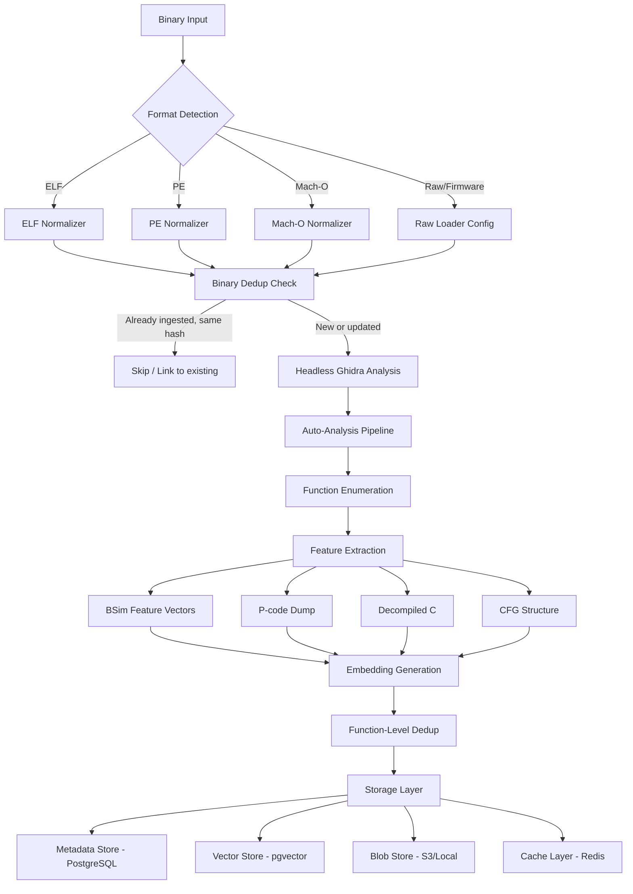
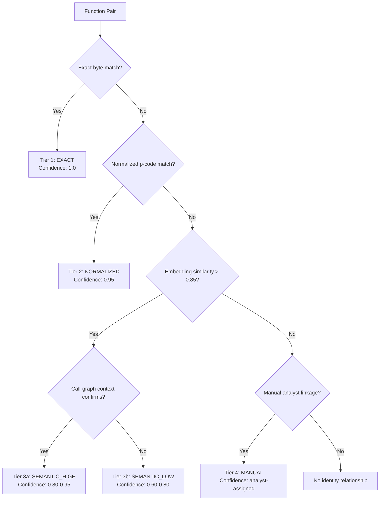
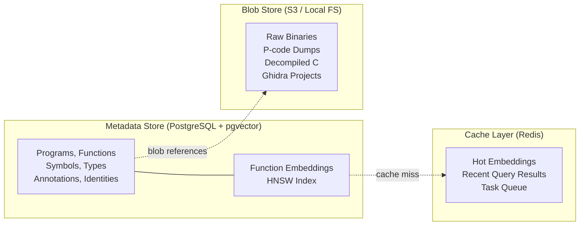
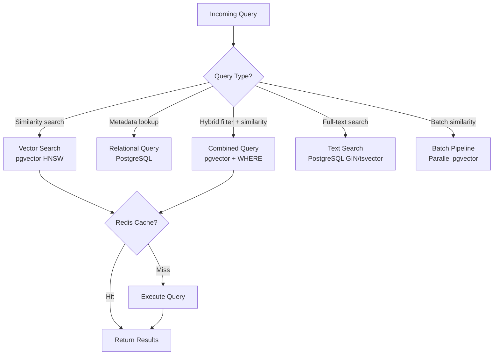

# Corpus-Scale Knowledge Base: Operational Architecture

This document specifies the concrete operational architecture for a corpus-scale binary function knowledge base (KB). The KB stores function-level metadata, embeddings, and analyst annotations across large binary corpora, enabling similarity search, cross-binary identity tracking, version evolution analysis, and collaborative knowledge reuse.

The design builds on Ghidra's existing BSim infrastructure (p-code feature vectors, PostgreSQL/Elasticsearch backends) and extends it with modern vector search, structured deduplication, and a cross-binary identity model.

Verification note (as of 2026-02-19): throughput targets, storage estimates, and vector-index sizing assumptions are design-time estimates and should be validated against your corpus, hardware profile, and model stack before implementation.

---

## 1. Ingestion Pipeline

### Overview

Binaries enter the KB through a multi-stage pipeline: format detection, headless Ghidra analysis, feature extraction, embedding generation, deduplication, and storage. The pipeline supports both batch import (initial corpus population) and incremental updates (new binaries or re-analysis).

### Pipeline Diagram



### Stage Details

**Format Detection and Normalization.** Incoming binaries are classified by format (ELF, PE, Mach-O, raw/firmware). Each format normalizer extracts header metadata (architecture, endianness, compiler hints, section layout, import/export tables) and produces a canonical representation for Ghidra import. For firmware blobs without standard headers, the pipeline accepts user-supplied loader configuration (processor ID, base address, entry points).

**Binary-Level Dedup.** Before analysis, the pipeline computes a SHA-256 hash of the raw binary. If an identical binary already exists in the KB, the pipeline skips re-analysis and creates a reference link (different source/context pointing to the same analyzed program). For "near-duplicate" binaries (same program, different build metadata), a fuzzy check compares section hashes; if code sections match, the pipeline links to the existing analysis and only ingests differing metadata.

**Headless Ghidra Analysis.** The binary is imported into a Ghidra project via `analyzeHeadless` with appropriate processor language and compiler spec. Auto-analysis runs all registered analyzers (format parsing, disassembly, function creation, reference recovery, FID matching, data type propagation). A per-binary timeout (configurable, default 10 minutes for binaries under 10 MB, scaling linearly) prevents unbounded analysis.

**Feature Extraction.** A post-analysis Ghidra script iterates all functions and extracts:
- **BSim feature vectors**: via `GenerateSignatures` using the `"normalize"` simplification style
- **P-code operations**: serialized high p-code op sequences per function (opcode + operand structure)
- **Decompiled C**: via `DecompInterface` with `"decompile"` style for LLM-based embedding models
- **CFG structure**: basic block graph (nodes = block indices, edges = control flow)
- **Metadata**: function address, size (bytes and p-code ops), calling convention, parameter count, string references, import references, computed FID hash

**Embedding Generation.** Function features are passed through one or more embedding models to produce fixed-dimensional vectors. The architecture supports pluggable embedding backends:
- **BSim native**: LSH-based feature vectors (already produced by Ghidra). Sparse, variable-dimension.
- **Neural embeddings**: Dense vectors from models like SAFE (128-d), jTrans (256-d), VexIR2Vec (256-d), or EBM (768-d). The default model produces 256-dimensional float32 vectors (1,024 bytes per function).

**Function-Level Dedup.** After embedding, each function is checked for exact duplicates (same normalized byte hash) and near-duplicates (embedding cosine similarity > 0.99). Exact duplicates are merged into a single canonical entry with back-references to all containing binaries. Near-duplicates are linked but kept as separate entries.

### Batch Import Pattern

For initial corpus population (thousands of binaries), the pipeline runs as a distributed job:

1. A task queue (Redis-backed) holds binary paths to process
2. Worker nodes (each running a headless Ghidra instance) pull binaries from the queue
3. Each worker produces a JSON-lines output file with extracted features
4. A coordinator process reads completed outputs, generates embeddings (GPU batch), and writes to storage
5. Workers are stateless; failed jobs are re-queued after timeout

**Target throughput**: 10-50 binaries/hour per worker (depending on binary size and complexity). A 16-worker cluster processes ~200-800 binaries/hour. A 1,000-binary corpus completes in 1-5 hours; 100K binaries in 5-20 days.

### Incremental Updates

New binaries are submitted to the same pipeline but bypass the batch coordinator. The pipeline checks for binary-level dedup, performs analysis, extracts features, and writes to storage. A changelog table records all incremental additions with timestamps for downstream consumers.

Re-analysis (e.g., after Ghidra version upgrade or model change) is triggered by marking affected programs as "stale" in the metadata store. A background job re-processes stale programs in priority order (most-queried first).

### Triage Calibration Loop (E5-S3)

The KB ingestion/evaluation loop now includes a versioned triage benchmark used to calibrate mission scoring thresholds:

- Benchmark fixture: `scripts/ml/fixtures/triage_benchmark_v2026_02_1.json`
- Calibration command: `python3 scripts/ml/local_embedding_pipeline.py triage-calibrate --benchmark scripts/ml/fixtures/triage_benchmark_v2026_02_1.json`
- Baseline thresholds: `entrypoint=0.45`, `hotspot=0.30`, `unknown=0.55`
- Calibrated thresholds: `entrypoint=0.30`, `hotspot=0.25`, `unknown=0.65`

Measured improvement on the curated benchmark (2026-02-20):

| Metric | Baseline | Calibrated |
|---|---:|---:|
| Macro F1 | 0.848677 | 0.969697 |
| Entrypoint recall | 0.666667 | 1.000000 |
| Hotspot recall | 0.800000 | 1.000000 |
| Unknown precision | 0.750000 | 1.000000 |

This closes the tuning loop between stored corpus evidence and triage output quality, while keeping benchmark versions explicit and reproducible.

---

## 2. Deduplication and Versioning

### Function-Level Deduplication

Functions are deduplicated at three tiers:

**Tier 1: Exact byte match.** Functions with identical normalized bytes (after masking relocatable operands, per FID/WARP methodology) share a single canonical hash. The hash computation follows WARP's approach: zero relocatable operands, exclude NOPs and semantic-NOP instructions, concatenate processed bytes, compute SHA-256. Functions with the same hash are considered identical regardless of their containing binary.

**Tier 2: Normalized match.** Functions with different raw bytes but identical high p-code (after BSim normalization) are linked as "p-code equivalent." This captures cross-compiler and cross-optimization matches where instruction selection differs but data-flow is identical. These share a `pcode_hash` computed over the normalized p-code op sequence.

**Tier 3: Semantic similarity.** Functions with embedding cosine similarity above a configurable threshold (default 0.95) but different p-code hashes are linked as "semantically similar." These represent behaviorally equivalent functions with structural differences (e.g., loop unrolling, inlining variations).

### Dedup Data Model

```
canonical_function
  id: UUID (primary key)
  byte_hash: CHAR(64)       -- SHA-256 of normalized bytes
  pcode_hash: CHAR(64)      -- SHA-256 of normalized p-code sequence
  representative_binary_id: UUID  -- one binary chosen as the "canonical" source
  function_size_bytes: INT
  pcode_op_count: INT
  created_at: TIMESTAMP

function_instance
  id: UUID (primary key)
  canonical_id: UUID         -- FK to canonical_function
  binary_id: UUID            -- FK to program
  address: BIGINT            -- address within the binary
  raw_byte_hash: CHAR(64)   -- hash before normalization
  dedup_tier: ENUM(exact, normalized, semantic)
  similarity_score: FLOAT    -- 1.0 for exact, computed for others
```

### Version Tracking

When the same logical function evolves across binary releases, the KB tracks version chains:

**Version chain model.** A `function_version_chain` links canonical functions that represent the same logical function across releases of the same program. Chain membership is established by:
1. Symbol name matching (if available) across program versions
2. Address stability (same offset in successive builds, common for incremental compilation)
3. High embedding similarity (>0.8) combined with call-graph context (same callers/callees)

```
function_version_chain
  id: UUID
  program_family: VARCHAR    -- e.g., "openssl", "libcurl"
  symbol_name: VARCHAR       -- canonical name if known
  created_at: TIMESTAMP

function_version_link
  chain_id: UUID             -- FK to function_version_chain
  canonical_function_id: UUID
  version_label: VARCHAR     -- e.g., "1.1.1k", "3.0.0"
  source_commit: VARCHAR     -- git commit SHA if known
  ordinal: INT               -- ordering within the chain
```

**Source commit linkage.** Where debug info or build metadata provides source commit SHAs, these are stored and used to correlate function changes with source diffs. The KB does not store source code, only commit references.

**Semantic dedup across versions.** When a function changes behavior across versions (different p-code, different embedding), both versions are kept as separate canonical functions linked in the version chain. The chain records the evolution, enabling queries like "show how `SSL_read` changed from OpenSSL 1.1.1 to 3.0."

---

## 3. Cross-Binary Identity Model

### The Problem

"The same function" can appear in different binaries compiled with different compilers, optimization levels, and target architectures. The identity model defines what "same" means at each confidence level.

### Identity Hierarchy



### Tier Definitions

| Tier | Name | Method | Confidence | False Positive Rate |
|------|------|--------|------------|---------------------|
| 1 | EXACT | Normalized byte hash match (FID/WARP style) | 1.0 | ~0% |
| 2 | NORMALIZED | P-code hash match after BSim normalization | 0.95 | <1% for non-trivial functions |
| 3a | SEMANTIC_HIGH | Embedding similarity > 0.85 + call-graph confirmation | 0.80-0.95 | ~2-5% |
| 3b | SEMANTIC_LOW | Embedding similarity > 0.70, no call-graph confirmation | 0.60-0.80 | ~10-20% |
| 4 | MANUAL | Analyst-created linkage with evidence notes | Analyst-assigned | N/A |

### Cross-Architecture Identity

For cross-architecture matching (e.g., x86 vs ARM builds of the same library), Tiers 1 and 2 cannot apply (different bytes, different raw p-code due to ISA differences). Identity relies on:

- **Tier 2 (extended)**: BSim's normalized p-code features, which abstract away register allocation and calling conventions, can match across architectures. BSim similarity > 0.7 with significance > 10.0 indicates cross-architecture match.
- **Tier 3**: Architecture-neutral embeddings (VexIR2Vec on VEX-IR, or models trained on normalized p-code) provide cross-architecture similarity scores.
- **Call-graph fingerprinting**: Even across architectures, the call graph structure (which functions call which) is largely preserved. A function's "call-graph signature" (sorted hashes of caller/callee names or embeddings) serves as a disambiguation signal.

### Identity Store Schema

```
function_identity
  id: UUID
  tier: ENUM(exact, normalized, semantic_high, semantic_low, manual)
  confidence: FLOAT
  function_a_id: UUID        -- FK to canonical_function
  function_b_id: UUID        -- FK to canonical_function
  evidence: JSONB            -- serialized evidence (similarity score, matching callees, analyst notes)
  created_by: VARCHAR        -- 'pipeline', 'analyst:<username>', 'model:<model_name>'
  created_at: TIMESTAMP

  UNIQUE(function_a_id, function_b_id)
```

---

## 4. Storage Architecture

### Overview

The storage layer uses four complementary stores, each optimized for its access pattern:



### Why PostgreSQL + pgvector (Not a Separate Vector DB)

The architecture co-locates vector search with relational metadata in PostgreSQL using the pgvector extension, rather than deploying a separate vector database (Qdrant, Milvus). Rationale:

1. **Unified queries.** Most useful queries combine vector similarity with metadata filters ("find functions similar to X that are in ARM binaries and have import references to `malloc`"). With pgvector, this is a single SQL query with WHERE clauses. With a separate vector DB, it requires a two-phase lookup and client-side join.

2. **Operational simplicity.** One database to back up, monitor, and scale. The KB is a research/analysis tool, not a web-scale search engine.

3. **Performance is sufficient.** pgvector 0.8+ with HNSW indexing handles up to ~50M vectors at sub-100ms query latency with 99% recall. At 256 dimensions (our default), this covers corpora up to ~5M functions per index partition. pgvectorscale extends this to 50M+ vectors at 471 QPS.

4. **BSim compatibility.** Ghidra's BSim already uses PostgreSQL as a backend. Co-locating the KB in the same PostgreSQL instance enables direct joins between BSim signatures and KB metadata.

**When to add a dedicated vector store**: If the corpus exceeds ~50M functions or if sub-10ms vector search latency is required, deploy Qdrant as a secondary index alongside PostgreSQL. The architecture supports this via the query routing layer.

### PostgreSQL Schema

```sql
-- Programs (binaries)
CREATE TABLE programs (
    id              UUID PRIMARY KEY DEFAULT gen_random_uuid(),
    sha256          CHAR(64) NOT NULL UNIQUE,
    filename        VARCHAR(512),
    format          VARCHAR(16) NOT NULL,  -- 'ELF', 'PE', 'MACHO', 'RAW'
    architecture    VARCHAR(32) NOT NULL,  -- 'x86_64', 'ARM', 'AARCH64', 'MIPS', etc.
    endianness      VARCHAR(8) NOT NULL,   -- 'LE', 'BE'
    compiler        VARCHAR(64),           -- 'GCC 12.2', 'MSVC 19.3', etc.
    optimization    VARCHAR(8),            -- 'O0', 'O1', 'O2', 'O3', 'Os'
    program_family  VARCHAR(256),          -- e.g., 'openssl', 'busybox'
    version_label   VARCHAR(128),
    file_size_bytes BIGINT NOT NULL,
    function_count  INT,
    blob_path       VARCHAR(1024),         -- path in blob store
    ghidra_project  VARCHAR(1024),         -- path to .gzf
    ingested_at     TIMESTAMP DEFAULT now(),
    analyzed_at     TIMESTAMP,
    status          VARCHAR(16) DEFAULT 'pending'  -- 'pending','analyzing','ready','stale','error'
);

CREATE INDEX idx_programs_family ON programs(program_family);
CREATE INDEX idx_programs_arch ON programs(architecture);
CREATE INDEX idx_programs_status ON programs(status);

-- Functions
CREATE TABLE functions (
    id                  UUID PRIMARY KEY DEFAULT gen_random_uuid(),
    program_id          UUID NOT NULL REFERENCES programs(id),
    canonical_id        UUID REFERENCES canonical_functions(id),
    address             BIGINT NOT NULL,
    name                VARCHAR(512),          -- symbol name if known
    byte_hash           CHAR(64) NOT NULL,     -- SHA-256 of normalized bytes
    pcode_hash          CHAR(64),              -- SHA-256 of normalized p-code
    size_bytes          INT NOT NULL,
    pcode_op_count      INT,
    basic_block_count   INT,
    calling_convention  VARCHAR(32),
    parameter_count     INT,
    has_variadic_args   BOOLEAN DEFAULT FALSE,
    is_thunk            BOOLEAN DEFAULT FALSE,
    is_library          BOOLEAN DEFAULT FALSE,
    fid_match           VARCHAR(256),          -- FID database match if any
    bsim_self_sig       FLOAT,                 -- BSim self-significance
    embedding           vector(256),           -- pgvector column, default 256-d
    created_at          TIMESTAMP DEFAULT now(),

    UNIQUE(program_id, address)
);

CREATE INDEX idx_functions_program ON functions(program_id);
CREATE INDEX idx_functions_bytehash ON functions(byte_hash);
CREATE INDEX idx_functions_pcodehash ON functions(pcode_hash);
CREATE INDEX idx_functions_canonical ON functions(canonical_id);
CREATE INDEX idx_functions_name ON functions(name) WHERE name IS NOT NULL;

-- HNSW vector index for similarity search
CREATE INDEX idx_functions_embedding ON functions
    USING hnsw (embedding vector_cosine_ops)
    WITH (m = 24, ef_construction = 200);

-- Canonical functions (dedup representatives)
CREATE TABLE canonical_functions (
    id                      UUID PRIMARY KEY DEFAULT gen_random_uuid(),
    byte_hash               CHAR(64) NOT NULL,
    pcode_hash              CHAR(64),
    representative_func_id  UUID,   -- FK to functions.id (set after first insert)
    instance_count          INT DEFAULT 1,
    first_seen_at           TIMESTAMP DEFAULT now()
);

CREATE UNIQUE INDEX idx_canonical_bytehash ON canonical_functions(byte_hash);

-- Cross-binary identity relationships
CREATE TABLE function_identities (
    id              UUID PRIMARY KEY DEFAULT gen_random_uuid(),
    function_a_id   UUID NOT NULL REFERENCES canonical_functions(id),
    function_b_id   UUID NOT NULL REFERENCES canonical_functions(id),
    tier            VARCHAR(16) NOT NULL,  -- 'exact','normalized','semantic_high','semantic_low','manual'
    confidence      FLOAT NOT NULL,
    evidence        JSONB,
    created_by      VARCHAR(128) NOT NULL,
    created_at      TIMESTAMP DEFAULT now(),

    UNIQUE(function_a_id, function_b_id),
    CHECK(function_a_id < function_b_id)  -- canonical ordering
);

-- Function version chains
CREATE TABLE version_chains (
    id              UUID PRIMARY KEY DEFAULT gen_random_uuid(),
    program_family  VARCHAR(256) NOT NULL,
    symbol_name     VARCHAR(512),
    created_at      TIMESTAMP DEFAULT now()
);

CREATE TABLE version_chain_members (
    chain_id            UUID NOT NULL REFERENCES version_chains(id),
    canonical_func_id   UUID NOT NULL REFERENCES canonical_functions(id),
    version_label       VARCHAR(128),
    source_commit       VARCHAR(64),
    ordinal             INT,

    PRIMARY KEY(chain_id, canonical_func_id)
);

-- Analyst annotations
CREATE TABLE annotations (
    id              UUID PRIMARY KEY DEFAULT gen_random_uuid(),
    function_id     UUID NOT NULL REFERENCES functions(id),
    annotation_type VARCHAR(32) NOT NULL,   -- 'name','comment','type_assertion','tag','vulnerability'
    content         JSONB NOT NULL,
    confidence      FLOAT DEFAULT 1.0,
    created_by      VARCHAR(128) NOT NULL,  -- 'analyst:alice', 'model:jtrans-v2', 'pipeline:fid'
    evidence        JSONB,                  -- receipts linking to xrefs, traces, etc.
    created_at      TIMESTAMP DEFAULT now(),
    superseded_by   UUID REFERENCES annotations(id)
);

CREATE INDEX idx_annotations_func ON annotations(function_id);
CREATE INDEX idx_annotations_type ON annotations(annotation_type);

-- Canonical evidence entities (E24 unification layer)
CREATE TABLE evidence_entities (
    entity_id                    CHAR(68) PRIMARY KEY, -- ev[sdytpr]_<stable-token>
    entity_type                  VARCHAR(16) NOT NULL, -- static|dynamic|symbolic|taint|proposal|receipt
    entity_schema_version        SMALLINT NOT NULL DEFAULT 1,
    program_id                   UUID REFERENCES programs(id),
    function_id                  UUID REFERENCES functions(id),
    source_locator               JSONB NOT NULL,       -- canonical source tuple
    min_snap                     BIGINT,               -- inclusive; NULL for non-temporal entities
    max_snap                     BIGINT,               -- inclusive; NULL for non-temporal entities
    first_receipt_entity_id      CHAR(68),             -- canonical receipt entity (evr_*)
    last_receipt_entity_id       CHAR(68),             -- canonical receipt entity (evr_*)
    reproducibility_manifest_hash CHAR(64) NOT NULL,   -- pinned config/dataset digest
    created_at                   TIMESTAMP DEFAULT now(),
    UNIQUE(entity_type, program_id, source_locator)
);

CREATE INDEX idx_evidence_entities_type_program ON evidence_entities(entity_type, program_id);
CREATE INDEX idx_evidence_entities_function ON evidence_entities(function_id);
CREATE INDEX idx_evidence_entities_lifespan ON evidence_entities(min_snap, max_snap);

-- Canonical evidence graph edges (contract-aligned)
CREATE TABLE evidence_edges (
    id                           UUID PRIMARY KEY DEFAULT gen_random_uuid(),
    edge_type                    VARCHAR(16) NOT NULL, -- supports|derived_from|corroborates|supersedes
    edge_schema_version          SMALLINT NOT NULL DEFAULT 1,
    source_entity_id             CHAR(68) NOT NULL REFERENCES evidence_entities(entity_id),
    target_entity_id             CHAR(68) NOT NULL REFERENCES evidence_entities(entity_id),
    min_snap                     BIGINT,
    max_snap                     BIGINT,
    first_receipt_entity_id      CHAR(68),
    last_receipt_entity_id       CHAR(68),
    reproducibility_manifest_hash CHAR(64) NOT NULL,
    created_at                   TIMESTAMP DEFAULT now(),
    UNIQUE(edge_type, source_entity_id, target_entity_id, min_snap, max_snap)
);

CREATE INDEX idx_evidence_edges_source ON evidence_edges(source_entity_id);
CREATE INDEX idx_evidence_edges_target ON evidence_edges(target_entity_id);
CREATE INDEX idx_evidence_edges_type ON evidence_edges(edge_type);

-- String references (extracted during analysis)
CREATE TABLE string_refs (
    function_id     UUID NOT NULL REFERENCES functions(id),
    string_value    TEXT NOT NULL,
    ref_address     BIGINT,

    PRIMARY KEY(function_id, ref_address)
);

CREATE INDEX idx_string_refs_value ON string_refs USING gin(to_tsvector('english', string_value));

-- Import references
CREATE TABLE import_refs (
    function_id     UUID NOT NULL REFERENCES functions(id),
    import_name     VARCHAR(512) NOT NULL,
    library_name    VARCHAR(256),

    PRIMARY KEY(function_id, import_name)
);

CREATE INDEX idx_import_refs_name ON import_refs(import_name);

-- Call graph edges (for call-graph context in identity resolution)
CREATE TABLE call_edges (
    caller_func_id  UUID NOT NULL REFERENCES functions(id),
    callee_func_id  UUID NOT NULL REFERENCES functions(id),
    call_address    BIGINT,

    PRIMARY KEY(caller_func_id, callee_func_id, call_address)
);

-- Ingestion changelog
CREATE TABLE ingestion_log (
    id          BIGSERIAL PRIMARY KEY,
    program_id  UUID REFERENCES programs(id),
    action      VARCHAR(16) NOT NULL,  -- 'ingest','re-analyze','delete'
    details     JSONB,
    created_at  TIMESTAMP DEFAULT now()
);
```

### Blob Store Layout

```
blob-store/
  binaries/
    <sha256-prefix-2>/<sha256>.bin          -- raw binary
  pcode/
    <program-id>/<function-address>.pcode   -- serialized p-code
  decompiled/
    <program-id>/<function-address>.c       -- decompiled C
  ghidra-projects/
    <program-id>.gzf                        -- Ghidra project archive
```

Blob store uses either local filesystem (development/small deployments) or S3-compatible object storage (production). Blobs are write-once, read-many. Retention policies are configurable per category (e.g., keep raw binaries indefinitely, expire p-code dumps after re-analysis).

### Cache Layer (Redis)

Redis serves three purposes:

1. **Hot embedding cache**: Recently queried function embeddings are cached as Redis vectors. Cache key: `embed:<function_id>`. TTL: 1 hour. Hit rate target: >80% for interactive queries.

2. **Query result cache**: Recent similarity search results are cached. Cache key: `query:<hash(query_vector, filters, k)>`. TTL: 5 minutes.

3. **Task queue**: Ingestion pipeline uses Redis as a job queue (via Redis Streams or a library like `rq`/`celery`). Jobs are binary paths to analyze.

---

## 5. Query Patterns

### Core Query Types

**Q1: "Find functions similar to X across the corpus."**
- Input: A function (by ID, or by raw bytes/p-code for ad-hoc queries)
- Routing: Vector store (pgvector HNSW nearest-neighbor search)
- Query:
```sql
SELECT f.id, f.name, p.filename, p.architecture,
       1 - (f.embedding <=> $query_embedding) AS similarity
FROM functions f
JOIN programs p ON f.program_id = p.id
WHERE f.embedding IS NOT NULL
ORDER BY f.embedding <=> $query_embedding
LIMIT 50;
```
- Optional filters: architecture, program family, minimum function size, exclude self-matches
- Latency target: <200ms for top-50 results across 10M functions

**Q2: "What binaries contain vulnerability pattern Y?"**
- Input: A vulnerability signature (function embedding of known-vulnerable function, or a set of string/import patterns)
- Routing: Hybrid (vector similarity + metadata filters)
- Query:
```sql
SELECT DISTINCT p.id, p.filename, p.sha256, f.name, f.address,
       1 - (f.embedding <=> $vuln_embedding) AS similarity
FROM functions f
JOIN programs p ON f.program_id = p.id
WHERE 1 - (f.embedding <=> $vuln_embedding) > 0.80
  AND f.size_bytes > 50
ORDER BY similarity DESC;
```
- For pattern-based queries, combine with:
```sql
-- Functions referencing specific imports
SELECT f.* FROM functions f
JOIN import_refs ir ON f.id = ir.function_id
WHERE ir.import_name IN ('strcpy', 'sprintf', 'gets')
  AND NOT f.is_library;
```
- Latency target: <2s for corpus-wide scan with filters

**Q3: "Show the evolution of function Z across versions."**
- Input: A function name or canonical ID + program family
- Routing: Metadata store (relational joins)
- Query:
```sql
SELECT vc.symbol_name, vcm.version_label, vcm.source_commit,
       cf.byte_hash, cf.pcode_hash, f.pcode_op_count, f.size_bytes
FROM version_chains vc
JOIN version_chain_members vcm ON vc.id = vcm.chain_id
JOIN canonical_functions cf ON vcm.canonical_func_id = cf.id
JOIN functions f ON f.canonical_id = cf.id
WHERE vc.program_family = $family
  AND vc.symbol_name = $symbol
ORDER BY vcm.ordinal;
```
- Latency target: <100ms

**Q4: "Which analyst annotations have highest confidence?"**
- Input: Optional filters (annotation type, function, analyst name)
- Routing: Metadata store (relational)
- Query:
```sql
SELECT a.*, f.name AS function_name, p.filename
FROM annotations a
JOIN functions f ON a.function_id = f.id
JOIN programs p ON f.program_id = p.id
WHERE a.superseded_by IS NULL
  AND ($type IS NULL OR a.annotation_type = $type)
ORDER BY a.confidence DESC, a.created_at DESC
LIMIT 100;
```
- Latency target: <50ms

**Q5: "Corpus-wide similarity scan (batch)."**
- Input: A set of query functions (e.g., all functions from a new binary)
- Routing: Batch vector search
- Method: For each query function, perform HNSW search. Batch queries are parallelized across connections. Results are aggregated and deduplicated.
- Latency target: <5 minutes for 10K query functions against 10M corpus

**Q6: "Cockpit chain from signal to applied change."**
- Input: function ID (or proposal entity ID) + optional `as_of_receipt_entity_id`
- Routing: Relational graph traversal over `evidence_entities` + `evidence_edges`
- Query:
```sql
WITH RECURSIVE cockpit_chain AS (
    SELECT ee.entity_id,
           ee.entity_type,
           0 AS depth
    FROM evidence_entities ee
    WHERE ee.function_id = $function_id
      AND ee.entity_type IN ('static', 'dynamic', 'symbolic', 'taint')

    UNION ALL

    SELECT ee2.entity_id,
           ee2.entity_type,
           cc.depth + 1
    FROM cockpit_chain cc
    JOIN evidence_edges ed ON ed.source_entity_id = cc.entity_id
    JOIN evidence_entities ee2 ON ee2.entity_id = ed.target_entity_id
    WHERE cc.depth < 4
      AND ed.edge_type IN ('supports', 'derived_from', 'supersedes')
)
SELECT cc.depth,
       cc.entity_type,
       cc.entity_id,
       ee.min_snap,
       ee.max_snap,
       ee.first_receipt_entity_id,
       ee.last_receipt_entity_id,
       ee.reproducibility_manifest_hash
FROM cockpit_chain cc
JOIN evidence_entities ee ON ee.entity_id = cc.entity_id
ORDER BY cc.depth, cc.entity_type, cc.entity_id;
```
- Latency target: <250ms for a single function chain in a 10M-function corpus

### Query Routing Architecture



---

## 6. Storage Cost Estimates

### Per-Function Storage Breakdown

| Component | Size | Notes |
|-----------|------|-------|
| Metadata row (functions table) | ~500 bytes | UUID fields, hashes, integers, varchar |
| Embedding (256-d float32) | 1,024 bytes | 256 x 4 bytes |
| HNSW index overhead | ~400 bytes | ~160 bytes graph links (M=24) + internal structures |
| P-code dump (blob) | ~2-10 KB | Variable; median ~4 KB for typical functions |
| Decompiled C (blob) | ~1-5 KB | Variable; median ~2 KB |
| Call graph edges | ~100 bytes | ~5 edges avg x 20 bytes each |
| String/import refs | ~200 bytes | Variable, median ~4 refs x 50 bytes |
| Annotations | ~100 bytes | Amortized (not all functions annotated) |
| **Total per function** | **~6-18 KB** | **Median ~8 KB** |

### Scaling Projections

Assumptions: Average binary has ~5,000 functions. Median per-function storage is 8 KB. HNSW index requires embedding + graph in memory for fast search.

| Scale | Binaries | Functions | Metadata+Vectors (PG) | Blobs (S3/FS) | PG Memory (HNSW index) | Total Disk |
|-------|----------|-----------|----------------------|---------------|----------------------|------------|
| Small | 1K | 5M | 10 GB | 25 GB | 7 GB | 35 GB |
| Medium | 10K | 50M | 100 GB | 250 GB | 70 GB | 350 GB |
| Large | 100K | 500M | 1 TB | 2.5 TB | 700 GB | 3.5 TB |
| Very Large | 1M | 5B | 10 TB | 25 TB | 7 TB | 35 TB |

**Memory requirements for vector search:**
- HNSW index must fit in memory for optimal performance
- Per-vector memory: embedding (1,024 bytes) + graph links (~400 bytes) = ~1.4 KB
- 5M functions: ~7 GB RAM (fits on a single server)
- 50M functions: ~70 GB RAM (requires a large server or sharding)
- 500M functions: ~700 GB RAM (requires distributed deployment or disk-based ANN)

**Compute requirements:**
- Ingestion: 1 Ghidra worker requires 4-8 GB RAM, 2 CPU cores. GPU for embedding (optional, ~10x speedup for neural models)
- Query serving: PostgreSQL with 64-128 GB RAM handles up to 50M functions on a single node
- Beyond 50M: Shard by architecture or program family across PostgreSQL instances, or add Qdrant as a secondary vector index

### Cost Comparison: Storage Backends

| Backend | 10M functions | 50M functions | 500M functions | Operational Notes |
|---------|---------------|---------------|----------------|-------------------|
| PostgreSQL + pgvector (single node) | ~$200/mo (32 GB RAM, 500 GB SSD) | ~$800/mo (128 GB RAM, 2 TB SSD) | Not recommended single-node | Simplest ops |
| PostgreSQL + pgvector (sharded) | Same as above | ~$1,200/mo (2 nodes) | ~$6,000/mo (10 nodes) | Requires sharding logic |
| Qdrant (dedicated) | ~$300/mo (64 GB RAM) | ~$600/mo (128 GB RAM) | ~$3,000/mo (cluster) | Add PG for metadata |
| Milvus (distributed) | ~$500/mo (multi-node) | ~$800/mo | ~$2,500/mo | Best at very large scale |

Costs assume cloud VM pricing (AWS/GCP general-purpose instances). Self-hosted on-premises costs are dominated by hardware amortization and would be 30-50% lower over 3 years.

---

## 7. Latency SLAs

### Target Latency by Query Type

| Query Type | Target Latency | Corpus Size Applicability | Bottleneck |
|------------|---------------|--------------------------|------------|
| Single function lookup (by ID) | <10ms | All scales | PostgreSQL index lookup |
| Single function similarity (top-50) | <200ms | Up to 50M functions | HNSW vector search |
| Filtered similarity (vector + WHERE) | <500ms | Up to 50M functions | Vector search + filter merge |
| Version chain lookup | <100ms | All scales | Relational join |
| Annotation query | <50ms | All scales | Relational index scan |
| Batch similarity (10K queries) | <5 min | Up to 50M functions | Parallelized HNSW |
| Corpus-wide similarity scan (all functions vs one) | <30 min | Up to 50M functions | Full index scan |
| Ingestion (single binary, <10 MB) | <15 min | N/A | Ghidra analysis |
| Ingestion (single binary, 10-100 MB) | <60 min | N/A | Ghidra analysis |
| Embedding generation (per function, CPU) | <100ms | N/A | Model inference |
| Embedding generation (per function, GPU batch) | <5ms | N/A | GPU throughput |

### Bottleneck Analysis

**Interactive queries (<200ms target)**: The HNSW index is the critical path. At 50M vectors with 256 dimensions, pgvector achieves sub-100ms p95 latency with ef_search=100. The Redis cache absorbs repeated queries. The main risk is filter complexity: queries with many WHERE clauses force post-filtering after HNSW search, which can increase latency to 500ms+.

**Batch queries (<5min target)**: Limited by connection parallelism and PostgreSQL's single-query model. Mitigation: open N parallel connections (default: 16), each running independent HNSW searches. At 471 QPS (pgvectorscale benchmark), 10K queries complete in ~21 seconds. Without pgvectorscale, at ~50 QPS baseline, 10K queries take ~200 seconds.

**Ingestion throughput**: Ghidra headless analysis is the dominant bottleneck. A typical binary (5-50 MB ELF/PE) takes 2-10 minutes for full analysis. Embedding generation adds <1 minute (GPU) or ~5 minutes (CPU, for all functions). Total: 3-15 minutes per binary. With 16 parallel workers: 60-300 binaries/hour.

**Scaling the ingestion bottleneck**: Ghidra analysis is CPU-bound and memory-bound (4-8 GB per instance). Scaling requires more workers, not faster workers. A 64-core machine can run ~8 parallel Ghidra instances (limited by memory). Cloud-based scaling with ephemeral containers is recommended for large batch jobs.

---

## 8. Benchmark Plan

### Objectives

Validate that the KB meets its functional and performance requirements:
1. **Recall**: Similarity search returns relevant results (ground-truth matching)
2. **Latency**: Queries meet SLA targets under realistic load
3. **Throughput**: Ingestion pipeline achieves target rates
4. **Accuracy**: Deduplication and identity tiers have acceptable false-positive/negative rates

### Test Datasets

| Dataset | Source | Size | Purpose |
|---------|--------|------|---------|
| **BinCodex** | Public benchmark (BenchCouncil 2024) | Multi-level dataset, 8 BFSD methods | Ground truth for cross-compiler, cross-optimization, cross-architecture similarity |
| **REFuSe-Bench** | Public benchmark (NeurIPS 2024) | Realistic BFSD evaluation including malware | Ground truth for similarity recall, realistic binary types |
| **GNU Coreutils multi-version** | Self-built: compile coreutils v8.25-v9.4 with GCC/Clang, O0-O3, x86/ARM | ~50K functions, 200 binaries | Version chain validation, cross-compiler dedup |
| **OpenSSL multi-version** | Self-built: compile OpenSSL 1.1.1a-3.3.0 | ~100K functions, 60 binaries | Vulnerability pattern search, version evolution |
| **Firmware corpus** | EMBA/FirmLine public datasets or custom firmware collection | 1K-10K firmware images, ~5M functions | Scale testing, multi-architecture ingestion |
| **Synthetic scale test** | Duplicate and permute above datasets to reach target vector counts | 10M, 50M vectors | Latency SLA validation at scale |

### Metrics

**Recall@K for similarity search:**
- For each query function with known ground-truth matches, compute recall@1, recall@10, recall@50
- Breakdowns: same-compiler, cross-compiler, cross-optimization, cross-architecture
- Target: recall@10 >= 0.80 for same-architecture, >= 0.60 for cross-architecture

**Query latency percentiles:**
- Measure p50, p95, p99 latency for each query type under concurrent load
- Load profile: 10 concurrent users, each issuing 1 query/second (mixed query types)
- Target: p95 < 200ms for single-function similarity, p99 < 500ms

**Ingestion throughput:**
- Measure end-to-end time from binary submission to searchable in KB
- Breakdown: analysis time, feature extraction time, embedding time, storage write time
- Target: 50 binaries/hour per worker (median), 10 binaries/hour (p95, for large binaries)

**Deduplication accuracy:**
- For the coreutils multi-version dataset where ground truth is known:
  - True positive rate for exact dedup (same function, same compiler): target >99%
  - True positive rate for normalized dedup (same function, different optimization): target >90%
  - False positive rate for semantic dedup: target <5%

**Identity tier accuracy:**
- Use BinCodex ground truth to evaluate each identity tier's precision and recall
- Cross-architecture identity: use ARM/x86 paired compilations from BinCodex

### Reproducibility Requirements

1. **Pinned versions**: Ghidra version, embedding model version, pgvector version, and all pipeline dependencies are locked in a `requirements.lock` / `bun.lockb`
2. **Deterministic analysis**: Ghidra headless with fixed analysis options (no user interaction, same analyzer set)
3. **Seeded operations**: Any random operations (e.g., ANN index construction) use fixed seeds
4. **Containerized execution**: Benchmark suite runs in Docker with pinned base images
5. **Published results**: Benchmark results are stored as JSON artifacts alongside the test datasets, with hardware specs recorded (CPU model, RAM, SSD type, GPU if used)

### Benchmark Execution Plan

```
Phase 1: Correctness (1-2 weeks)
  - Build coreutils and OpenSSL multi-version datasets
  - Ingest into KB
  - Validate dedup accuracy against ground truth
  - Validate identity tiers against BinCodex
  - Measure recall@K for similarity search

Phase 2: Performance (1 week)
  - Scale synthetic dataset to 10M, 50M vectors
  - Measure query latency percentiles under load
  - Measure ingestion throughput with 1, 4, 8, 16 workers
  - Identify bottlenecks, tune HNSW parameters (m, ef_construction, ef_search)

Phase 3: Integration (1 week)
  - End-to-end test: submit firmware corpus, query across it
  - Validate incremental update path (add new binaries, re-query)
  - Test re-analysis flow (mark stale, re-ingest, verify version chain updates)
```

---

## References

- Ghidra BSim documentation: [BSimTutorial_Intro.md](https://github.com/NationalSecurityAgency/ghidra/blob/master/GhidraDocs/GhidraClass/BSim/BSimTutorial_Intro.md)
- pgvector: [GitHub](https://github.com/pgvector/pgvector), [HNSW benchmarks](https://jkatz05.com/post/postgres/pgvector-performance-150x-speedup/)
- pgvectorscale: 471 QPS at 99% recall on 50M vectors ([Timescale benchmarks](https://www.tigerdata.com/blog/pgvector-is-now-as-fast-as-pinecone-at-75-less-cost))
- Qdrant benchmarks: [qdrant.tech/benchmarks](https://qdrant.tech/benchmarks/)
- HNSW memory model: ~160 bytes graph overhead per vector at M=24 ([Lantern calculator](https://lantern.dev/blog/calculator))
- VectorDBBench: [GitHub](https://github.com/zilliztech/VectorDBBench)
- BinCodex benchmark: "BinCodex: A Comprehensive and Multi-Level Dataset," BenchCouncil Trans. 2024
- REFuSe-Bench: "Is Function Similarity Over-Engineered?," NeurIPS 2024
- FirmLine: "A Generic Pipeline for Large-Scale Analysis of Non-Linux Firmware," 2025
- Firmware corpus standards: "Mens Sana In Corpore Sano: Sound Firmware Corpora for Vulnerability Research," NDSS 2025
- EBM: "Transforming Generic Coder LLMs to Effective Binary Code Embedding Models," NeurIPS 2025
- VexIR2Vec: "An Architecture-Neutral Embedding Framework for Binary Similarity," TOSEM 2024
- Binary embedding quantization: [Hugging Face blog](https://huggingface.co/blog/embedding-quantization)
