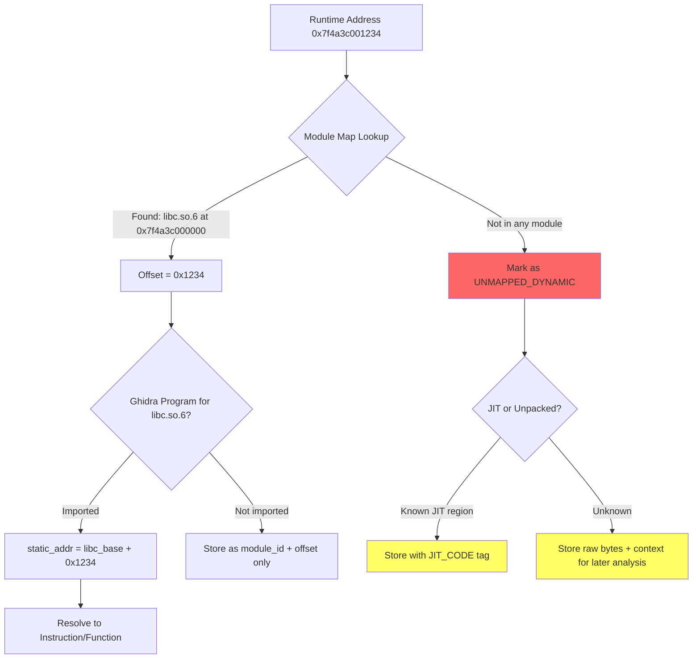
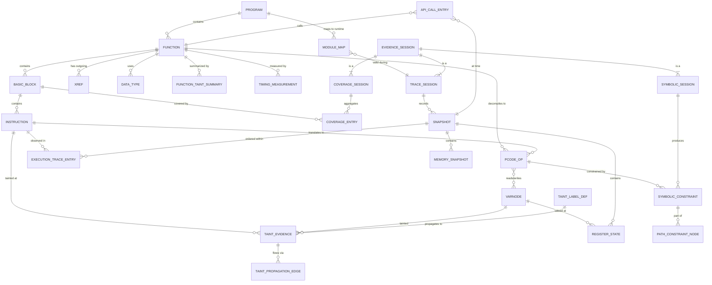
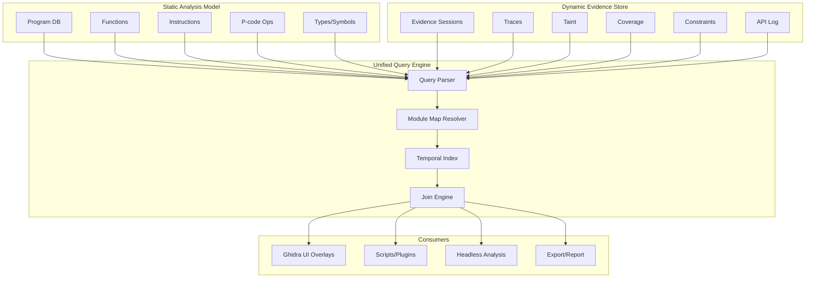

# Dynamic-Static Evidence Unification Data Model

> Concrete data model specification for unifying dynamic analysis evidence (execution traces, taint labels, symbolic constraints, coverage maps) with Ghidra's static analysis model (p-code, types, xrefs). Covers schemas, query interfaces, storage formats, UI overlay patterns, and integration with Ghidra's Trace RMI architecture.
>
> Verification note (as of 2026-02-19): Ghidra API paths reference the upstream `master` branch. Schema sizes are estimates based on profiling data from public benchmarks; validate against your workload before capacity planning.

---

## Table of Contents

1. [Evidence Taxonomy](#1-evidence-taxonomy)
2. [Trace-to-Code Evidence Mapping](#2-trace-to-code-evidence-mapping)
3. [Temporal Query Model](#3-temporal-query-model)
4. [Taint Evidence Storage](#4-taint-evidence-storage)
5. [Path/Constraint Evidence](#5-pathconstraint-evidence)
6. [UI Overlay Patterns](#6-ui-overlay-patterns)
7. [Integration with Ghidra Trace Database](#7-integration-with-ghidra-trace-database)
8. [Unification Data Model](#8-unification-data-model)

---

## 1. Evidence Taxonomy

Dynamic analysis produces several distinct categories of evidence. Each has different granularity, storage characteristics, and mapping semantics to static code locations.

### 1.1 Evidence Type Catalog

| Evidence Type | Schema (key fields) | Granularity | Typical Size per Unit | Static Mapping Target |
|---|---|---|---|---|
| **Execution Trace** | `{snap_id, thread_id, pc, insn_bytes, timestamp}` | Instruction | 16-24 bytes/entry | Instruction address in Listing |
| **Memory Snapshot** | `{snap_id, addr_space, offset, length, bytes, state}` | Page (4KB) or region | 4KB-64KB/page | RAM address space overlay |
| **Register State** | `{snap_id, thread_id, reg_name, value, size}` | Per-register per snapshot | 8-16 bytes/entry | Register space Varnode |
| **Taint Label** | `{location, label_set, snap_id, propagation_depth}` | Byte or word | 12-32 bytes/entry | Varnode (register/memory) |
| **Symbolic Constraint** | `{branch_addr, condition_ast, constraint_smt2, satisfying_input}` | Per-branch | 200B-10KB/constraint | CBRANCH p-code op |
| **Coverage Map** | `{module_id, block_offset, block_size, hit_count}` | Basic block | 8-12 bytes/entry | BasicBlock in CFG |
| **API Call Sequence** | `{snap_id, thread_id, callee_addr, args[], retval, caller_addr}` | Per-call | 64-256 bytes/entry | CALL/CALLIND p-code op |
| **Static Xref Evidence** | `{from_addr, to_addr, xref_type, function_addr}` | Per-xref | 24-48 bytes/entry | Xref + caller/callee Function |
| **Constant/String Evidence** | `{instruction_addr, operand_index, constant_value, literal_text}` | Per constant use | 16-96 bytes/entry | Instruction operand / decompiler token |
| **Callsite Evidence** | `{call_addr, caller_func, callee_target, arg_hints}` | Per callsite | 32-160 bytes/entry | CALL/CALLIND + call graph edge |
| **Network Traffic Capture** | `{snap_id, direction, protocol, src, dst, payload_ref}` | Per-packet | Variable (header 64B + payload ref) | External reference / data label |
| **Timing Measurement** | `{snap_id, addr_range, cycle_count, wall_ns, iteration}` | Per-function or per-block | 32 bytes/entry | Function or BasicBlock |

### 1.2 Stable Evidence Reference IDs (Proposal-Safe)

Evidence attached to review proposals must use a stable identifier that survives:

- re-ingestion of traces/symbolic outputs
- proposal approval and apply
- proposal rollback/revert

Use a deterministic ID derived from canonical source fields rather than a storage row id:

```
EvidenceRefIdV1 = "evr_" + hex(sha256(canonical_key))

canonical_key =
  evidence_type + "|" +
  program_id + "|" +
  canonical_source_tuple
```

Canonical source tuples for UI-219 evidence classes:

- `xref`: `from_addr|to_addr|xref_type`
- `constant`: `instruction_addr|operand_index|normalized_value|encoding`
- `callsite`: `call_addr|caller_function_addr|callee_target`

`evidence_ref_id` is immutable. Re-importing the same source tuple must resolve to the same ID, enabling dedup and stable proposal links.

### 1.3 Evidence Category Details

#### Execution Traces

An execution trace is an ordered sequence of executed instructions, optionally annotated with register/memory side effects.

```
ExecutionTraceEntry {
    snap_id:       uint64       // Snapshot (point in time)
    seq_num:       uint64       // Monotonic sequence within trace
    thread_id:     uint32       // Thread identifier
    pc:            uint64       // Program counter (virtual address)
    insn_length:   uint8        // Instruction byte count
    insn_bytes:    bytes[15]    // Raw instruction bytes (max x86-64 length)
    timestamp_ns:  uint64       // Wall-clock or emulation timestamp
}
```

**Storage profile**: A 1-million-instruction trace at 24 bytes/entry consumes ~24 MB uncompressed. Traces compress well (70-80% with zstd) due to repetitive PC patterns in loops.

**Static mapping**: Each `pc` maps to an instruction address in Ghidra's Listing view. The `insn_bytes` field enables verification against the static disassembly (detecting self-modifying code or JIT).

#### Memory Snapshots

Memory state captured at discrete points (breakpoints, steps, periodic sampling).

```
MemorySnapshot {
    snap_id:       uint64
    addr_space:    string       // "ram", "register", or custom overlay
    offset:        uint64       // Start address
    length:        uint32       // Byte count
    bytes:         blob         // Content
    state:         enum { KNOWN, UNKNOWN, ERROR }
    write_source:  optional<uint64>  // PC that last wrote this region
}
```

**Static mapping**: Maps directly to Ghidra's address spaces. The `addr_space` field corresponds to Ghidra's named spaces (ram, register, unique, const).

#### Register States

Per-thread register file captured at each snapshot.

```
RegisterState {
    snap_id:       uint64
    thread_id:     uint32
    register:      string       // e.g., "RAX", "XMM0", "CPSR"
    value:         bytes[32]    // Up to 256-bit registers (AVX)
    size:          uint8        // Actual register size in bytes
}
```

**Static mapping**: Maps to Varnode `(register_space, offset, size)` triples. The register name resolves via the SLEIGH register definition.

#### Taint Labels

Byte-level taint propagation results from dynamic taint analysis.

```
TaintEvidence {
    snap_id:       uint64
    location_type: enum { MEMORY, REGISTER }
    location:      uint64       // Address or register offset
    label_set:     uint32[]     // Set of taint label IDs
    taint_compute_number: uint32 // Propagation depth from source
    source_snap:   uint64       // When taint was introduced
}
```

**Static mapping**: Taint on a memory address maps to the corresponding RAM Varnode. Taint on a register maps to the register Varnode. The label set identifies which input bytes influence this location.

#### Symbolic Constraints

Path constraints discovered by symbolic/concolic execution.

```
SymbolicConstraint {
    branch_addr:       uint64           // Address of CBRANCH
    pcode_seq:         uint16           // P-code op index within instruction
    condition:         string           // Human-readable: "input[4] > 0x7f"
    constraint_smt2:   string           // SMT-LIB2 format
    branch_taken:      bool             // Which direction was explored
    satisfying_input:  optional<bytes>  // Concrete input satisfying constraint
    solver_time_ms:    uint32           // Time to solve
    engine:            string           // "angr", "symqemu", "triton"
}
```

**Static mapping**: Maps to a specific CBRANCH p-code operation at `branch_addr`. The `pcode_seq` disambiguates when an instruction produces multiple p-code branches.

#### Coverage Maps

Basic-block-level coverage from fuzzing or tracing.

```
CoverageEntry {
    module_id:     uint16       // Module table index
    block_offset:  uint32       // Offset from module base
    block_size:    uint16       // Block size in bytes
    hit_count:     uint32       // Execution count (0 = not hit)
    first_snap:    uint64       // First snapshot that hit this block
    last_snap:     uint64       // Most recent hit
}
```

**Storage profile**: A program with 50,000 basic blocks at 12 bytes/entry requires 600 KB per coverage session. Multiple sessions are stored independently for differential analysis.

**Format compatibility**:
- **drcov** (DynamoRIO): `{start: uint32, size: uint16, mod_id: uint16}` -- 8 bytes/entry, module+offset format
- **AFL bitmap**: 64KB shared memory bitmap indexed by `(prev_block XOR cur_block)`, edge-level
- **SanCov**: Magic header `0xC0BFFFFFFFFFFF64` followed by array of 64-bit PCs

**Static mapping**: Each `(module_id, block_offset)` resolves to a BasicBlock in Ghidra's CFG after module base address adjustment.

#### API Call Sequences

Intercepted function calls with arguments and return values.

```
APICallEntry {
    snap_id:       uint64
    seq_num:       uint64       // Global ordering
    thread_id:     uint32
    callee_addr:   uint64       // Target function address
    caller_addr:   uint64       // Return address (call site)
    args:          Value[]      // Up to N captured arguments
    retval:        optional<Value>
    callee_name:   optional<string>  // Resolved symbol name
}

Value {
    raw:           uint64       // Raw register/stack value
    deref:         optional<bytes>  // Dereferenced content if pointer
    type_hint:     optional<string> // "ptr_to_string", "int", "fd", etc.
}
```

**Static mapping**: `callee_addr` maps to a Function entry point. `caller_addr` maps to a CALL/CALLIND p-code op.

#### Network Traffic Captures

Network I/O correlated with execution state.

```
NetworkCapture {
    snap_id:       uint64
    direction:     enum { SEND, RECV }
    protocol:      string       // "tcp", "udp", "tls", etc.
    src_addr:      string
    dst_addr:      string
    payload:       blob
    syscall_addr:  uint64       // PC of the send/recv syscall
    fd:            int32        // File descriptor
}
```

**Static mapping**: `syscall_addr` maps to the instruction performing the I/O. Payload bytes can be cross-referenced with taint labels to track network input through the program.

#### Timing Measurements

Performance data correlated with code regions.

```
TimingMeasurement {
    snap_id:       uint64
    addr_start:    uint64
    addr_end:      uint64
    cycle_count:   uint64
    wall_ns:       uint64
    iteration:     uint32       // For loop bodies: which iteration
    measurement:   string       // "function_latency", "block_cycles", etc.
}
```

**Static mapping**: Address range maps to a Function or set of BasicBlocks. Useful for identifying crypto routines (constant-time analysis), hot loops, and performance bottlenecks.

---

## 2. Trace-to-Code Evidence Mapping

### 2.1 The Address Translation Problem

Dynamic addresses observed at runtime rarely match the static addresses in a Ghidra listing due to:

1. **ASLR (Address Space Layout Randomization)**: OS randomizes base addresses of executables and libraries at load time.
2. **PIE (Position-Independent Executables)**: The main executable itself has a randomized base.
3. **Shared libraries**: Loaded at unpredictable addresses.
4. **Dynamically loaded code**: `dlopen()`/`LoadLibrary()` modules, JIT-compiled code, unpacked malware stages.

### 2.2 Module Map as the Translation Layer

The module map records which binary modules are loaded at which addresses during a dynamic session:

```
ModuleMapEntry {
    module_id:     uint16
    name:          string       // e.g., "libc.so.6", "target.exe"
    load_base:     uint64       // Runtime base address
    size:          uint64       // Mapped size
    static_base:   uint64       // Preferred/static base in Ghidra
    sections:      SectionEntry[]
    snap_range:    Lifespan     // When this mapping was valid
    ghidra_program: optional<string>  // Ghidra program name if imported
}

SectionEntry {
    name:          string       // ".text", ".data", etc.
    runtime_offset: uint64      // Offset from load_base
    static_offset:  uint64      // Offset from static_base
    size:          uint64
    permissions:   uint8        // R/W/X flags
}
```

**Translation formula**:
```
static_addr = (runtime_addr - module.load_base) + module.static_base
```

For PIE executables where `static_base` is 0 in Ghidra:
```
static_addr = runtime_addr - module.load_base
```

### 2.3 Multi-Level Mapping Resolution

Evidence maps to static analysis at three levels of granularity:

```
                    +-----------------------+
                    |   Function Level      |
                    |   (coarsest)          |
                    |   FunctionEvidence    |
                    +-----------+-----------+
                                |
                    +-----------v-----------+
                    |  Instruction Level    |
                    |   (standard)          |
                    |   InstructionEvidence |
                    +-----------+-----------+
                                |
                    +-----------v-----------+
                    |    P-code Level       |
                    |   (finest)            |
                    |   PcodeOpEvidence     |
                    +-----------------------+
```

**Function-level mapping**: Coverage percentages, call counts, taint summaries. Maps `runtime_addr` to the containing `Function` via Ghidra's `FunctionManager.getFunctionContaining(addr)`.

**Instruction-level mapping**: Register states, taint at specific instructions, branch decisions. Maps `runtime_pc` to an `Instruction` via `listing.getInstructionAt(addr)`.

**P-code-level mapping**: Symbolic constraints on specific p-code operations (e.g., which CBRANCH was constrained). Maps to `PcodeOp` via `(instruction_addr, pcode_sequence_number)`. This is essential because a single machine instruction can produce multiple p-code branches.

### 2.4 Handling Shared Libraries and Dynamic Code



**Key design decisions**:

1. **Lazy program association**: Evidence is stored with `(module_id, offset)` pairs. The association to a Ghidra `Program` is resolved at query time, not at ingestion time. This allows importing traces before all libraries have been analyzed.

2. **Multi-program evidence**: A single trace session may span multiple Ghidra programs (main binary + shared libraries). The module map acts as a join table.

3. **Dynamic code regions**: Code generated at runtime (JIT, unpacking, self-modifying code) has no static counterpart initially. Evidence for these regions is stored with raw instruction bytes and memory snapshots, enabling later analysis by creating a new Ghidra program from the captured bytes.

4. **ASLR-agnostic storage**: All evidence is internally normalized to `(module_id, offset)` form. Runtime absolute addresses are stored alongside for cross-referencing with raw trace files, but the canonical form is module-relative.

---

## 3. Temporal Query Model

### 3.1 Design Requirements

The temporal query model must support these query patterns efficiently:

| Query Pattern | Example | Index Required |
|---|---|---|
| **Point-in-time state** | "What was RAX at snapshot 42?" | B-tree on `(location, snap_id)` |
| **First-occurrence** | "When did taint first reach `memcpy` arg1?" | B-tree on `(location, snap_id)` with scan |
| **Range query** | "All states where RAX held 0xdeadbeef" | B-tree on `(register, value)` + lifespan filter |
| **Temporal slice** | "All evidence for function `parse_header` between snaps 10-50" | Interval tree on `(addr_range, snap_range)` |
| **Diff query** | "What changed between snapshot 30 and 31?" | Delta log indexed by snap_id |
| **Taint reachability** | "Show all locations tainted by label 7 at any time" | Inverted index on label_id |
| **Coverage evolution** | "Coverage delta between fuzzing run A and run B" | Set difference on coverage entry sets |

### 3.2 Temporal Indexing Strategy

The evidence store uses a two-level indexing scheme:

```
Primary Index:  B+tree on (evidence_ref_id, snap_id)
    - evidence_ref_id: deterministic ID from canonical evidence key
      (see Section 1.2)
    - snap_id: snapshot number
    - Supports point queries and forward/backward scans

Secondary Index: Interval tree on (addr_range, lifespan)
    - addr_range: [start_addr, end_addr)
    - lifespan: [min_snap, max_snap]
    - Supports "all evidence overlapping this address range in this time window"

Tertiary Index: Value index (type-specific)
    - Register value index: B+tree on (register_name, value) -> snap_id[]
    - Taint label index: Inverted index label_id -> (location, snap_range)[]
    - Coverage index: Bitmap per session, indexed by block_id
```

### 3.3 The Lifespan Model

Following Ghidra's existing trace database design, every piece of evidence has a **Lifespan** -- a `[min_snap, max_snap]` range indicating when that evidence is valid:

```
Lifespan {
    min_snap:  int64    // First snapshot where this evidence holds
    max_snap:  int64    // Last snapshot (Long.MAX_VALUE = "still valid")
}
```

**Overlap semantics**: Two evidence items "overlap" if their address ranges intersect AND their lifespans intersect. This is the core predicate for spatial-temporal queries.

**Lifespan operations**:
- `contains(snap)`: Is `snap` within `[min_snap, max_snap]`?
- `intersects(other)`: Do two lifespans share any snapshot?
- `extend(snap)`: Widen `max_snap` to include a later snapshot
- `truncate(snap)`: Set `max_snap` to `snap - 1`

### 3.4 Query Interface

```java
interface EvidenceQuery {
    // Point-in-time queries
    RegisterState getRegisterAt(String regName, long threadId, long snapId);
    byte[] getMemoryAt(long address, int length, long snapId);
    Set<TaintLabel> getTaintAt(long address, long snapId);

    // Temporal range queries
    List<RegisterState> getRegisterHistory(String regName, long threadId,
                                            Lifespan range);
    List<TaintEvidence> getTaintHistory(long address, Lifespan range);

    // First-occurrence queries
    Optional<Long> firstSnapshotWhere(Predicate<EvidenceState> condition);
    Optional<Long> firstTaintReach(long sinkAddress, int labelId);

    // Spatial-temporal queries (address range x time range)
    Collection<Evidence> getEvidenceInRegion(AddressRange addrRange,
                                              Lifespan timeRange,
                                              EnumSet<EvidenceType> types);

    // Value search queries
    List<SnapLocation> findRegisterValue(String regName, long value);
    List<SnapLocation> findMemoryPattern(byte[] pattern, AddressRange range,
                                          Lifespan timeRange);

    // Coverage queries
    CoverageMap getCoverageAt(long snapId);
    CoverageMap getCoverageDelta(long snapA, long snapB);
    Set<AddressRange> getUncoveredBlocks(long snapId);

    // Taint reachability
    Set<Long> getLocationsWithLabel(int labelId, Lifespan range);
    TaintPropagationGraph getTaintGraph(int labelId, Lifespan range);

    // Cross-boundary: static + dynamic
    FunctionEvidence getFunctionEvidence(Function func, Lifespan range);
    List<Evidence> getEvidenceForPcodeOp(PcodeOp op, Lifespan range);
}
```

### 3.5 Indexing Data Structures

```
                +---------------------------------+
                |     Evidence Store              |
                +---------------------------------+
                |                                 |
    +-----------v-----------+    +----------------v----------------+
    |   B+tree Primary      |    |   Interval R-tree               |
    |   Key: (evidence_ref, |    |   Key: (addr_range, lifespan)   |
    |         snap)         |    |   Value: evidence_ref_id        |
    |   Value: evidence_row |    |                                 |
    +-----------------------+    +---------------------------------+
                |                                 |
    +-----------v-----------+    +----------------v----------------+
    |   Value Indexes       |    |   Label Inverted Index          |
    |   B+tree per type     |    |   label_id -> posting_list      |
    +-----------------------+    +---------------------------------+
```

**B+tree on (evidence_ref_id, snap_id)**: Handles point-in-time lookups and temporal scans. `evidence_ref_id` is a deterministic hash over canonical source fields (e.g., `xref(from,to,type)` or `constant(insn,operand,value)`), so proposal links remain stable across imports, apply, and rollback.

**Interval R-tree on (addr_range, lifespan)**: Handles 2D rectangle queries (address range x time range). Used for "show all evidence for this function in this time window." The R-tree can be approximated with a pair of B+trees (one on address, one on snap) with intersection at query time if R-tree complexity is unwarranted.

**Inverted index on taint labels**: Maps each label ID to a posting list of `(location, snap_range)` pairs. Enables efficient "where did label 7 go?" queries without scanning all taint evidence.

### 3.6 Proposal Evidence Link Persistence

Review proposals reference evidence by stable ID, never by transient row position.

```
ProposalEvidenceLink {
    link_id:         UUID              // immutable link record
    changeset_id:    UUID
    delta_id:        UUID              // proposal record inside the changeset
    evidence_ref_id: string            // "evr_<sha256>"
    evidence_kind:   enum { XREF, CONSTANT, CALLSITE, OTHER }
    role:            enum { PRIMARY, SUPPORTING, CONTRADICTING }
    captured_at:     timestamptz
    metadata:        json
}
```

Lifecycle rules:

1. **Capture**: proposal creation writes `ProposalEvidenceLink` rows keyed by `delta_id + evidence_ref_id`.
2. **Apply**: approval receipts copy link references by ID (no new evidence rows required).
3. **Rollback**: rollback receipts reference the same `evidence_ref_id` set used at apply time.
4. **Retention**: links are append-only; rollback marks proposal state but does not delete evidence links.

---

## 4. Taint Evidence Storage

### 4.1 Taint Label Model

```
TaintLabelDefinition {
    label_id:      uint32       // Unique label identifier
    source_type:   enum { FILE_INPUT, NETWORK, ENVIRONMENT, REGISTER, CUSTOM }
    source_desc:   string       // "stdin byte 42", "recv() packet 3 offset 0x10"
    creation_snap: uint64       // When this label was introduced
    byte_offset:   uint32       // Offset within the source (e.g., byte position in input)
}
```

### 4.2 Label Propagation Graph

The taint propagation graph tracks how labels flow through computation:

```
TaintPropagationEdge {
    from_location: Location     // Source varnode/memory
    to_location:   Location     // Destination varnode/memory
    snap_id:       uint64       // When propagation occurred
    operation:     string       // P-code op that caused propagation (e.g., "INT_ADD")
    pc:            uint64       // Instruction address
    edge_type:     enum { DATA_FLOW, CONTROL_FLOW, ADDRESS_DEPENDENCY }
}

Location {
    type:          enum { MEMORY, REGISTER, TEMP }
    space:         string       // Ghidra address space name
    offset:        uint64
    size:          uint8
}
```

**Edge types**:
- `DATA_FLOW`: Standard taint propagation through arithmetic/logic (`add rax, rbx` propagates union of labels).
- `CONTROL_FLOW`: Implicit flow through taint-dependent branches (optional, often disabled to avoid over-tainting).
- `ADDRESS_DEPENDENCY`: Tainted value used as a memory address (signals potential arbitrary read/write).

### 4.3 Per-Function Taint Summary

For scalable analysis, taint is summarized at function boundaries:

```
FunctionTaintSummary {
    function_addr: uint64
    snap_range:    Lifespan
    input_taint:   TaintMap     // Parameter index -> label_set at entry
    output_taint:  TaintMap     // Return value + modified globals -> label_set at exit
    internal_sinks: SinkHit[]   // Dangerous operations reached by taint
    tainted_args_to_callees: CallTaint[]  // Taint passed to called functions
}

SinkHit {
    sink_addr:     uint64       // Address of dangerous operation
    sink_type:     string       // "memcpy_size", "format_string", "system_arg"
    reaching_labels: uint32[]   // Which input labels reached this sink
    snap_id:       uint64       // When it was observed
}
```

### 4.4 Integration with External Taint Engines

#### PANDA taint2 Output Format

PANDA taint2 writes to the PandaLog protobuf format. Key message types:

```protobuf
// From PANDA's pandalog.proto (simplified)
message TaintQueryUniqueLabelSet {
    uint64 ptr = 1;             // Label set address (unique ID)
    repeated uint32 label = 2;  // The actual label values
}

message TaintQuery {
    uint64 ptr = 1;             // References a TaintQueryUniqueLabelSet
    uint32 tcn = 2;             // Taint compute number (propagation depth)
    uint64 offset = 3;          // Offset into tainted buffer
}

message TaintedBranch {
    uint64 addr = 1;            // Guest address of tainted branch
    repeated TaintQuery taint = 2;
    CallStack call_stack = 3;   // Full call stack at branch point
}
```

**Import mapping**: Each `TaintedBranch.addr` maps to a CBRANCH p-code op. The `taint` field's label sets become `TaintEvidence` entries. The `tcn` becomes `taint_compute_number`.

#### Triton Output Format

Triton exposes taint through its Python API:

```python
# Triton taint query (Python API)
ctx.isTainted(reg)          # -> bool
ctx.getTaintedRegisters()   # -> set of registers
ctx.getTaintedMemory()      # -> dict{addr: bool}

# Symbolic expressions (SSA form, SMT-LIB2)
ast = ctx.getSymbolicRegister(REG.RAX)
smt2 = str(ast)  # "(bvadd ref!41 ref!39)"
```

**Import mapping**: Iterate `getTaintedRegisters()` and `getTaintedMemory()` at each instruction step. Build `TaintEvidence` entries with location type and label tracking (Triton uses boolean taint by default; label tracking requires the symbolic engine).

### 4.5 Storage Format Comparison

| Aspect | PANDA taint2 | Triton | angr (symbolic) | Our Unified Model |
|---|---|---|---|---|
| **Label granularity** | Byte-level, arbitrary label sets | Boolean (tainted/not) or symbolic | Symbolic (bit-level via constraints) | Byte-level, label sets |
| **Storage format** | PandaLog protobuf | In-memory Python objects | In-memory AST (Claripy) | Custom DB tables (see Section 7) |
| **Max labels** | Configurable (default unlimited) | N/A (boolean) | Unlimited (symbolic vars) | uint32 (4 billion labels) |
| **Propagation tracking** | TCN (taint compute number) | Not tracked | Via AST depth | TCN + propagation graph |
| **Serialization** | Protobuf binary | JSON export possible | Pickle (fragile) | Protobuf + DB storage |
| **Strengths** | Full-system, architecture-neutral | Fast, symbolic integration | Full symbolic reasoning | Queryable, temporal, cross-tool |
| **Weaknesses** | Requires QEMU recording | Single-process only | Slow at scale | Import overhead |

---

## 5. Path/Constraint Evidence

### 5.1 Constraint Evidence Schema

```
PathConstraint {
    // Identity
    constraint_id: uint64       // Unique identifier
    session_id:    uint64       // Which symbolic execution session

    // Location
    branch_addr:   uint64       // Address of the conditional branch
    pcode_op_seq:  uint16       // P-code op sequence number within instruction
    branch_taken:  bool         // True = taken, False = fall-through

    // The constraint itself
    condition_readable: string  // Human-readable: "input[4] > 0x7f"
    constraint_smt2:    string  // Full SMT-LIB2: "(assert (bvugt (select input 4) #x7f))"

    // Context
    path_depth:    uint32       // Number of branches on this path
    path_hash:     bytes[32]    // SHA-256 of the full path constraint conjunction

    // Solution
    satisfying_input: optional<bytes>  // Concrete input that satisfies this path
    solver_result: enum { SAT, UNSAT, TIMEOUT, UNKNOWN }
    solver_time_ms: uint32

    // Provenance
    engine:        string       // "angr", "symqemu", "triton", "klee"
    engine_version: string
    timestamp:     uint64
}
```

### 5.2 Path Constraint Tree

Constraints form a binary tree rooted at the entry point:

```
PathConstraintTree {
    root:          PathConstraint   // First branch
    children:      PathConstraintTree[2]  // [taken, not-taken]
    depth:         uint32
    total_constraints: uint32       // Size of subtree
}
```

Flattened storage uses parent references:

```
PathConstraintNode {
    constraint_id:  uint64
    parent_id:      optional<uint64>  // null for root
    branch_side:    bool               // Which parent branch leads here
    cumulative_smt2: string           // Conjunction of all constraints on path
}
```

### 5.3 Branch Annotation Model

Constraints annotate branches in the static listing:

```
BranchAnnotation {
    branch_addr:    uint64

    // Aggregated from all symbolic sessions
    total_paths_explored: uint32
    feasible_taken:       uint32    // How many paths found taken branch feasible
    feasible_not_taken:   uint32
    always_taken:         bool      // Statically determinate?
    always_not_taken:     bool

    // Tightest constraint for each direction
    taken_constraint:     optional<string>     // Simplest condition for taken
    not_taken_constraint: optional<string>     // Simplest condition for not-taken

    // Concrete test cases
    taken_inputs:         bytes[]    // Inputs that take this branch
    not_taken_inputs:     bytes[]    // Inputs that skip this branch
}
```

### 5.4 Integration with Symbolic Engines

#### angr Output

```python
# After angr exploration
for state in simgr.found:
    for constraint in state.solver.constraints:
        # constraint is a Claripy AST
        smt2 = state.solver.to_smt2(constraint)
        # Extract branch address from state history
        for addr in state.history.bbl_addrs:
            # Build PathConstraint entry
            pass

    # Get satisfying input
    concrete = state.solver.eval(stdin_sym, cast_to=bytes)
```

**Mapping**: angr's `state.history.bbl_addrs` provides the basic block trace. Branch addresses are extracted from the last instruction of each basic block. Constraints are serialized to SMT-LIB2 via Claripy's Z3 backend.

#### SymQEMU Output

SymQEMU generates test cases (concrete inputs) in an output directory. It does not directly emit constraint trees, but its internal constraint solving produces test cases that exercise different paths. To extract constraints, instrument the SymCC runtime backend to log branch decisions and their symbolic expressions.

**Mapping**: Each generated test case corresponds to a unique path. Running the test case under a tracer (e.g., drcov) provides the coverage map, which can be correlated with the SymQEMU session to infer which constraints were solved.

#### Triton Output

```python
# Triton path constraint extraction
for pc in ctx.getPathConstraints():
    branches = pc.getBranchConstraints()
    for branch in branches:
        taken = branch['isTaken']
        addr = branch['srcAddr']
        constraint = branch['constraint']  # Triton AST node
        smt2 = str(ctx.getAstContext().unroll(constraint))
```

**Mapping**: Triton's `getPathConstraints()` returns an ordered list of branch decisions. Each has `srcAddr` (the branch instruction address) and the constraint AST. Direct conversion to our `PathConstraint` schema.

---

## 6. UI Overlay Patterns

### 6.1 Coverage Heat Map

**Purpose**: Visualize which basic blocks have been executed and how frequently.

**Rendering**:
- Color gradient from blue (cold: few hits) through green/yellow to red (hot: many hits)
- Blocks with zero hits shown in gray or with a diagonal hatch pattern
- Opacity modulated by confidence (more trace data = more opaque)

**Mockup description**:
```
Listing View with Coverage Overlay
+---------------------------------------------------------+
| 00401000  push  rbp           |  [GREEN ████]  hits: 847 |
| 00401001  mov   rbp, rsp      |  [GREEN ████]  hits: 847 |
| 00401004  sub   rsp, 0x40     |  [GREEN ████]  hits: 847 |
| 00401008  cmp   edi, 0        |  [GREEN ████]  hits: 847 |
| 0040100b  je    0x401030      |  [YELLOW ███]  hits: 312 |
| 0040100d  mov   eax, [rsi]    |  [YELLOW ███]  hits: 535 |
| ...                           |                           |
| 00401030  xor   eax, eax      |  [GRAY  ░░░░]  hits: 0   |
| 00401032  jmp   0x401050      |  [GRAY  ░░░░]  hits: 0   |
+---------------------------------------------------------+
Status bar: Coverage: 73.2% (1,847/2,523 blocks) | Session: fuzz_run_042
```

**CFG view**: Blocks colored by hit count. Edges colored by traversal frequency. Unreached subgraphs highlighted for prioritization.

### 6.2 Taint Flow Highlighting

**Purpose**: Show which instructions handle tainted (attacker-influenced) data.

**Rendering**:
- Tainted registers highlighted in a configurable color (default: orange)
- Tainted memory accesses underlined
- Taint sinks (dangerous functions receiving tainted data) marked with a warning icon
- Decompiler view: tainted variables colored in-line

**Mockup description**:
```
Listing View with Taint Overlay
+---------------------------------------------------------+
| 00401020  mov   rdi, [rbp-8]  |  rdi <- [TAINTED: {0,1}] |
| 00401024  call  strlen        |  arg0 tainted             |
| 00401029  mov   rsi, [rbp-8]  |  rsi <- [TAINTED: {0,1}] |
| 0040102d  mov   edx, eax      |  edx <- [TAINTED: {0,1}] |
| 0040102f  mov   rdi, rbx      |  (clean)                  |
| 00401032  call  memcpy        |  [!] SINK: size arg tainted|
+---------------------------------------------------------+
Taint Source: stdin bytes [0..127] | Labels active: 128
```

### 6.3 Constraint Annotations on Branches

**Purpose**: Show what conditions must hold for each branch direction.

**Rendering**:
- Branch instructions annotated with constraint in comment form
- Taken/not-taken edges labeled with their constraint
- Satisfiable directions shown in green, unsatisfiable in red, unexplored in gray
- Clickable annotations that reveal full SMT-LIB2 and provide "generate input" action

**Mockup description**:
```
Listing View with Constraint Annotations
+---------------------------------------------------------+
| 0040100b  cmp   byte [rdi+4], 0x7f                       |
| 0040100f  jbe   0x401030                                  |
|           ; TAKEN when: input[4] <= 0x7f  (SAT, 312 paths)|
|           ; NOT TAKEN when: input[4] > 0x7f  (SAT, 535 paths)|
|           ; [Generate input for TAKEN] [Generate for NOT TAKEN]|
+---------------------------------------------------------+
```

### 6.4 Execution Frequency Overlay

**Purpose**: Show how often each instruction/block executes relative to the hottest block.

**Rendering**:
- Side gutter with mini bar chart (sparkline) proportional to hit count
- Function-level summary showing total instruction count, unique blocks hit, loop iteration ranges
- Decompiler view: loop trip count annotations on `while`/`for` structures

### 6.5 Temporal Navigation Slider

**Purpose**: Navigate through time (snapshots) and see how evidence evolves.

**Rendering**:
- Horizontal slider at bottom of Listing/Decompiler view
- Slider position = current snapshot being viewed
- Tick marks at snapshots where state changed
- Markers for key events: breakpoints hit, taint sink reached, crash
- All evidence displays update as slider moves
- Playback mode: auto-advance through snapshots at configurable speed

**Mockup description**:
```
+---------------------------------------------------------------------+
|  Listing View (showing state at snap 42)                             |
|  ...                                                                 |
+---------------------------------------------------------------------+
|  [|<] [<] [>] [>|]   Snap: 42 / 1,847   [Auto: 10/sec]            |
|  |----*--*--*------*----[===]--*--*-----*----|                       |
|  ^    ^  ^  ^      ^    ^42   ^  ^     ^    ^                       |
|  0   12 15 18     30          55 58   72   100                      |
|  start  breakpoints  current    taint_sink  crash                   |
+---------------------------------------------------------------------+
```

### 6.6 Unified Evidence Panel

**Purpose**: A single panel that aggregates all evidence types for the current selection (instruction, function, or address range).

**Layout**:
```
+-- Evidence Panel for 0x0040102f (call memcpy) --+
| Coverage:    Hit 535 times across 3 sessions     |
| Taint:       arg1 (dst): clean                   |
|              arg2 (src): tainted {0..127}         |
|              arg3 (size): tainted {0,1}           |
| Constraints: size > 0x100 => overflow (2 paths)  |
| Timing:      avg 23ns, max 847ns                 |
| API Log:     last call: memcpy(0x7ff..., 0x...)  |
| Snapshots:   Present in snaps 12, 15, 18-42, 55 |
+-------------------------------------------------+
```

### 6.7 Proposal Evidence Drawer (Review UI)

**Purpose**: Let reviewers inspect exactly which `xref`, `constant/string`, and `callsite` evidence links support a single proposal delta.

**Rendering**:
- Drawer opens from a selected proposal row in the review panel.
- Evidence is grouped by `evidence_kind` (`XREF`, `CONSTANT`, `CALLSITE`).
- Each row shows `evidence_ref_id`, concise rationale, and a deep-link target (`listing`, `decompiler`, or trace snap).
- Rows remain visible after apply and after rollback because the drawer resolves by `delta_id -> evidence_ref_id`.

**Drawer query path**:
1. Read `proposal_evidence_link` by `changeset_id + delta_id`.
2. Join to `evidence_ref` for canonical evidence payload.
3. Resolve source rows (`xref`, instruction operand, call graph edge) for expanded context.

---

## 7. Integration with Ghidra Trace Database

### 7.1 Ghidra Trace Architecture Overview

Ghidra's trace database (`Framework-TraceModeling`) provides the foundational infrastructure:

- **`DBTrace`**: Top-level trace object extending `DBCachedDomainObjectAdapter`. Contains managers for memory, registers, modules, threads, breakpoints, bookmarks, and the object model.
- **`DBTraceMemoryManager`** / **`DBTraceMemorySpace`**: Store memory state at each snapshot with copy-on-write semantics.
- **`Lifespan`**: A `[min_snap, max_snap]` range used pervasively to track temporal validity.
- **`TraceObject`** hierarchy: A hierarchical key-value model (paths like `Inferiors[0].Threads[1].Stack[0].Registers`) that represents debugger state.
- **Trace RMI**: Protocol for external connectors to push state into the trace database.

### 7.2 Extending DBTrace for New Evidence Types

New evidence types are added by creating custom `DBTraceManager` subclasses and corresponding `TraceObject` subtypes.

#### Custom Evidence Managers

```java
// New manager for taint evidence
public class DBTraceTaintManager extends DBTraceManager {

    // DB table: stores TaintEvidence records
    private final DBCachedObjectStoreFactory storeFactory;

    // Schema for taint records
    static final Schema TAINT_SCHEMA = new SchemaBuilder()
        .field("snap_id", LongField.INSTANCE)
        .field("location_type", ByteField.INSTANCE)
        .field("location_offset", LongField.INSTANCE)
        .field("location_size", ByteField.INSTANCE)
        .field("label_set", BinaryField.INSTANCE)  // Serialized uint32[]
        .field("tcn", IntField.INSTANCE)
        .field("source_snap", LongField.INSTANCE)
        .keyField("snap_id")
        .keyField("location_offset")
        .build();

    // Queries
    public Collection<TaintEvidence> getTaintAt(long address, long snap);
    public Collection<TaintEvidence> getTaintInRange(
        AddressRange range, Lifespan timeRange);
    public Set<Integer> getLabelsReaching(long sinkAddress, Lifespan range);
}

// New manager for coverage evidence
public class DBTraceCoverageManager extends DBTraceManager {

    static final Schema COVERAGE_SCHEMA = new SchemaBuilder()
        .field("module_id", ShortField.INSTANCE)
        .field("block_offset", IntField.INSTANCE)
        .field("block_size", ShortField.INSTANCE)
        .field("hit_count", IntField.INSTANCE)
        .field("first_snap", LongField.INSTANCE)
        .field("last_snap", LongField.INSTANCE)
        .keyField("module_id")
        .keyField("block_offset")
        .build();

    public CoverageMap getCoverageAt(long snap);
    public double getCoveragePercentage(Function func, long snap);
    public Set<AddressRange> getUncoveredBlocks(long snap);
}

// New manager for symbolic constraints
public class DBTraceConstraintManager extends DBTraceManager {

    static final Schema CONSTRAINT_SCHEMA = new SchemaBuilder()
        .field("constraint_id", LongField.INSTANCE)
        .field("branch_addr", LongField.INSTANCE)
        .field("pcode_seq", ShortField.INSTANCE)
        .field("branch_taken", BooleanField.INSTANCE)
        .field("condition_readable", StringField.INSTANCE)
        .field("constraint_smt2", StringField.INSTANCE)
        .field("satisfying_input", BinaryField.INSTANCE)
        .field("solver_result", ByteField.INSTANCE)
        .field("engine", StringField.INSTANCE)
        .keyField("constraint_id")
        .build();

    public List<PathConstraint> getConstraintsAtBranch(long branchAddr);
    public Optional<byte[]> getInputForPath(long[] branchAddrs, boolean[] taken);
}
```

#### Custom TraceObject Subtypes

The `TraceObject` model supports custom subtypes in its hierarchical namespace:

```
Trace Root
├── Inferiors[0]
│   ├── Threads[0..N]
│   │   ├── Stack[0..M]
│   │   └── Registers
│   ├── Modules[0..N]
│   └── Memory
├── Evidence                          // NEW: Evidence subtree
│   ├── Taint
│   │   ├── Labels[0..N]             // TaintLabelDefinition objects
│   │   ├── Active[addr]             // Currently tainted locations
│   │   └── Summaries[func_addr]     // Per-function taint summaries
│   ├── Coverage
│   │   ├── Sessions[0..N]           // Individual coverage sessions
│   │   └── Aggregate                // Merged coverage across sessions
│   ├── Constraints
│   │   ├── Branches[addr]           // Per-branch constraint sets
│   │   └── Paths[0..N]             // Complete path constraint trees
│   ├── Timing
│   │   └── Measurements[addr]       // Per-address timing data
│   └── APILog
│       └── Calls[0..N]             // Intercepted API calls
└── Sessions                          // NEW: Analysis session metadata
    └── [session_id]
        ├── engine: "panda_taint2"
        ├── timestamp: 1708300800
        └── config: {...}
```

### 7.3 Using Lifespan for Temporal Evidence

Every evidence entry uses Ghidra's `Lifespan` model:

```java
// Example: storing taint evidence with temporal validity
public void addTaintEvidence(long address, Set<Integer> labels,
                              long snapId, long endSnap) {
    Lifespan lifespan = Lifespan.span(snapId, endSnap);

    try (Transaction tx = trace.openTransaction("Add taint")) {
        TraceObject taintObj = objectManager.createObject(
            TraceObjectKeyPath.parse("Evidence.Taint.Active["
                + address + "]"));
        taintObj.insert(lifespan, ConflictResolution.DENY);
        taintObj.setAttribute(lifespan, "labels",
            serializeLabelSet(labels));
        taintObj.setAttribute(lifespan, "address",
            trace.getBaseAddressFactory().getAddress(address));
    }
}

// Query: what was tainted at snap 42?
public Collection<TraceObject> getTaintedAt(long snap) {
    TraceObjectKeyPath taintRoot =
        TraceObjectKeyPath.parse("Evidence.Taint.Active");
    return objectManager.getObjectsAt(snap, taintRoot);
}
```

### 7.4 Extending the Trace RMI Protocol

To push evidence from external tools (PANDA, Triton, angr), extend the Trace RMI protocol with new message types:

```protobuf
// Additions to trace-rmi.proto

message RequestPutTaintEvidence {
    int32 trace_id = 1;
    int64 snap_id = 2;

    message TaintEntry {
        int64 address = 1;
        int32 size = 2;
        repeated uint32 labels = 3;
        uint32 tcn = 4;
    }
    repeated TaintEntry entries = 3;
}

message RequestPutCoverage {
    int32 trace_id = 1;
    string session_name = 2;

    message CoverageBlock {
        uint32 module_id = 1;
        uint32 offset = 2;
        uint32 size = 3;
        uint32 hit_count = 4;
    }
    repeated CoverageBlock blocks = 3;
}

message RequestPutConstraint {
    int32 trace_id = 1;

    message Constraint {
        uint64 branch_addr = 1;
        bool branch_taken = 2;
        string condition = 3;
        string smt2 = 4;
        bytes satisfying_input = 5;
        string engine = 6;
    }
    repeated Constraint constraints = 2;
}
```

#### Python Connector for Evidence Ingestion

```python
# Evidence connector using ghidratrace client library
from ghidratrace.client import Client, Trace, MethodRegistry

class EvidenceConnector:
    """Base class for evidence connectors that push
    dynamic analysis results into Ghidra's trace database."""

    def __init__(self, client: Client, trace: Trace):
        self.client = client
        self.trace = trace

    def push_coverage(self, session_name: str, entries: list):
        """Push coverage data from drcov/AFL/SanCov format."""
        with self.client.batch():
            root = self.trace.create_object("Evidence.Coverage.Sessions")
            session = self.trace.create_object(
                f"Evidence.Coverage.Sessions[{session_name}]")
            session.insert(lifespan=(0, 2**63 - 1))

            for entry in entries:
                block = self.trace.create_object(
                    f"Evidence.Coverage.Sessions[{session_name}]"
                    f".Blocks[0x{entry['offset']:x}]")
                block.set_value("hit_count", entry['hits'])
                block.set_value("block_size", entry['size'])
                block.set_value("module", entry['module_name'])
                block.insert(lifespan=(0, 2**63 - 1))

    def push_taint(self, snap_id: int, taint_entries: list):
        """Push taint evidence from PANDA/Triton."""
        with self.client.batch():
            snap = self.trace.snapshot(f"Taint analysis at {snap_id}")
            for entry in taint_entries:
                addr = entry['address']
                obj = self.trace.create_object(
                    f"Evidence.Taint.Active[0x{addr:x}]")
                obj.set_value("labels", str(entry['labels']))
                obj.set_value("tcn", entry.get('tcn', 0))
                obj.insert(lifespan=(snap_id, snap_id))

    def push_constraints(self, constraints: list):
        """Push symbolic constraints from angr/Triton/SymQEMU."""
        with self.client.batch():
            for c in constraints:
                addr = c['branch_addr']
                obj = self.trace.create_object(
                    f"Evidence.Constraints.Branches[0x{addr:x}]"
                    f"[{'taken' if c['taken'] else 'not_taken'}]")
                obj.set_value("condition", c['condition'])
                obj.set_value("smt2", c.get('smt2', ''))
                obj.set_value("engine", c.get('engine', 'unknown'))
                if c.get('satisfying_input'):
                    obj.set_value("input",
                        c['satisfying_input'].hex())
                obj.insert(lifespan=(0, 2**63 - 1))
```

---

## 8. Unification Data Model

### 8.1 Design Principles

The unified model must:

1. **Preserve static analysis integrity**: The program database (symbols, types, xrefs, p-code) remains the authoritative static model. Evidence overlays do not modify static data; they annotate it.
2. **Enable cross-boundary queries**: "Show all functions where tainted data reaches a sink AND the decompiler identifies a type mismatch."
3. **Support temporal navigation**: Any query can be scoped to a time range.
4. **Scale to real programs**: A 10MB binary with 50K functions, 1M instructions, and 10M-entry traces.

### 8.2 Entity-Relationship Diagram



### 8.3 Complete Schema Definition

#### Static Layer (existing Ghidra model -- referenced, not modified)

```sql
-- These tables already exist in Ghidra's DBHandle-based storage.
-- Shown here for cross-reference purposes only.

-- Program: top-level container
-- Function: {entry_addr, name, return_type, calling_convention}
-- BasicBlock: {start_addr, end_addr, function_ref}
-- Instruction: {addr, bytes, mnemonic, pcode_ops[]}
-- PcodeOp: {addr, seq_num, opcode, inputs[], output}
-- Varnode: {space, offset, size}
-- DataType: {name, category, size, fields[]}
-- Xref: {from_addr, to_addr, ref_type}
-- Symbol: {name, addr, namespace, source}
```

#### Dynamic Evidence Layer (new)

```sql
-- Session tracking: every evidence import is a session
CREATE TABLE evidence_session (
    session_id     BIGINT PRIMARY KEY,
    session_type   VARCHAR(32),    -- 'trace', 'coverage', 'symbolic', 'taint'
    engine_name    VARCHAR(64),    -- 'gdb', 'panda', 'angr', 'afl++'
    engine_version VARCHAR(32),
    created_at     BIGINT,         -- Unix timestamp
    config_json    TEXT,           -- Engine configuration
    notes          TEXT
);

-- Module map: runtime module -> static program mapping
CREATE TABLE module_map (
    module_id      SMALLINT,
    session_id     BIGINT REFERENCES evidence_session,
    module_name    VARCHAR(256),
    load_base      BIGINT,
    size           BIGINT,
    static_base    BIGINT,
    ghidra_program VARCHAR(256),   -- Program name if imported
    snap_min       BIGINT,
    snap_max       BIGINT,
    PRIMARY KEY (session_id, module_id)
);

-- Execution trace entries
CREATE TABLE execution_trace (
    session_id     BIGINT REFERENCES evidence_session,
    seq_num        BIGINT,
    snap_id        BIGINT,
    thread_id      INTEGER,
    pc             BIGINT,         -- Runtime address
    module_id      SMALLINT,
    module_offset  INTEGER,        -- Module-relative offset
    insn_length    SMALLINT,
    timestamp_ns   BIGINT,
    PRIMARY KEY (session_id, seq_num)
);
CREATE INDEX idx_trace_pc ON execution_trace(module_id, module_offset);
CREATE INDEX idx_trace_snap ON execution_trace(snap_id);

-- Memory snapshots
CREATE TABLE memory_snapshot (
    session_id     BIGINT,
    snap_id        BIGINT,
    addr_space     VARCHAR(32),
    offset         BIGINT,
    length         INTEGER,
    bytes          BLOB,
    state          SMALLINT,       -- 0=KNOWN, 1=UNKNOWN, 2=ERROR
    PRIMARY KEY (session_id, snap_id, addr_space, offset)
);

-- Register states
CREATE TABLE register_state (
    session_id     BIGINT,
    snap_id        BIGINT,
    thread_id      INTEGER,
    register_name  VARCHAR(16),
    value          BLOB,           -- Raw bytes, up to 32 bytes
    size           SMALLINT,
    PRIMARY KEY (session_id, snap_id, thread_id, register_name)
);

-- Taint label definitions
CREATE TABLE taint_label_def (
    session_id     BIGINT,
    label_id       INTEGER,
    source_type    SMALLINT,       -- 0=FILE, 1=NETWORK, 2=ENV, 3=REG, 4=CUSTOM
    source_desc    VARCHAR(256),
    creation_snap  BIGINT,
    byte_offset    INTEGER,
    PRIMARY KEY (session_id, label_id)
);

-- Taint evidence (byte-level taint at specific points)
CREATE TABLE taint_evidence (
    session_id     BIGINT,
    snap_id        BIGINT,
    location_type  SMALLINT,       -- 0=MEMORY, 1=REGISTER
    location_offset BIGINT,
    location_size  SMALLINT,
    label_set      BLOB,           -- Serialized uint32 array
    tcn            INTEGER,        -- Taint compute number
    source_snap    BIGINT,
    PRIMARY KEY (session_id, snap_id, location_type, location_offset)
);
CREATE INDEX idx_taint_addr ON taint_evidence(location_offset, snap_id);

-- Taint propagation edges (flow graph)
CREATE TABLE taint_propagation (
    session_id     BIGINT,
    edge_id        BIGINT,
    snap_id        BIGINT,
    from_type      SMALLINT,
    from_offset    BIGINT,
    from_size      SMALLINT,
    to_type        SMALLINT,
    to_offset      BIGINT,
    to_size        SMALLINT,
    operation      VARCHAR(32),    -- P-code op name
    pc             BIGINT,
    edge_type      SMALLINT,       -- 0=DATA, 1=CONTROL, 2=ADDRESS
    PRIMARY KEY (session_id, edge_id)
);

-- Function taint summaries
CREATE TABLE function_taint_summary (
    session_id     BIGINT,
    function_addr  BIGINT,
    snap_min       BIGINT,
    snap_max       BIGINT,
    input_taint    BLOB,           -- Serialized: param_idx -> label_set
    output_taint   BLOB,           -- Serialized: retval/global -> label_set
    sink_hits      BLOB,           -- Serialized SinkHit array
    PRIMARY KEY (session_id, function_addr, snap_min)
);

-- Coverage entries
CREATE TABLE coverage_entry (
    session_id     BIGINT,
    module_id      SMALLINT,
    block_offset   INTEGER,
    block_size     SMALLINT,
    hit_count      INTEGER,
    first_snap     BIGINT,
    last_snap      BIGINT,
    PRIMARY KEY (session_id, module_id, block_offset)
);
CREATE INDEX idx_coverage_hits ON coverage_entry(hit_count);

-- Symbolic constraints
CREATE TABLE symbolic_constraint (
    constraint_id  BIGINT PRIMARY KEY,
    session_id     BIGINT REFERENCES evidence_session,
    branch_addr    BIGINT,
    pcode_seq      SMALLINT,
    branch_taken   BOOLEAN,
    condition_readable VARCHAR(512),
    constraint_smt2 TEXT,
    satisfying_input BLOB,
    solver_result  SMALLINT,       -- 0=SAT, 1=UNSAT, 2=TIMEOUT, 3=UNKNOWN
    solver_time_ms INTEGER,
    engine         VARCHAR(32),
    path_depth     INTEGER,
    parent_id      BIGINT REFERENCES symbolic_constraint(constraint_id)
);
CREATE INDEX idx_constraint_branch ON symbolic_constraint(branch_addr);

-- API call log
CREATE TABLE api_call_log (
    session_id     BIGINT,
    seq_num        BIGINT,
    snap_id        BIGINT,
    thread_id      INTEGER,
    callee_addr    BIGINT,
    caller_addr    BIGINT,
    callee_name    VARCHAR(256),
    args_json      TEXT,           -- JSON array of argument values
    retval         BIGINT,
    PRIMARY KEY (session_id, seq_num)
);
CREATE INDEX idx_api_callee ON api_call_log(callee_addr);

-- Timing measurements
CREATE TABLE timing_measurement (
    session_id     BIGINT,
    snap_id        BIGINT,
    addr_start     BIGINT,
    addr_end       BIGINT,
    cycle_count    BIGINT,
    wall_ns        BIGINT,
    iteration      INTEGER,
    measurement_type VARCHAR(64),
    PRIMARY KEY (session_id, snap_id, addr_start)
);

-- Network captures
CREATE TABLE network_capture (
    session_id     BIGINT,
    snap_id        BIGINT,
    seq_num        BIGINT,
    direction      SMALLINT,       -- 0=SEND, 1=RECV
    protocol       VARCHAR(16),
    src_addr       VARCHAR(64),
    dst_addr       VARCHAR(64),
    payload        BLOB,
    syscall_addr   BIGINT,
    fd             INTEGER,
    PRIMARY KEY (session_id, seq_num)
);

-- Canonical evidence refs used by proposal/review workflows
CREATE TABLE evidence_ref (
    evidence_ref_id CHAR(68) PRIMARY KEY, -- "evr_" + sha256(canonical_key)
    evidence_type   VARCHAR(32),          -- 'xref', 'constant', 'callsite', ...
    program_id      VARCHAR(36),
    canonical_key   TEXT,                 -- normalized tuple encoded as text
    source_table    VARCHAR(64),          -- 'xref', 'instruction', 'call_edge', ...
    source_pk       VARCHAR(96),          -- stable PK in source table
    payload_hash    BLOB,                 -- optional hash of expanded evidence payload
    metadata        TEXT,
    created_at      BIGINT,
    UNIQUE (evidence_type, program_id, canonical_key)
);
CREATE INDEX idx_evidence_ref_source ON evidence_ref(source_table, source_pk);

-- Delta-level links used by the review UI evidence drawer
CREATE TABLE proposal_evidence_link (
    link_id         VARCHAR(36) PRIMARY KEY,
    changeset_id    VARCHAR(36),
    delta_id        VARCHAR(36),
    evidence_ref_id CHAR(68) REFERENCES evidence_ref(evidence_ref_id),
    link_role       SMALLINT,             -- 0=PRIMARY, 1=SUPPORTING, 2=CONTRADICTING
    created_at      BIGINT,
    detached_at     BIGINT,               -- tombstone for logical detach; keep history
    metadata        TEXT
);
CREATE UNIQUE INDEX idx_proposal_evidence_unique
    ON proposal_evidence_link(delta_id, evidence_ref_id);
CREATE INDEX idx_proposal_evidence_changeset
    ON proposal_evidence_link(changeset_id, delta_id);

-- Apply/rollback receipts reference existing evidence links by ID
CREATE TABLE receipt_evidence_link (
    receipt_id      VARCHAR(36),
    proposal_link_id VARCHAR(36) REFERENCES proposal_evidence_link(link_id),
    evidence_ref_id CHAR(68) REFERENCES evidence_ref(evidence_ref_id),
    relationship    SMALLINT,             -- 0=APPLY_SUPPORT, 1=ROLLBACK_SUPPORT
    PRIMARY KEY (receipt_id, evidence_ref_id)
);
```

### 8.4 Cross-Boundary Query Examples

The unified model enables queries that span static analysis and dynamic evidence:

#### Query 1: "Functions where tainted data reaches a dangerous sink"

```sql
SELECT DISTINCT f.name, f.entry_addr,
       fts.sink_hits, ce.hit_count
FROM function f
JOIN function_taint_summary fts
    ON f.entry_addr = fts.function_addr
JOIN coverage_entry ce
    ON f.entry_addr BETWEEN ce.block_offset
                        AND ce.block_offset + ce.block_size
WHERE fts.sink_hits IS NOT NULL
  AND ce.hit_count > 0
ORDER BY json_array_length(fts.sink_hits) DESC;
```

#### Query 2: "Branches with symbolic constraints that are never taken in traces"

```sql
SELECT sc.branch_addr, sc.condition_readable,
       sc.branch_taken, ce.hit_count
FROM symbolic_constraint sc
LEFT JOIN coverage_entry ce
    ON sc.branch_addr = ce.block_offset
WHERE sc.solver_result = 0  -- SAT
  AND (ce.hit_count IS NULL OR ce.hit_count = 0)
ORDER BY sc.branch_addr;
```

#### Query 3: "Timeline of taint reaching a specific address"

```sql
SELECT te.snap_id, te.label_set, te.tcn,
       tld.source_desc, tld.byte_offset
FROM taint_evidence te
JOIN taint_label_def tld
    ON te.session_id = tld.session_id
   AND tld.label_id IN (SELECT unnest_label FROM unnest_labels(te.label_set))
WHERE te.location_offset = 0x00401032  -- target address
ORDER BY te.snap_id;
```

#### Query 4: "Uncovered code with high static complexity (candidate for targeted fuzzing)"

```sql
SELECT bb.start_addr, bb.end_addr,
       f.name as function_name,
       (SELECT COUNT(*) FROM xref x
        WHERE x.from_addr BETWEEN bb.start_addr AND bb.end_addr) as xref_count
FROM basic_block bb
JOIN function f ON bb.function_ref = f.entry_addr
LEFT JOIN coverage_entry ce
    ON bb.start_addr = ce.block_offset
WHERE ce.hit_count IS NULL OR ce.hit_count = 0
ORDER BY xref_count DESC
LIMIT 50;
```

#### Query 5: "Render evidence drawer for one proposal delta"

```sql
SELECT pel.delta_id,
       er.evidence_ref_id,
       er.evidence_type,
       er.source_table,
       er.source_pk,
       pel.link_role,
       er.metadata
FROM proposal_evidence_link pel
JOIN evidence_ref er ON er.evidence_ref_id = pel.evidence_ref_id
WHERE pel.changeset_id = :changeset_id
  AND pel.delta_id = :delta_id
  AND pel.detached_at IS NULL
ORDER BY pel.link_role, er.evidence_type, er.evidence_ref_id;
```

#### Query 6: "Verify evidence survives apply and rollback"

```sql
SELECT rel.receipt_id,
       rel.relationship,
       rel.evidence_ref_id
FROM receipt_evidence_link rel
WHERE rel.receipt_id IN (:apply_receipt_id, :rollback_receipt_id)
ORDER BY rel.evidence_ref_id, rel.relationship;
```

### 8.5 Query Interface Architecture



### 8.6 Storage Budget Estimates

For a representative analysis target (10MB binary, 50K functions, 1M instructions):

| Evidence Type | Typical Volume | Raw Size | Compressed (zstd) |
|---|---|---|---|
| Coverage (1 session) | 50K blocks | 600 KB | 120 KB |
| Execution trace (10M insns) | 10M entries | 240 MB | 48 MB |
| Taint (full trace) | 1M tainted locations | 32 MB | 8 MB |
| Taint propagation graph | 5M edges | 200 MB | 50 MB |
| Register snapshots (10K snaps) | 10K x 32 regs | 5 MB | 1 MB |
| Symbolic constraints (1K branches) | 1K entries | 2 MB | 500 KB |
| API call log (100K calls) | 100K entries | 25 MB | 5 MB |
| Function taint summaries | 50K functions | 10 MB | 2 MB |
| **Total (heavy session)** | | **~515 MB** | **~115 MB** |

These estimates assume a single thorough analysis session. Real-world usage involves selective evidence collection -- most sessions collect only coverage or only taint, not all evidence types simultaneously.

---

## References

### Ghidra Trace Database
- [DBTrace.java (GitHub)](https://github.com/NationalSecurityAgency/ghidra/blob/master/Ghidra/Debug/Framework-TraceModeling/src/main/java/ghidra/trace/database/DBTrace.java)
- [Trace API (Javadoc)](https://ghidra.re/ghidra_docs/api/ghidra/trace/model/Trace.html)
- [Ghidra Trace Format Discussion](https://github.com/NationalSecurityAgency/ghidra/discussions/4051)
- [DBTrace API (Javadoc)](https://ghidra.re/ghidra_docs/api/ghidra/trace/database/DBTrace.html)
- [Trace RMI Protocol (trace-rmi.proto)](https://github.com/NationalSecurityAgency/ghidra/blob/master/Ghidra/Debug/Debugger-rmi-trace/src/main/proto/trace-rmi.proto)

### Taint Analysis Tools
- [PANDA taint2 plugin](https://github.com/panda-re/panda/tree/dev/panda/plugins/taint2)
- [PANDA taint2 README](https://github.com/panda-re/panda/blob/dev/panda/plugins/taint2/README.md)
- [PANDA ida_taint2 plugin](https://github.com/panda-re/panda/blob/dev/panda/plugins/ida_taint2/README.md)
- [Triton DBA Library](https://triton-library.github.io/)
- [Triton Under the Hood (Quarkslab)](https://blog.quarkslab.com/triton-under-the-hood.html)

### Symbolic Execution
- [angr Symbolic Expressions and Constraint Solving](https://docs.angr.io/en/latest/core-concepts/solver.html)
- [SymQEMU (GitHub)](https://github.com/eurecom-s3/symqemu)
- [SymQEMU Paper (NDSS 2021)](https://www.ndss-symposium.org/ndss-paper/symqemu-compilation-based-symbolic-execution-for-binaries/)

### Coverage Formats
- [DrCov File Format](https://www.ayrx.me/drcov-file-format/)
- [bncov Coverage Plugin](https://github.com/ForAllSecure/bncov)
- [SanCov Interface](https://calabi-yau.space/blog/sanitizer-coverage-interface.html)

### Temporal Databases
- [Interval B+tree (Bozkaya & Ozsoyoglu)](https://link.springer.com/chapter/10.1007/BFb0054512)
- [RI-Tree for Interval Data](https://www.dbs.ifi.lmu.de/research/CAD/presentations/RI-Tree.pdf)
- [Time Index for Temporal Data (VLDB 1990)](https://www.vldb.org/conf/1990/P001.PDF)

### Execution Trace Analysis
- [Quarkslab Execution Trace Analysis](https://blog.quarkslab.com/exploring-execution-trace-analysis.html)
- [LibIHT Hardware-Based Tracing (2025)](https://dl.acm.org/doi/10.1145/3733822.3764670)
