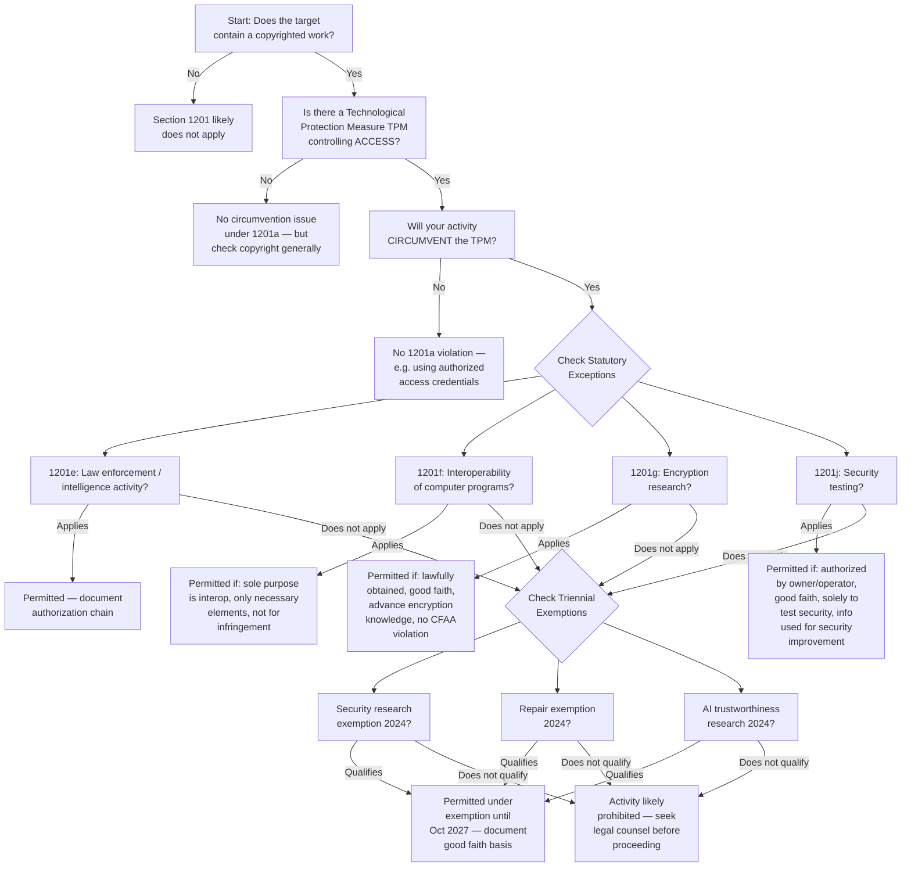
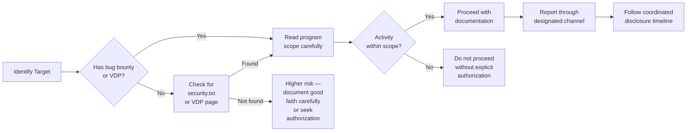
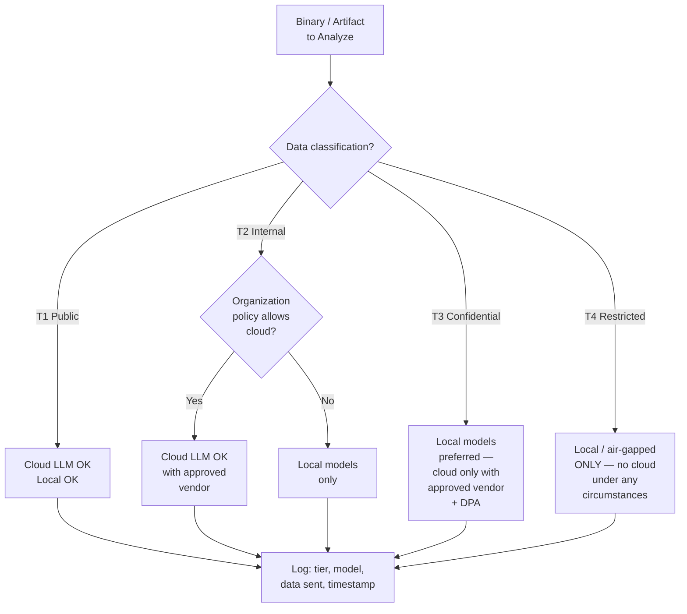
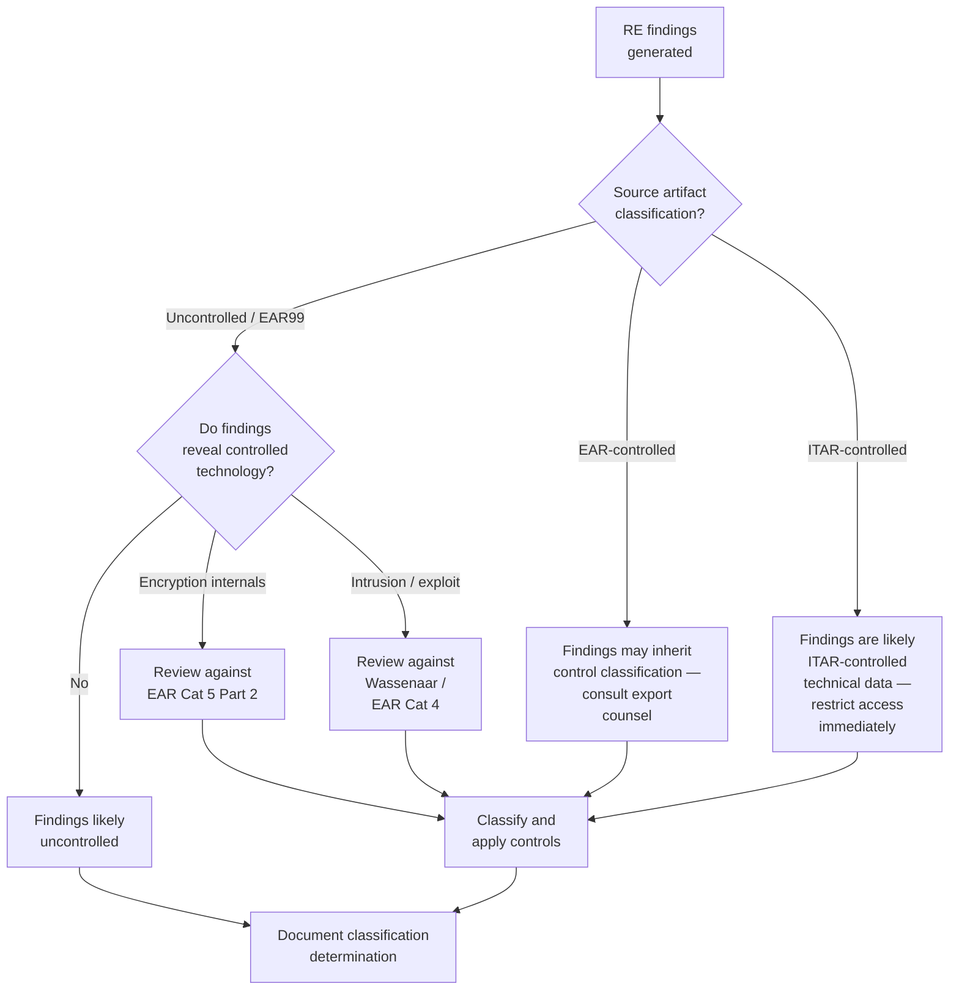

# Legal Compliance Playbook for AI-Augmented Reverse Engineering

> **NOTICE: This document is an informational template — not legal advice.**
> It is intended as a starting point for organizational policy development. For operational or compliance decisions, consult qualified counsel in the relevant jurisdiction. Laws, regulations, and enforcement postures change; verify all citations against current sources before relying on them.
>
> Verification note (as of 2026-02-19): statutory references, triennial exemption
> outcomes, and enforcement guidance should be rechecked before policy adoption.

---

## Table of Contents

1. [DMCA / Anti-Circumvention Decision Tree](#1-dmca--anti-circumvention-decision-tree)
2. [CFAA / Good-Faith Security Research](#2-cfaa--good-faith-security-research)
3. [EU Directive 2009/24/EC and Interoperability](#3-eu-directive-200924ec-and-interoperability)
4. [Cloud vs Offline Policy Templates](#4-cloud-vs-offline-policy-templates)
5. [Audit Requirements](#5-audit-requirements)
6. [Export Control Considerations](#6-export-control-considerations)
7. [Open Source License Compliance](#7-open-source-license-compliance)
8. [Organizational Deployment Checklist](#8-organizational-deployment-checklist)

---

## 1. DMCA / Anti-Circumvention Decision Tree

### Background

DMCA Section 1201 (17 U.S.C. 1201) prohibits (a) circumvention of technological protection measures (TPMs) that control access to copyrighted works and (b) trafficking in circumvention tools. However, a complex landscape of statutory exceptions (1201(e)-(j)) and triennial exemptions adopted by the Librarian of Congress provide safe harbors for certain activities.

### 2024 Triennial Rulemaking Outcomes (Ninth Proceeding)

The Librarian of Congress issued the final rule on October 25, 2024 (effective October 28, 2024; expires October 28, 2027). Key outcomes relevant to RE:

| Exemption Category | Status | Scope |
|---|---|---|
| Security research on devices/software (renewed) | Adopted | Good-faith testing of computer programs on lawfully acquired devices; covers firmware, IoT, vehicles, medical devices |
| Computer program repair (renewed) | Adopted | Circumvention for diagnosis, maintenance, repair of lawfully acquired devices |
| AI trustworthiness research (NEW) | Adopted | Good-faith research into AI system trustworthiness; new exemption class |
| AI security research (broader proposal) | Denied | Proposed exemption for circumventing access controls on generative AI platforms for bias/security research was not adopted |
| Preservation of software/video games (expanded) | Adopted | Expanded scope for libraries and archives |

### Decision Tree

### Key Questions Checklist

Before beginning any RE activity involving a TPM, document answers to:

- [ ] Is there a TPM controlling access (not just a copy-control measure)?
- [ ] Do you have lawful access to the copy being analyzed?
- [ ] What is the purpose of circumvention? (security research, interop, repair, encryption research)
- [ ] Does the activity fall under a statutory exception (1201(e)-(k))?
- [ ] Does the activity fall under a current triennial exemption?
- [ ] Is the activity limited in scope to what is necessary?
- [ ] Are you prepared to document good-faith basis?
- [ ] Will you need to distribute circumvention tools? (separate analysis under 1201(a)(2) and 1201(b) — more restrictive)

---

## 2. CFAA / Good-Faith Security Research

### DOJ 2022 Revised Charging Policy

On May 19, 2022, the Department of Justice announced a revised charging policy for Computer Fraud and Abuse Act (18 U.S.C. 1030) cases. Key elements:

**Definition of good-faith security research**: "Accessing a computer solely for purposes of good-faith testing, investigation, and/or correction of a security flaw or vulnerability, where such activity is carried out in a manner designed to avoid any harm to individuals or the public, and where the information derived from the activity is used primarily to promote the security or safety of the class of devices, machines, or online services to which the accessed computer belongs."

**Policy commitments**:
- DOJ will not charge good-faith security research as a CFAA violation
- Federal prosecutors must consult with the Computer Crime and Intellectual Property Section (CCIPS) before bringing charges
- Mere terms-of-service violations are insufficient basis for prosecution

**What is NOT protected**:
- Research conducted to extort owners
- Activity designed to cause harm
- Research as pretext for other criminal activity

### Authorization Documentation Requirements

| Document | Purpose | When Required |
|---|---|---|
| Written scope of work | Defines authorized systems, methods, timeframe | Before any engagement |
| Rules of engagement (ROE) | Specific technical boundaries, escalation procedures | Before any engagement |
| Client authorization letter | Proves system owner consent | Before any engagement |
| Bug bounty program terms | Establishes safe harbor scope | Before submission |
| Vulnerability disclosure policy | Defines reporting timeline and expectations | Before disclosure |
| Activity logs | Proves scope compliance after the fact | During and after |

### Bug Bounty Safe Harbors

### Scope Limitations for RE Contexts

When performing RE as part of security research:

- **Binary analysis on locally owned copies**: Generally lower risk — no unauthorized access to a remote computer
- **Dynamic analysis / emulation on your hardware**: Generally lower risk — you control the system being accessed
- **Connecting to remote services during analysis**: Higher risk — may constitute "accessing a protected computer"
- **Extracting data from cloud services**: Highest risk — careful scoping required
- **Automated fuzzing of remote endpoints**: Requires explicit authorization

---

## 3. EU Directive 2009/24/EC and Interoperability

### Article 5: Observation, Study, and Testing

Users with lawful access may "observe, study or test the functioning of the program in order to determine the ideas and principles which underlie any element of the program." This right:

- Applies while performing loading, displaying, running, transmitting, or storing
- Cannot be restricted by licensing agreements (per CJEU case law)
- Covers determining ideas and principles, not copying expression

### Article 6: Decompilation for Interoperability

Decompilation is permitted when **all** of the following conditions are met:

| Condition | Requirement |
|---|---|
| **Who** | Performed by licensee or person authorized to use a copy |
| **Necessity** | Information necessary to achieve interoperability is not readily available by other means |
| **Scope** | Limited to parts of the program necessary for interoperability |
| **Purpose** | Solely to achieve interoperability of an independently created program |

**Prohibited uses of information obtained**:

- Used for goals other than interoperability
- Given to third parties (except when necessary for interoperability)
- Used for developing a substantially similar program in its expression
- Used for any act that infringes copyright

### Interaction with Trade Secret Law

The EU Trade Secrets Directive (2016/943) provides that reverse engineering of a lawfully acquired product is a lawful means of acquiring trade secrets (Article 3(1)(b)), **unless** contractual restrictions on RE are valid and applicable. However:

- Article 6 of Directive 2009/24/EC may override contractual RE restrictions for software interoperability
- Tension exists between contractual trade secret protections and statutory decompilation rights
- National implementation varies — check the specific member state

### GDPR Implications for Binary Analysis

When binaries contain personal data (embedded strings, telemetry endpoints, user identifiers, developer names):

| Scenario | GDPR Consideration |
|---|---|
| Binaries contain embedded developer PII (names, emails) | Processing occurs when extracting/indexing strings — legal basis required |
| Telemetry URLs/endpoints exposed | May reveal data processing activities — handle as potentially sensitive |
| Sending binary content to cloud LLM | Cross-border transfer if LLM provider is outside EU — check adequacy decisions |
| Sharing RE findings containing PII | Minimize personal data in reports; redact where possible |
| Storing extracted strings in knowledge base | Data minimization principle applies — retain only what is necessary |

**Practical mitigations**:
- Implement automated PII detection/redaction in string extraction pipelines
- Log data processing activities involving binaries as part of GDPR records of processing
- Apply data minimization when indexing extracted content
- Review cloud LLM data processing agreements for GDPR compliance

---

## 4. Cloud vs Offline Policy Templates

### Data Classification Tiers

| Tier | Label | Description | Examples in RE Context |
|---|---|---|---|
| T1 | Public | Freely available information | Open-source binaries, public malware samples (e.g., MalwareBazaar), published CVE details |
| T2 | Internal | Organization-internal, low sensitivity | Internal tool configurations, non-sensitive analysis notes, generic RE workflows |
| T3 | Confidential | Business-sensitive, restricted distribution | Client binaries under NDA, proprietary firmware, vulnerability findings pre-disclosure |
| T4 | Restricted | Highest sensitivity, strict controls | Classified binaries, export-controlled firmware, active exploit code, military/defense targets |

### Decision Matrix: Cloud vs Local

### Policy Template: T1 (Public)

> **Permitted processing**: Cloud LLM APIs, public sandboxes, community sharing.
> **Controls**: Standard API key management, usage logging, cost monitoring.
> **Approval**: No special approval required beyond team-level authorization.
> **Retention**: Per organizational data retention policy.

### Policy Template: T2 (Internal)

> **Permitted processing**: Cloud LLM APIs with approved vendors; local models.
> **Controls**: API key management, usage logging, data classification review before submission. No submission of code snippets longer than [ORG_THRESHOLD] tokens without review.
> **Approval**: Team lead approval for cloud processing.
> **Restrictions**: Do not include internal hostnames, IPs, or credentials in prompts.
> **Retention**: Per organizational data retention policy.

### Policy Template: T3 (Confidential)

> **Permitted processing**: Local models strongly preferred. Cloud LLM only with explicit written approval AND vendor data processing agreement (DPA) covering confidentiality, data deletion, and no-training guarantees.
> **Controls**: Full prompt/response logging, artifact redaction pipeline, egress monitoring, encrypted storage.
> **Approval**: Security officer + legal review for cloud processing. Team lead for local processing.
> **Restrictions**: Strip all strings, paths, and identifiers before any cloud submission. Use abstracted representations (e.g., p-code, sanitized CFGs) rather than raw decompilation.
> **Retention**: Audit trail retained for [ORG_RETENTION_PERIOD]. Analysis artifacts destroyed per client agreement.

### Policy Template: T4 (Restricted)

> **Permitted processing**: Local / air-gapped models ONLY. No network connectivity during analysis.
> **Controls**: Air-gapped workstation, physical access controls, full session recording, two-person integrity where required.
> **Approval**: CISO/FSO approval required. Legal review required. Compliance officer sign-off.
> **Restrictions**: No data leaves the analysis environment. No cloud services. No external model APIs. USB/removable media policy enforced.
> **Retention**: Per classification guide and regulatory requirements. Destruction certificates required.

### Handling Specific Artifact Types

| Artifact Type | Default Tier | Notes |
|---|---|---|
| Public malware samples | T1 | Already publicly available; check source TOS |
| Client firmware under NDA | T3 | NDA terms govern; typically no cloud without consent |
| Military/defense binaries | T4 | May be classified or CUI; follow handling markings |
| Open-source project builds | T1 | Source available; binary analysis adds no sensitivity |
| Proprietary commercial software | T3 | License terms may restrict RE; check EULA |
| IoT device firmware (purchased) | T2-T3 | Depends on vendor agreements and content |
| Active exploit code | T3-T4 | Weaponized content requires strict controls |

---

## 5. Audit Requirements

### What Must Be Logged

| Log Category | Required Fields | Purpose |
|---|---|---|
| **Tool usage** | Timestamp, user, tool name, tool version, action performed, target artifact hash | Traceability of analysis actions |
| **Data access** | Timestamp, user, artifact ID, access type (read/write/delete), data classification | Access control audit |
| **LLM interactions** | Timestamp, user, model ID, prompt hash/summary, response hash, data tier of input, tokens consumed | AI interaction audit, data leakage detection |
| **Analysis mutations** | Timestamp, user, change type (rename, retype, comment, annotation), before/after values, artifact ID | Change attribution and rollback |
| **Export/sharing** | Timestamp, user, destination, artifact IDs, data classification, approval reference | Data exfiltration prevention |
| **Authentication events** | Timestamp, user, event type (login/logout/failure), source IP, MFA status | Access security |

### Ghidra Transaction Log Mapping

Ghidra maintains an undo/redo transaction log for program database changes. This maps to audit needs as follows:

| Ghidra Mechanism | Audit Mapping | Gap |
|---|---|---|
| Program transaction log (undo/redo stack) | Records analysis mutations with descriptions | Loses granularity on commit; no user attribution in single-user mode |
| Server-mode change sets | Per-user change tracking with conflict resolution | Requires Ghidra Server; not available in standalone mode |
| Script execution log | Records which scripts were run | Does not capture script arguments or output by default |
| Plugin activity | No standard logging | Gap — plugins must implement their own logging |
| Data type changes | Tracked in DataTypeManager transactions | Granularity varies; category-level vs. type-level |

**Recommended augmentation**: Implement a Ghidra plugin (or platform wrapper) that intercepts DomainObjectListener events and writes structured audit records including user identity, timestamp, change type, and before/after values.

### NIST SP 800-53 Rev 5 Relevant Controls

| Control | Title | Relevance to RE Platform |
|---|---|---|
| **AU-2** | Event Logging | Define auditable events for RE tools and LLM interactions |
| **AU-3** | Content of Audit Records | Ensure logs include who, what, when, where, outcome |
| **AU-6** | Audit Record Review, Analysis, and Reporting | Regular review of RE activity logs for anomalies |
| **AU-8** | Time Stamps | Synchronized timestamps across RE tool components |
| **AU-9** | Protection of Audit Information | Immutable/append-only log storage; access controls on logs |
| **AU-11** | Audit Record Retention | Retain per data classification and regulatory requirements |
| **AU-12** | Audit Record Generation | All RE platform components generate audit records |
| **AC-2** | Account Management | User lifecycle for RE platform access |
| **AC-6** | Least Privilege | Role-based access to analysis projects and artifacts |
| **CM-8** | System Component Inventory | Track RE tool versions, plugins, model versions |
| **IA-2** | Identification and Authentication | MFA for RE platform access |
| **SC-7** | Boundary Protection | Network egress controls for cloud LLM access |
| **SC-8** | Transmission Confidentiality and Integrity | TLS for all LLM API communications |
| **SI-4** | System Monitoring | Monitor for unauthorized data exfiltration |
| **MP-6** | Media Sanitization | Secure deletion of analysis artifacts |

### Retention Periods

| Data Type | Minimum Retention | Basis |
|---|---|---|
| Authentication logs | 1 year | NIST SP 800-53 AU-11 baseline |
| Analysis activity logs | 3 years | Contractual / regulatory (varies) |
| LLM interaction logs | Duration of project + 1 year | Data processing accountability |
| Export/sharing records | 5 years | Export control (EAR) record-keeping |
| Vulnerability findings | Until remediation + 2 years | Coordinated disclosure timelines |
| Classified analysis records | Per classification guide | NIST SP 800-53 / agency policy |

> **Note**: Retention periods are illustrative defaults. Adjust based on organizational policy, contractual obligations, and applicable regulations. Some jurisdictions or contracts may require longer retention.

---

## 6. Export Control Considerations

### EAR (Export Administration Regulations) Implications

The Bureau of Industry and Security (BIS) administers EAR. Key considerations for RE tools and findings:

| Item / Activity | EAR Classification | Notes |
|---|---|---|
| Ghidra (open-source, NSA-released) | Publicly available (EAR99 / NLR) | Published open-source software generally excluded per EAR 734.3(b)(3) |
| Custom RE plugins/scripts | Likely EAR99 unless encryption-specific | Review if plugin performs cryptanalysis |
| Encryption analysis tools | May fall under Category 5, Part 2 | Cryptanalysis tools and techniques may be controlled |
| Vulnerability/exploit information | May become ECCN 4E001 / 4D004 | Intrusion software and related technology are controlled |
| Decompiled proprietary code | Controlled if derived from controlled source | Inherits classification of the source artifact |
| Analysis findings on controlled items | May be controlled technical data | RE findings on ITAR/EAR-controlled items can themselves be controlled |

### ITAR (International Traffic in Arms Regulations) Implications

ITAR (22 CFR 120-130) applies to defense articles and services on the United States Munitions List (USML).

- RE of ITAR-controlled items (defense articles) may generate controlled technical data
- Analysis findings, vulnerability reports, and even decompiled code from ITAR items are likely controlled
- Sharing with foreign persons (including foreign national employees) requires a license or exemption
- Cloud processing of ITAR data requires ITAR-compliant infrastructure

### Encryption Analysis Controls

Under EAR Category 5, Part 2:

- **ECCN 5A002/5D002**: Encryption hardware/software designed for cryptanalysis
- **ECCN 5E002**: Technology for development/production of 5A002/5D002 items
- Tools performing automated cryptanalytic functions may require classification
- License Exception ENC may apply — but requires classification request and potentially semi-annual reporting

### When RE Findings Become Controlled Technical Data

### Country-Specific Restrictions

| Destination Group | EAR Treatment | Practical Impact |
|---|---|---|
| Country Group A (allies) | Most favorable; many license exceptions available | Most RE tool sharing feasible with proper classification |
| Country Group B (general) | License exceptions may apply; case-by-case | Review specific ECCNs against destination |
| Country Group D (restricted) | Limited exceptions; encryption controls strict | Encryption analysis tools/findings likely need licenses |
| Country Group E (embargoed: Cuba, Iran, North Korea, Syria, Crimea/Donetsk/Luhansk) | Presumption of denial | Effectively no sharing of RE tools or findings |

> **Practical guidance**: Before sharing any RE tools, plugins, or analysis findings with foreign entities, conduct an export classification review. When in doubt, file a commodity classification request with BIS or consult export control counsel.

---

## 7. Open Source License Compliance

### Ghidra's Licensing Structure

Ghidra uses a dual-directory licensing approach:

| Component | License | Location |
|---|---|---|
| Core Ghidra | Apache License 2.0 | Root directory |
| GPL support programs | GPL 3.0 | `GPL/` directory |
| Third-party dependencies | Various (see NOTICE) | Bundled per component |

**Key design principle**: GPL code lives in a standalone `GPL/` directory, is built independently, and communicates with the core via process separation (executed as separate processes, output parsed). This avoids direct linking and GPL contamination of the Apache 2.0 core.

### License Compatibility Matrix

| License A | License B | Compatible for linking? | Distribution requirements |
|---|---|---|---|
| Apache 2.0 | Apache 2.0 | Yes | Include NOTICE and LICENSE files |
| Apache 2.0 | MIT | Yes | Include MIT copyright notice |
| Apache 2.0 | BSD 2/3 | Yes | Include BSD copyright notice |
| Apache 2.0 | GPL 2.0 only | **No** (per both ASF and FSF) | Cannot link — use process separation |
| Apache 2.0 | GPL 3.0 | Yes (one-way: result is GPL 3.0) | Distribution must be under GPL 3.0 |
| Apache 2.0 | LGPL 2.1+ | Yes (if dynamically linked) | LGPL obligations apply to LGPL component |
| Apache 2.0 | MPL 2.0 | Yes | MPL files remain MPL; Apache files remain Apache |
| GPL 2.0 | GPL 3.0 | **No** (unless "or later" clause) | Cannot combine |
| MIT | GPL (any) | Yes (result is GPL) | Distribution under GPL |

### GPL Contamination Risks from Plugins

| Scenario | Risk Level | Mitigation |
|---|---|---|
| GPL plugin loaded into Ghidra JVM | Medium-High | May create a "combined work" under GPL interpretation — Ghidra's process-separation model avoids this for GPL/ directory items |
| GPL library linked by a plugin | High | Plugin distribution must be GPL; may affect host application depending on interpretation |
| LGPL library dynamically loaded | Low | Maintain dynamic linking; provide ability to relink |
| GPL tool invoked as subprocess | Low | Process separation generally accepted as not creating combined work |
| Plugin uses GPL Python library (Jython/PyGhidra-based workflow) | Medium | Depends on linking model; Python import may constitute linking |

### Distribution Requirements

When shipping modified Ghidra or Ghidra-based distributions:

- [ ] Include Apache 2.0 LICENSE file for core components
- [ ] Include NOTICE file with all required attribution notices
- [ ] State changes made to original Apache 2.0 code (per Section 4(b))
- [ ] For any GPL components: include GPL license text, provide source code (or written offer), and mark GPL boundary clearly
- [ ] For bundled third-party dependencies: comply with each dependency's license terms (check Ghidra's `licenses/` directory and NOTICE file)
- [ ] Do not use "Ghidra" trademark in ways that imply NSA endorsement (trademark, not copyright, issue)
- [ ] If adding proprietary plugins: ensure clean separation from GPL components; do not link against GPL code

### Common RE Tool Dependency Licenses

| Tool / Library | License | Linking Concern |
|---|---|---|
| Capstone | BSD 3-Clause | Safe for all uses |
| Unicorn | GPL 2.0 | Contamination risk if linked; use subprocess |
| Keystone | GPL 2.0 | Same as Unicorn |
| radare2/rizin | LGPL 3.0 | Dynamic linking OK; static linking triggers LGPL |
| Yara | BSD 3-Clause | Safe for all uses |
| Z3 (SMT solver) | MIT | Safe for all uses |
| angr | BSD 2-Clause | Safe for all uses |
| Binary Ninja API | Proprietary | Check license for plugin distribution rights |
| Volatility | GPL 2.0 | Contamination risk if linked |
| pwntools | MIT | Safe for all uses |
| LIEF | Apache 2.0 | Safe for all uses |

---

## 8. Organizational Deployment Checklist

### Phase 1: Pre-Deployment Legal Review

- [ ] **Identify applicable jurisdictions** — where will the platform be used? (US, EU, other)
- [ ] **DMCA/1201 review** — will any workflows involve circumventing TPMs? If yes, identify applicable exemptions and document legal basis
- [ ] **CFAA review** — will any workflows involve accessing remote systems? If yes, document authorization chain
- [ ] **EU software directive review** — if operating in EU, confirm decompilation activities meet Article 6 conditions
- [ ] **Export control classification** — classify the platform, custom plugins, and typical output for EAR/ITAR
- [ ] **License audit** — review all open-source dependencies for license compatibility; resolve GPL contamination risks
- [ ] **Data protection impact assessment (DPIA)** — required under GDPR if processing personal data; recommended generally
- [ ] **Legal sign-off** — obtain written legal review approval before proceeding to technical deployment

### Phase 2: Data Handling Procedures

- [ ] **Define data classification tiers** — adapt the T1-T4 framework above to organizational terminology
- [ ] **Implement classification labeling** — all projects/artifacts must be classified at creation
- [ ] **Configure egress controls** — network policy enforcing cloud/offline rules per data tier
- [ ] **Set up artifact redaction pipeline** — automated PII/path/credential stripping for cloud-bound data
- [ ] **Establish data processing agreements** — DPAs with all cloud LLM vendors covering: no training on inputs, data deletion, breach notification
- [ ] **Implement encryption at rest and in transit** — for all analysis artifacts and audit logs
- [ ] **Define data destruction procedures** — secure deletion for completed engagements; destruction certificates for T4

### Phase 3: Platform Technical Controls

- [ ] **Deploy audit logging** — structured logs for all categories in Section 5
- [ ] **Configure log immutability** — append-only storage or SIEM forwarding for audit logs
- [ ] **Implement role-based access control** — least-privilege access to projects, artifacts, and admin functions
- [ ] **Enable MFA** — for all platform access
- [ ] **Set up monitoring/alerting** — detect unauthorized data exfiltration, anomalous LLM usage, scope violations
- [ ] **Establish plugin/extension review process** — security and license review before any plugin is approved for use
- [ ] **Configure model governance** — approved model list, version pinning, performance baseline tracking
- [ ] **Test air-gapped mode** — verify T4 workflows function without network connectivity

### Phase 4: Incident Response for Data Leaks

- [ ] **Define incident classification** — what constitutes a data leak in RE context (e.g., classified binary content sent to unauthorized cloud service)
- [ ] **Establish response team** — security, legal, compliance, and engineering contacts
- [ ] **Create response procedures**:
  - Immediate containment (revoke API keys, isolate workstation)
  - Assessment (what data was exposed, to whom, data classification)
  - Notification (client, legal, regulators per GDPR 72-hour rule if applicable)
  - Remediation (root cause analysis, control improvements)
  - Documentation (incident report, lessons learned)
- [ ] **Tabletop exercises** — run data leak scenarios quarterly
- [ ] **Breach notification templates** — pre-approved templates for client and regulatory notifications

### Phase 5: Training Requirements

| Audience | Training Topic | Frequency |
|---|---|---|
| All users | Data classification and handling | Annual + onboarding |
| All users | Acceptable use policy for AI/LLM tools | Annual + onboarding |
| Analysts | DMCA/CFAA legal boundaries for RE | Annual |
| Analysts | Export control awareness | Annual |
| Analysts | Secure analysis workflows (cloud vs offline) | Annual + per-engagement briefing |
| Platform admins | Audit log review and incident response | Quarterly |
| Management | Compliance reporting and risk acceptance | Annual |

### Phase 6: Ongoing Compliance

- [ ] **Quarterly audit log reviews** — review for policy violations, anomalies, access patterns
- [ ] **Annual license compliance audit** — re-scan all dependencies for license changes
- [ ] **Triennial DMCA exemption tracking** — monitor Copyright Office rulemaking cycle (next: 2027)
- [ ] **Export control regulation monitoring** — subscribe to BIS and DDTC updates for regulatory changes
- [ ] **Vendor DPA reviews** — annual review of cloud LLM vendor compliance with data processing agreements
- [ ] **Policy updates** — revise this playbook when laws, regulations, or organizational circumstances change
- [ ] **Penetration testing** — annual security assessment of the RE platform itself

---

## Appendix A: Quick Reference — Jurisdiction Comparison

| Factor | United States | European Union |
|---|---|---|
| **RE for interoperability** | DMCA 1201(f) — narrow statutory exception | Directive 2009/24/EC Art. 6 — broader right, cannot be contracted away |
| **RE for security research** | DMCA 1201(j) + triennial exemptions; CFAA 2022 DOJ policy | Varies by member state; Cyber Resilience Act may expand |
| **Decompilation right** | No general right; must fit exception/exemption | Art. 5 (observation/study) + Art. 6 (decompilation for interop) |
| **Contractual override** | EULA/TOS restrictions generally enforceable | Art. 6 rights cannot be overridden by contract |
| **Trade secrets** | DTSA / state UTSA — RE of lawfully obtained products generally OK | Directive 2016/943 Art. 3(1)(b) — RE of lawfully acquired products is lawful acquisition |
| **Data protection** | Sector-specific (HIPAA, GLBA, state laws) | GDPR applies broadly; DPIA may be required |
| **Export controls** | EAR + ITAR | EU Dual-Use Regulation (2021/821) |

## Appendix B: Key Legal References

| Reference | Citation | Relevance |
|---|---|---|
| DMCA Anti-Circumvention | 17 U.S.C. 1201 | TPM circumvention prohibition and exceptions |
| 2024 Triennial Rulemaking Final Rule | 89 FR 85688 (Oct. 28, 2024) | Current exemptions through Oct. 2027 |
| Computer Fraud and Abuse Act | 18 U.S.C. 1030 | Unauthorized computer access |
| DOJ 2022 CFAA Charging Policy | DOJ Press Release, May 19, 2022 | Good-faith security research safe harbor |
| EU Computer Programs Directive | Directive 2009/24/EC | Software decompilation and interoperability |
| EU Trade Secrets Directive | Directive 2016/943 | Lawful RE as trade secret acquisition |
| GDPR | Regulation 2016/679 | Personal data in binaries and analysis |
| EAR | 15 CFR 730-774 | Export controls on RE tools and findings |
| ITAR | 22 CFR 120-130 | Defense article controls |
| NIST SP 800-53 Rev 5 | NIST Special Publication | Security and privacy controls framework |
| Wassenaar Arrangement | Category 4, 5 | Intrusion software and cryptanalysis controls |

---

> **Document version**: 1.0
> **Last updated**: 2026-02-19
> **Classification**: INFORMATIONAL TEMPLATE — NOT LEGAL ADVICE
> **Review cycle**: Update when laws, regulations, or organizational circumstances change. At minimum, review at each DMCA triennial rulemaking cycle.
