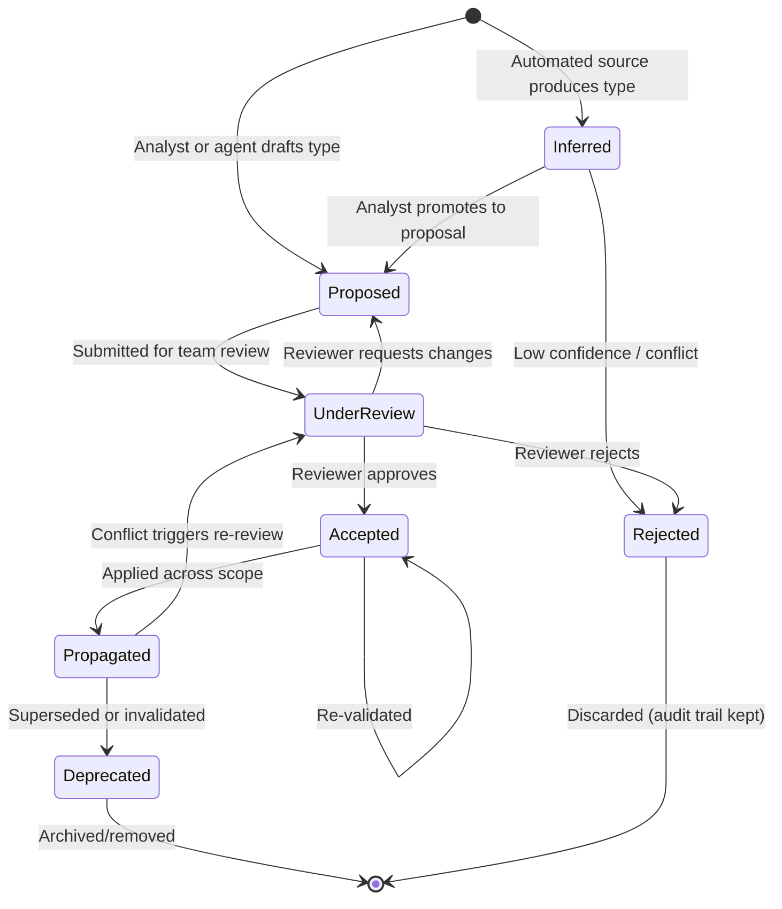
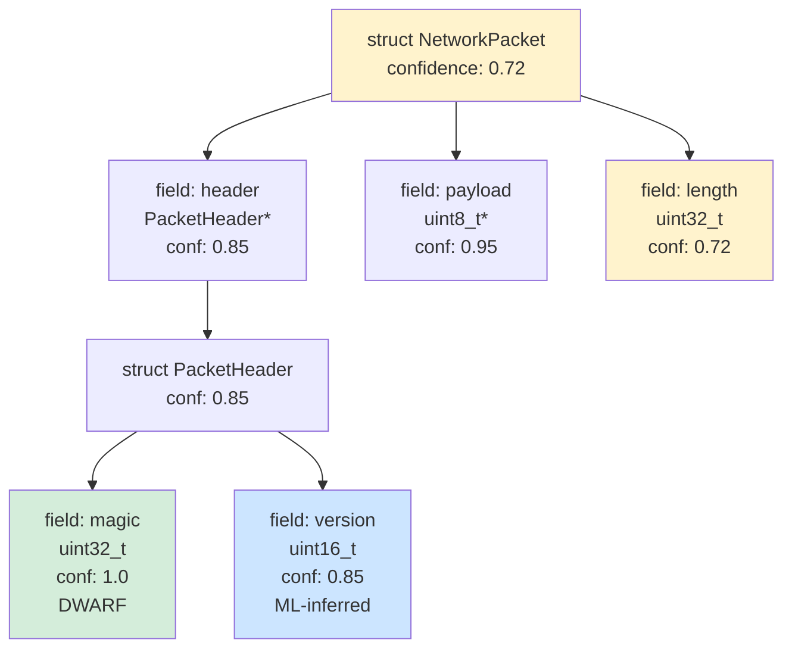
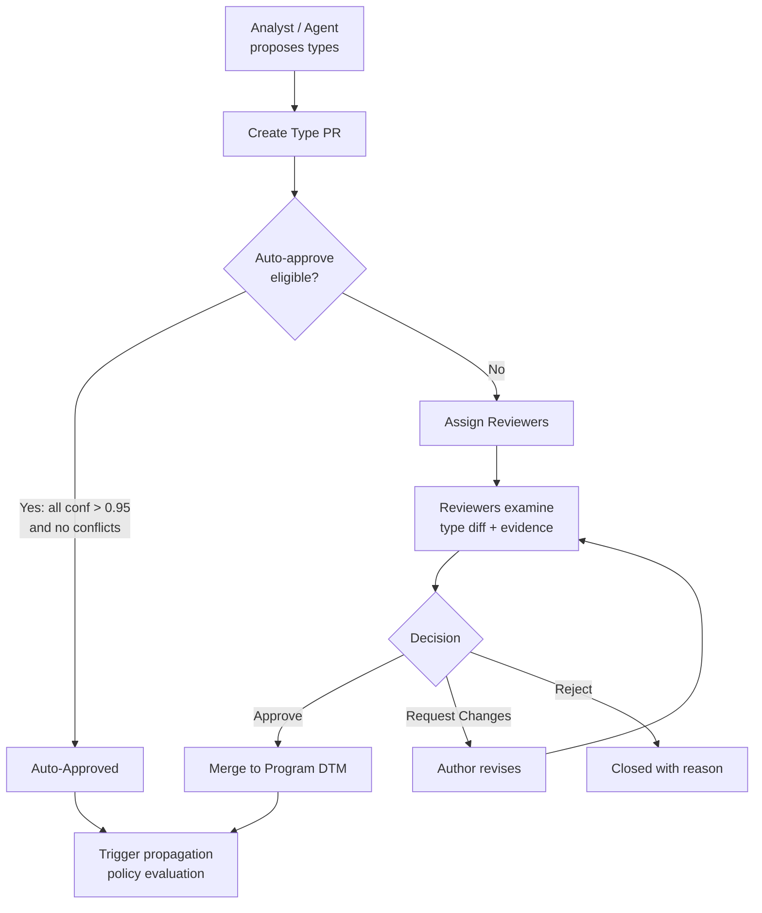
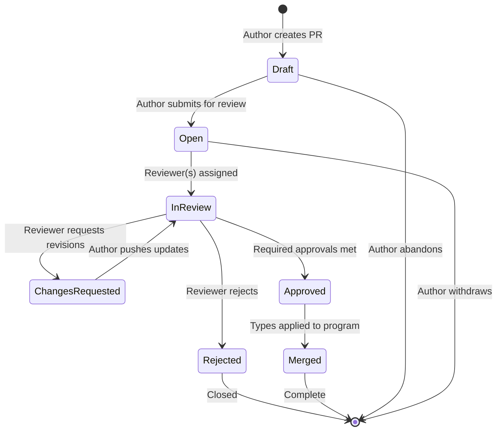
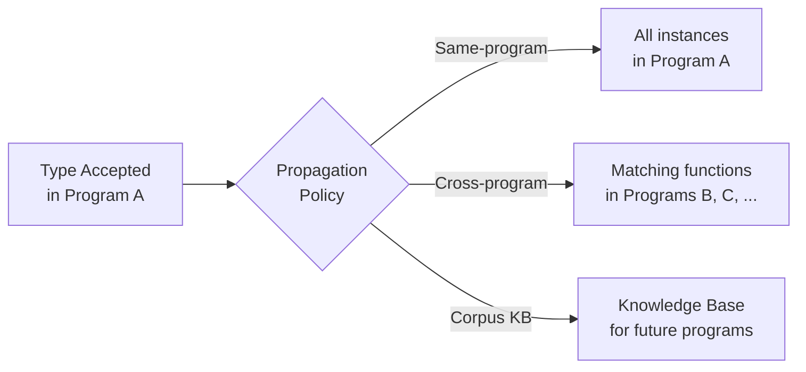
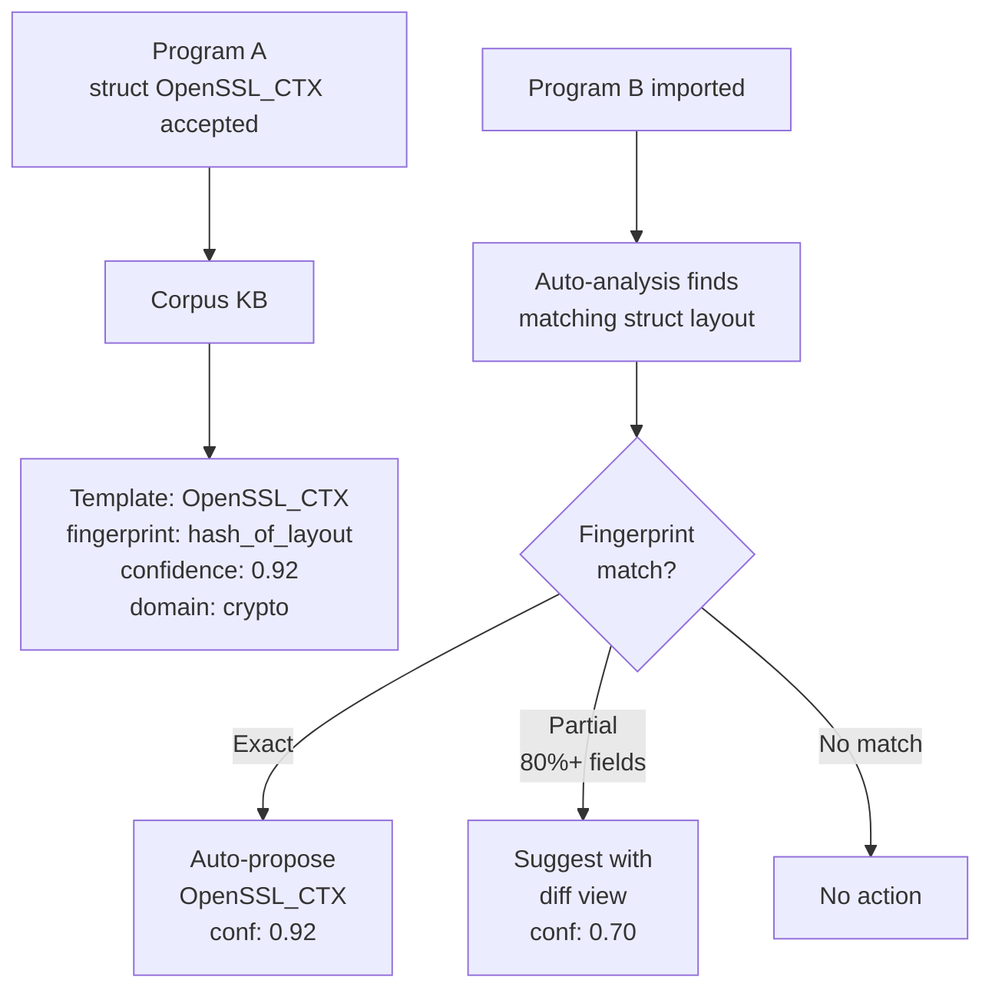
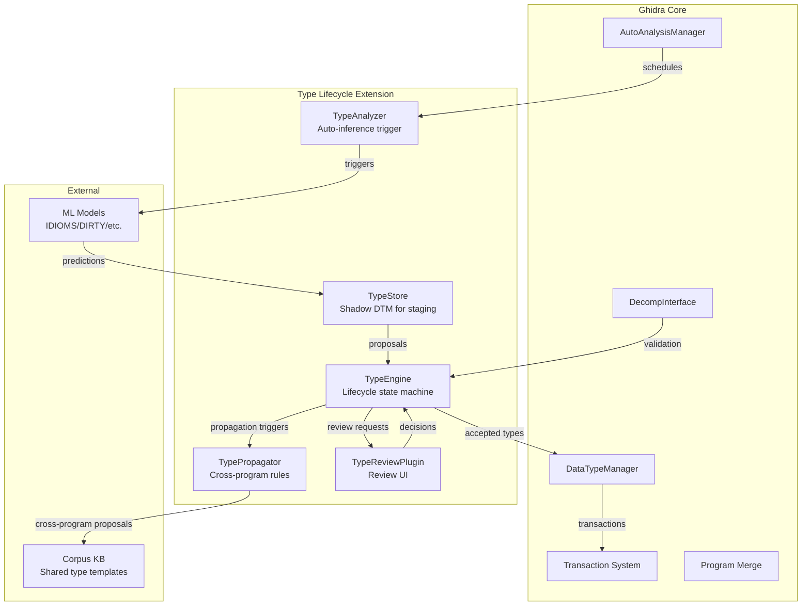

# Type Lifecycle UX and Governance

> Compiled: 2026-02-19 | Scope: Type lifecycle state management, confidence modeling, conflict resolution, team review workflows, rollback semantics, propagation rules, and Ghidra integration design
>
> Verification note: Ghidra API references are cross-checked against `ghidra-internals-architecture.md` and `decompilation-type-recovery.md` in this repository. UX patterns are informed by agentic AI design research and collaborative code review best practices.

---

## 1. Type Lifecycle States

### 1.1 The Problem

Binary analysis produces types from multiple sources with varying reliability: debug symbols (DWARF/PDB), analyst manual annotations, heuristic analysis, constraint-based inference (RETYPD/BinSub), and ML model predictions (DIRTY, IDIOMS, ReSym). These sources operate at different confidence levels, at different times, and sometimes disagree. Today, Ghidra's `DataTypeManager` treats all types the same once applied -- there is no distinction between a type from DWARF debug info and one hallucinated by an LLM. This conflation undermines trust and makes rollback, review, and propagation intractable at scale.

### 1.2 Lifecycle State Machine

A type assertion (the claim that "variable X at address 0x4012A0 has type `struct TLS_Context*`") progresses through a defined lifecycle:



### 1.3 State Definitions

| State | Description | Who Triggers | Persistence |
|---|---|---|---|
| **Inferred** | Raw output from an automated source (analyzer, ML model, heuristic). Not yet endorsed by any human. Stored in a staging area, not the program's canonical type database. | Analyzers, ML models, constraint solvers | Staging DB (shadow `DataTypeManager`) |
| **Proposed** | A type assertion explicitly put forward for consideration. May originate from an analyst's manual work or from an analyst promoting an inferred type. Includes a justification/evidence record. | Analyst, agent (with receipt) | Proposal queue |
| **Under Review** | A proposal assigned to one or more reviewers. Locked against conflicting edits during review. | Submitter (analyst or automated workflow) | Review system |
| **Accepted** | Approved by required reviewers. The type is now canonical within its scope (single program). Not yet propagated to other programs or the corpus knowledge base. | Reviewer(s) | Program `DataTypeManager` |
| **Propagated** | The accepted type has been applied beyond its original scope -- to other instances in the same program, to other programs in the corpus, or to the shared knowledge base. | Propagation engine (policy-driven) | Program DTM + Corpus KB |
| **Deprecated** | A previously accepted/propagated type that has been superseded by a better type, invalidated by new evidence, or marked stale by time-based decay. Retained for audit. | Analyst, automated staleness check, conflict resolution | Archive with deprecation metadata |
| **Rejected** | A proposal or inference that was explicitly denied. The rejection reason is recorded. The type is never applied to canonical storage. | Reviewer, conflict resolver, policy rule | Audit log only |

### 1.4 ML-Inferred vs. Analyst-Created Types

The lifecycle distinguishes these by **source metadata** attached to every type assertion:

| Property | ML-Inferred | Analyst-Created |
|---|---|---|
| Initial state | `Inferred` | `Proposed` (skips inference staging) |
| Auto-promotion eligible | Yes, if confidence >= threshold AND no conflicts | N/A (already proposed) |
| Requires review | Configurable: always, never, or confidence-dependent | Configurable per team policy |
| Evidence record | Model ID, version, input features hash, confidence score | Analyst rationale (free text or structured) |
| Decay eligible | Yes (staleness increases as binary/model change) | No (analyst assertions are durable unless explicitly deprecated) |
| Batch operations | Common (model infers types for entire binary) | Uncommon (analysts work incrementally) |

### 1.5 Transition Triggers

| Transition | Trigger | Automated? |
|---|---|---|
| `[*]` -> `Inferred` | Analyzer/model run completes | Yes |
| `Inferred` -> `Proposed` | Analyst reviews and promotes; or auto-promote policy fires (confidence >= 0.95, no conflicts) | Either |
| `Proposed` -> `Under Review` | Submitter requests review; or policy requires review for type category | Either |
| `Under Review` -> `Accepted` | All required approvals received | No (requires human) |
| `Under Review` -> `Rejected` | Any reviewer rejects, or review timeout expires | Either |
| `Accepted` -> `Propagated` | Propagation policy fires (exact match: auto; fuzzy match: propose) | Yes (policy-gated) |
| `Propagated` -> `Deprecated` | Superseding type accepted; staleness timer expires; analyst marks deprecated | Either |
| Any -> `Rejected` | Conflict detected with higher-priority source; manual rejection | Either |

Lifecycle transitions are validated server-side against an allowlist (`from_state`, `to_state`) before persistence. Invalid transitions are rejected at write time, and valid transitions must reference the receipt that performed the mutation.

---

## 2. Confidence Model

### 2.1 Multi-Signal Confidence Scoring

Each type assertion carries a **confidence score** in [0.0, 1.0] computed from the source signal and contextual factors:

#### Source Base Scores

| Source | Base Confidence | Rationale |
|---|---|---|
| DWARF/PDB debug info (exact match) | **1.0** | Ground truth by definition; compiler-emitted |
| DWARF/PDB (partial/reconstructed) | **0.90** | Debug info present but stripped or incomplete |
| Analyst manual annotation | **0.95** | Expert judgment; may have errors but high baseline trust |
| Constraint-based inference (RETYPD, BinSub, TRex) | **0.75 - 0.90** | Sound reasoning but may be imprecise; depends on constraint completeness |
| ML model (high-confidence prediction) | **0.50 - 0.85** | Varies by model calibration, training data quality, and prediction type |
| ML model (low-confidence prediction) | **0.20 - 0.50** | Below auto-promote threshold; requires human review |
| Heuristic / pattern match | **0.30 - 0.60** | Rules of thumb (e.g., "4-byte aligned access likely int") |
| Ghidra built-in type propagation | **0.70** | Unification-based; good baseline but limited precision |

#### Contextual Modifiers

The base score is adjusted by contextual signals:

```
final_confidence = base_confidence * cross_ref_factor * consistency_factor * freshness_factor
```

| Factor | Range | Description |
|---|---|---|
| `cross_ref_factor` | 0.8 - 1.2 | Multiple independent call sites agree on type (+); contradictions (-) |
| `consistency_factor` | 0.7 - 1.1 | Type is consistent with field access patterns, size constraints, calling convention |
| `freshness_factor` | 0.5 - 1.0 | Decays over time if the binary, model, or analysis context changes (see 2.3) |

The final score is clamped to [0.0, 1.0].

### 2.2 Confidence Propagation Through Type Dependencies

Types form a dependency graph: a struct's confidence depends on the confidence of its field types; a function signature depends on parameter and return types; a typedef inherits from its base type.

**Propagation rules:**

1. **Struct confidence** = min(struct_own_confidence, min(field_confidences))
   - Rationale: a struct is only as reliable as its least-reliable field
   - Exception: if a field has `source = DWARF` (confidence 1.0) but the struct layout was ML-inferred, the struct confidence dominates

2. **Pointer type confidence** = target_type_confidence * 0.95
   - Slight discount: even if we know the pointed-to type, the pointer relationship itself could be wrong

3. **Function signature confidence** = min(return_type_confidence, min(param_confidences)) * calling_convention_factor
   - `calling_convention_factor` = 1.0 if calling convention is confirmed (e.g., from debug info or consistent analysis), 0.9 if inferred

4. **Typedef confidence** = base_type_confidence * 1.0
   - Typedefs are transparent wrappers; confidence passes through unchanged

5. **Array confidence** = element_type_confidence * array_bounds_confidence
   - `array_bounds_confidence` reflects how reliably the array length was determined (loop analysis: 0.8; access pattern: 0.6; fixed size from debug info: 1.0)



In this example, `NetworkPacket.length` has confidence 0.72 (ML-inferred from access patterns), which pulls the entire struct confidence down to 0.72. The `PacketHeader` has higher confidence because its `magic` field comes from DWARF and `version` was ML-inferred with 0.85 confidence.

### 2.3 Decay Model for Stale Types

Type confidence is not static. It decays when the context that produced the type changes:

**Decay triggers:**

| Trigger | Decay Rate | Rationale |
|---|---|---|
| Binary re-analyzed with updated tool | 0.9x per re-analysis cycle | New analysis may produce different/better types |
| ML model version updated | 0.8x on old model's predictions | Newer model may disagree; old predictions are suspect |
| Conflicting type proposed (not yet resolved) | 0.7x on both conflicting types | Unresolved conflict reduces trust in either assertion |
| Time since last validation | 0.95x per review period (configurable, e.g., 30 days) | Types not re-validated may be based on outdated understanding |
| Dependent type deprecated | 0.6x | If a field type is deprecated, the parent struct confidence drops |

**Decay formula:**

```
decayed_confidence = base_confidence * decay_factor^(time_periods_elapsed)
```

Where `time_periods_elapsed` = floor((now - last_validated) / review_period).

**Staleness threshold:** When `decayed_confidence < 0.3`, the type transitions to `Deprecated` with reason "staleness" and is flagged for re-evaluation.

**Refresh mechanism:** An analyst or automated re-analysis that confirms an existing type resets `last_validated` to now and restores confidence to the original base score.

---

## 3. Conflict Resolution

### 3.1 Conflict Detection

Conflicts arise when two or more sources assert different types for the same target (variable, parameter, struct field, function return type). Detection occurs at proposal time and during propagation.

**Conflict categories:**

| Category | Example | Detection Method |
|---|---|---|
| **Primitive type disagreement** | Source A says `int32_t`, source B says `uint32_t` | Exact type comparison at resolution target |
| **Struct layout conflict** | Source A: 3 fields at offsets 0/4/8; Source B: 2 fields at offsets 0/8 | Field-by-field offset and type comparison |
| **Function signature conflict** | Source A: `int foo(char*, int)`; Source B: `void foo(void*, size_t)` | Parameter count, types, return type comparison |
| **Typedef chain conflict** | Source A: `HANDLE` -> `void*`; Source B: `HANDLE` -> `int` | Resolve typedef chains, compare underlying types |
| **Pointer depth conflict** | Source A: `char*`; Source B: `char**` | Pointer nesting depth comparison |
| **Struct name conflict** | Both define `struct Context` but with different layouts | Name match + structural difference |

### 3.2 Priority Rules

When conflicts are detected, priority rules determine the default resolution:

```
Debug Info (DWARF/PDB) > Analyst Manual > Constraint-Based > ML Model > Heuristic > Ghidra Default
```

**Priority resolution algorithm:**

```
function resolve_conflict(assertion_a, assertion_b):
    if priority(assertion_a.source) != priority(assertion_b.source):
        winner = highest_priority(assertion_a, assertion_b)
        loser = other(assertion_a, assertion_b)
        return Resolution(
            accept=winner,
            reject=loser,
            reason="source priority",
            requires_review=(priority_gap < 2)  # close priorities need human check
        )
    else:
        # Same priority tier: use confidence scores
        if abs(assertion_a.confidence - assertion_b.confidence) > 0.15:
            return Resolution(accept=higher_confidence, reject=lower)
        else:
            # Too close to call: escalate to human review
            return Resolution(
                accept=None,
                escalate=True,
                reason="same-tier conflict within confidence margin"
            )
```

### 3.3 Type Diff Visualization

When conflicts are escalated, the reviewer needs a clear visualization of what differs. The "type diff" presents two type assertions side-by-side with differences highlighted:

```
  struct TLS_Context (Source A: ML-IDIOMS v2.1, conf=0.78)
  ──────────────────────────────────────────────────────────
  offset  0: uint32_t     version        // AGREE
- offset  4: uint8_t[32]  session_id     // A: array of 32 bytes
+ offset  4: char[48]     session_id     // B: array of 48 chars
  offset 36: uint16_t     cipher_suite   // AGREE (A only, offset adjusted)
- offset 38: uint8_t      padding[2]     // A: explicit padding
  offset 40: void*        cert_chain     // AGREE
- TOTAL SIZE: 48 bytes                   // A
+ TOTAL SIZE: 56 bytes                   // B

  struct TLS_Context (Source B: Analyst @alice, conf=0.95)
```

**Diff features:**

- Field-by-field alignment with offset tracking
- Color coding: green (agree), red (source A only), blue (source B only), yellow (both present but differ)
- Size and alignment summary
- Confidence scores for each field where available
- Link to evidence: what analysis/xrefs support each assertion

### 3.4 Interactive Resolution UI Patterns

The conflict resolution UI follows established code review interaction patterns adapted for type assertions:

1. **Side-by-side panel**: Two type definitions displayed in parallel with inline diff markers
2. **Cherry-pick fields**: Reviewer can accept individual fields from either source (building a merged type)
3. **Edit-in-place**: Reviewer can modify the merged result directly
4. **Evidence drawer**: Expandable panel showing the evidence (xrefs, access patterns, decompiler output, model inputs) supporting each assertion
5. **One-click resolutions**: "Accept A", "Accept B", "Merge (take higher confidence per field)", "Defer (mark for later)"
6. **Batch resolution**: When the same conflict pattern repeats (e.g., `int` vs `uint` across 50 variables), offer "apply this resolution to all similar conflicts"

---

## 4. Team Approval Flows

### 4.1 The "Type PR" Concept

Borrowing from software development's pull request model, a **Type PR** bundles a set of related type changes into a reviewable unit:



**Type PR contents:**

| Field | Description |
|---|---|
| **Title** | Brief summary (e.g., "TLS struct recovery for libssl.so functions") |
| **Author** | Analyst or agent identity |
| **Source** | Model/tool that produced the types, or "manual" |
| **Scope** | Program(s) affected |
| **Changes** | List of (target, old_type, new_type, confidence, evidence_ref) tuples |
| **Conflicts** | Any detected conflicts with existing types (pre-computed) |
| **Batch metadata** | If ML-generated: model version, run ID, aggregate statistics |

### 4.2 Reviewer Assignment

Reviewers are assigned based on domain expertise and type category:

| Type Category | Suggested Reviewer Profile | Example |
|---|---|---|
| Cryptographic structs | Crypto domain expert | TLS/SSL structures, key material layouts |
| Network protocol types | Protocol analyst | Packet headers, socket structures |
| OS/kernel types | Systems-level analyst | Process structures, driver IOCTLs |
| Complex nested structs (> 5 levels) | Senior reverse engineer | Deeply nested class hierarchies |
| Function signatures (> 4 params) | Calling convention expert | Complex API surfaces |
| ML-inferred batch (> 50 types) | Team lead + domain expert | Bulk model output review |
| Primitive type renames | Any team member | `int` -> `uint32_t` style changes |

**Assignment algorithm:**

1. Categorize each type change in the PR by domain tags (crypto, network, OS, general)
2. Look up team members with matching expertise tags
3. Assign primary reviewer (most specific expertise match) and optional secondary reviewer (for high-impact changes)
4. If no domain expert is available, assign to team lead with a note requesting domain-specific attention

### 4.3 Approval Thresholds

| Condition | Required Approvals | Rationale |
|---|---|---|
| All types have confidence >= 0.95 AND no conflicts AND source is DWARF/PDB | **0** (auto-approve) | Debug-info types are ground truth |
| All types have confidence >= 0.95 AND no conflicts AND source is analyst | **0** (auto-approve, configurable) | High-confidence analyst work; teams can require 1 reviewer |
| All types have confidence >= 0.80 AND no conflicts | **1** reviewer | Moderate confidence; one expert eye sufficient |
| Any type has confidence < 0.80 OR conflicts exist | **2** reviewers | Lower confidence or disputes need consensus |
| Batch ML inference (> 20 types) | **1** reviewer + spot-check protocol | Reviewer validates a random sample (sqrt(N) types) rather than reviewing every type |
| Types affecting exported API signatures | **2** reviewers (one must be team lead) | High blast radius; affects downstream consumers |

### 4.4 Review Workflow States



---

## 5. Rollback Semantics

### 5.1 Ghidra's Transaction System as Foundation

Ghidra's `ProgramDB` uses a transaction-based model where all modifications occur within database transactions. The `DataTypeManager` participates in the program's transaction system, and transactions support undo/redo through a stack of changes. This provides the foundation for type rollback.

Key Ghidra primitives:

- `program.startTransaction(description)` / `program.endTransaction(txId, commit)`: Wraps all changes in a named transaction
- `program.undo()` / `program.redo()`: Reverts or re-applies the last transaction
- `DataTypeManagerDB.dataTypeChanged(...)` / `dataTypeAdded(...)`: Fires notifications that listeners can use for cascading updates
- After undo/redo/rollback, `DataTypeManager` notifies listeners that the manager has been restored, triggering cache invalidation

### 5.2 Rollback Scope Levels

Type rollback operates at three scope levels, each with different blast radius and complexity:

#### Level 1: Single Type Rollback

**Scope:** Revert one type assertion to its previous state.

**Mechanism:**
1. Look up the type's change history (maintained in the Type PR audit log)
2. Restore the previous type definition from the history
3. Re-apply the previous type to all locations where the reverted type was used (via `HighFunctionDBUtil.updateDBVariable` or `DataTypeManager.replaceDataType`)
4. Update confidence metadata and lifecycle state

**Cascading effects:**
- If the reverted type was a struct, all variables typed as that struct revert to the previous struct definition
- If other types reference the reverted type (e.g., a pointer to the reverted struct), those references remain valid but now point to the restored definition
- Function signatures using the reverted type are re-decompiled to reflect the change

**Complexity:** Low. Contained within a single `DataTypeManager` transaction.

#### Level 2: Batch Rollback (Type PR)

**Scope:** Revert all type changes from a single Type PR.

**Mechanism:**
1. Retrieve the Type PR's change manifest (list of all types added, modified, or removed)
2. Apply inverse operations in reverse order within a single transaction:
   - Added types: remove them
   - Modified types: restore previous definitions
   - Removed types: re-add them
3. Re-decompile affected functions to verify consistency

**Cascading effects:**
- All types in the batch are reverted atomically
- Cross-references between batch types are handled correctly because they are reverted together
- Types that were propagated from this batch to other programs are flagged as "source reverted" in the corpus KB (but not automatically reverted in other programs -- that requires a separate propagation rollback)

**Complexity:** Medium. Requires ordering inverse operations correctly and handling cross-type dependencies within the batch.

#### Level 3: Source-Class Rollback

**Scope:** Revert all type changes from a specific source (e.g., "all types inferred by IDIOMS v2.1 model run on 2026-02-15").

**Mechanism:**
1. Query the audit log for all type assertions matching the source filter
2. Group by program and Type PR
3. Apply Level 2 rollback for each Type PR in reverse chronological order
4. Verify no orphaned type references remain

**Cascading effects:**
- Potentially large blast radius (hundreds or thousands of types)
- Some accepted types from the reverted source may have been manually validated and should be preserved. The rollback UI must present these and allow selective retention.
- Types that were subsequently modified by analysts (building on top of ML-inferred types) present a merge challenge: the analyst's modifications are layered on a now-reverted base.

**Complexity:** High. Requires dependency analysis to handle layered modifications and selective retention.

### 5.3 Rollback Safety Checks

Before executing any rollback:

1. **Dependency scan**: Identify all types, variables, functions, and cross-references that depend on the types being reverted
2. **Blast radius report**: Show the user exactly what will change (number of types, functions, variables affected)
3. **Conflict preview**: If the rollback would create conflicts with other accepted types, show them before proceeding
4. **Dry-run mode**: Execute the rollback in a temporary transaction, report results, then discard -- allowing the user to preview without committing
5. **Point-of-no-return confirmation**: For Level 3 rollbacks, require explicit confirmation with the blast radius summary

### 5.4 Implementation on Ghidra Transactions

```java
// Level 1: Single type rollback
int txId = program.startTransaction("Rollback type: " + typeName);
try {
    DataType previousDef = typeHistory.getPreviousDefinition(typeId);
    DataType currentDef = dtm.getDataType(typeId);
    dtm.replaceDataType(currentDef, previousDef, true); // true = update references
    // Update lifecycle metadata
    typeMetadataStore.setLifecycleState(typeId, LifecycleState.DEPRECATED);
    typeMetadataStore.setDeprecationReason(typeId, "Rolled back by " + currentUser);
    program.endTransaction(txId, true); // commit
} catch (Exception e) {
    program.endTransaction(txId, false); // rollback the rollback
    throw e;
}

// Level 2: Batch rollback (Type PR)
int txId = program.startTransaction("Rollback Type PR: " + prId);
try {
    List<TypeChange> changes = typePR.getChanges();
    Collections.reverse(changes); // apply inverses in reverse order
    for (TypeChange change : changes) {
        change.applyInverse(dtm);
    }
    program.endTransaction(txId, true);
} catch (Exception e) {
    program.endTransaction(txId, false);
    throw e;
}
```

---

## 6. Propagation Rules

### 6.1 Propagation Scopes

When a type is accepted, it can propagate across three scopes:



### 6.2 Same-Program Propagation

When a type is accepted for a specific variable/parameter, it may apply to other locations in the same program:

| Propagation Rule | Condition | Action |
|---|---|---|
| **Direct dataflow** | Variable `x` flows into variable `y` (copy, assignment) | Apply same type to `y` (confidence *= 0.95) |
| **Call-site consistency** | Function `f(param: T)` called at 10 sites; type `T` accepted at one site | Propose type `T` for all call sites (confidence = min across sites) |
| **Struct field access** | Variable `v` is accessed at offset matching `struct S.field_x` | Propose `struct S*` for `v` (confidence = field match confidence) |
| **Return type propagation** | Function return type accepted; return value assigned to variables at call sites | Apply return type to receiving variables |
| **Global type consistency** | Global variable typed as `T` at one reference | Apply `T` to all references to that global |

**Policy options:**
- `AUTO_PROPAGATE`: Apply immediately without review (for high-confidence, low-risk types)
- `PROPOSE`: Create proposals for each propagation target (reviewer must approve)
- `DISABLED`: No automatic propagation; analyst must manually apply at each location

### 6.3 Cross-Program Propagation

When analyzing a corpus of related binaries (e.g., firmware versions, library variants), types from one program can inform another:

| Match Type | Confidence Adjustment | Policy |
|---|---|---|
| **Exact function match** (same bytes, same hash) | 1.0x (no adjustment) | Auto-propagate |
| **High-similarity function match** (BSim score > 0.95) | 0.90x | Propose (with similarity evidence) |
| **Same-name function** (exported symbol match) | 0.85x | Propose |
| **Structural match** (same callgraph position, similar p-code) | 0.75x | Propose (requires review) |
| **Fuzzy match** (partial overlap, significant differences) | 0.50x | Suggest only (not auto-proposed) |

### 6.4 Corpus Knowledge Base Propagation

The corpus KB stores accepted types as reusable templates:



**KB entry structure:**

```
TypeTemplate:
  name: "OpenSSL_CTX"
  category: "/crypto/openssl"
  layout_fingerprint: sha256(field_offsets + field_sizes + field_types)
  source_programs: [program_a_hash, program_c_hash]
  acceptance_count: 3  # number of programs where this type was independently accepted
  average_confidence: 0.91
  field_definitions: [...]
  domain_tags: ["crypto", "tls", "openssl"]
  created: 2026-02-15
  last_validated: 2026-02-19
```

### 6.5 Propagation Conflict Handling

When a propagated type conflicts with an existing type at the target:

1. **Existing type from higher-priority source**: Propagation is silently dropped (the target keeps its type)
2. **Existing type from same-priority source**: Conflict is created and queued for review (see Section 3)
3. **No existing type**: Propagation applies directly (subject to auto-approve thresholds)
4. **Existing type from lower-priority source**: Propagated type is proposed as replacement (flagged in review queue with comparison)

---

## 7. Reviewer Rubric

### 7.1 Type Review Checklist

Reviewers evaluating a Type PR should verify each type against this checklist. Each item is scored Pass / Marginal / Fail:

#### Structural Correctness

| Check | Description | How to Verify |
|---|---|---|
| **Field alignment** | Do field offsets match natural alignment for the target architecture? (e.g., 4-byte fields at 4-byte aligned offsets) | Compare offsets against architecture alignment rules; check for unexpected padding |
| **Total size** | Does the struct size match observed allocation sizes and access patterns? | Cross-reference with `malloc`/`calloc` arguments, array stride, stack frame size |
| **Access pattern match** | Do field types match how the fields are actually accessed in code? (e.g., a field typed as `int` should not be consistently accessed as `float`) | Review decompiler output for the most common access patterns per field |
| **Pointer consistency** | Are pointer types consistent with their dereference targets? (e.g., `struct Foo*` should point to memory that looks like `struct Foo`) | Trace pointer dereferences in decompiler output |
| **Padding/alignment holes** | Are any unexplained gaps between fields? If so, are they plausible as padding or are they missed fields? | Check for gaps > alignment requirement |

#### Semantic Quality

| Check | Description | How to Verify |
|---|---|---|
| **Name meaningfulness** | Are type and field names meaningful rather than generic? (`session_id` vs `field_4`) | Read names; do they convey purpose without needing comments? |
| **Domain consistency** | Do names match established conventions for the domain? (e.g., OpenSSL types should use OpenSSL naming patterns) | Compare against known library type names if applicable |
| **Typedef appropriateness** | Are typedefs used for semantic types (e.g., `HANDLE`, `error_code_t`) rather than obfuscating simple types? | Check that typedefs add meaning, not just indirection |

#### Function Signature Quality

| Check | Description | How to Verify |
|---|---|---|
| **Calling convention match** | Does the signature match the expected calling convention for the platform/compiler? | Verify parameter passing registers/stack match the convention |
| **Parameter count** | Does the parameter count match the function's actual argument usage? | Check all parameter registers/stack slots are accounted for in the body |
| **Return type accuracy** | Does the return type match how callers use the return value? | Examine call sites; is the return value used as the declared type? |
| **Variadic detection** | If the function is variadic (e.g., `printf`-style), is it marked as such? | Look for format string parameters and variable argument counts across call sites |

#### Confidence and Provenance

| Check | Description | How to Verify |
|---|---|---|
| **Confidence plausibility** | Is the stated confidence score reasonable given the evidence? | Review evidence record; does the score match the strength of evidence? |
| **Evidence completeness** | Are there sufficient xrefs, access patterns, or other evidence to support the type? | Check evidence record has >= 2 independent supporting signals |
| **Source credibility** | Is the source (model, tool, analyst) known to be reliable for this type of assertion? | Check source's historical accuracy if available |

### 7.2 Quantitative Scoring Guide

Each checklist item is scored:

| Score | Label | Meaning |
|---|---|---|
| 2 | **Pass** | Fully correct; no issues |
| 1 | **Marginal** | Minor issues that do not affect usability (e.g., suboptimal name but structurally correct) |
| 0 | **Fail** | Incorrect or missing; must be fixed before acceptance |

**Aggregate scoring:**

- **Total score** = sum of all item scores
- **Max score** = 2 * number of applicable items (not all items apply to all types)
- **Score ratio** = total / max

| Score Ratio | Decision |
|---|---|
| >= 0.85 | Approve (may note marginals for future improvement) |
| 0.65 - 0.84 | Request changes (marginals and fails must be addressed) |
| < 0.65 | Reject (fundamental issues; requires re-analysis) |

### 7.3 Spot-Check Protocol for Batch Reviews

When an ML model produces a large batch (N > 20 types), full review of every type is impractical. The spot-check protocol:

1. **Sample size**: Review ceil(sqrt(N)) types, minimum 5, maximum 25
2. **Sampling strategy**: Stratified by confidence -- review all types with confidence < 0.80, then random sample from higher-confidence types
3. **Quality gate**: If >= 80% of sampled types pass the rubric, approve the batch. If < 80%, reject the entire batch for re-analysis.
4. **Escalation**: If any sampled type scores < 0.50 on the rubric, escalate to full review regardless of batch pass rate

---

## 8. Ghidra Integration Design

### 8.1 Architecture Overview

The type lifecycle system integrates with Ghidra through four extension mechanisms:



### 8.2 Extension Points and Concrete Classes

#### TypeAnalyzer (Analyzer Extension)

Registers as a Ghidra Analyzer to trigger type inference after decompilation:

```java
@ExtensionInfo(
    name = "ML Type Inference Analyzer",
    description = "Runs ML-based type recovery on decompiled functions"
)
public class TypeInferenceAnalyzer extends AbstractAnalyzer {

    @Override
    public AnalyzerType getAnalysisType() {
        return AnalyzerType.FUNCTION_ANALYZER; // trigger on function creation
    }

    @Override
    public AnalysisPriority getPriority() {
        return AnalysisPriority.DATA_TYPE_PROPAGATION.before();
        // Run just before Ghidra's built-in type propagation
    }

    @Override
    public boolean added(Program program, AddressSetView set,
                         TaskMonitor monitor, MessageLog log) {
        DecompInterface ifc = new DecompInterface();
        ifc.setSimplificationStyle("normalize"); // pre-type-recovery P-code
        ifc.openProgram(program);

        for (Function func : program.getFunctionManager()
                .getFunctionsOverlapping(set)) {
            DecompileResults res = ifc.decompileFunction(func, 30, monitor);
            if (res.decompileCompleted()) {
                // Extract features from normalized P-code
                TypeFeatures features = extractFeatures(res.getHighFunction());
                // Send to ML model (local or remote)
                List<TypePrediction> predictions = mlModel.infer(features);
                // Store in staging area (not program DTM)
                typeStagingStore.addInferred(func, predictions);
            }
        }
        ifc.dispose();
        return true;
    }
}
```

#### TypeStore (Shadow DataTypeManager)

A staging area for inferred types that have not yet been accepted:

```java
public class TypeStore {
    private StandAloneDataTypeManager stagingDtm;
    private Map<UniversalID, TypeAssertion> assertions;

    // Store an inferred type without affecting the program
    public TypeAssertion addInferred(Function func, TypePrediction pred) {
        DataType dt = pred.toDataType();
        DataType resolved = stagingDtm.addDataType(dt,
            DataTypeConflictHandler.REPLACE_HANDLER);
        TypeAssertion assertion = new TypeAssertion(
            resolved, func.getEntryPoint(),
            LifecycleState.INFERRED,
            pred.getConfidence(),
            new SourceInfo(pred.getModelId(), pred.getModelVersion()),
            new Evidence(pred.getFeatureHash(), pred.getInputContext())
        );
        assertions.put(resolved.getUniversalID(), assertion);
        return assertion;
    }

    // Promote to program DTM when accepted
    public void applyToProgram(Program program, TypeAssertion assertion) {
        DataTypeManager programDtm = program.getDataTypeManager();
        int txId = program.startTransaction("Apply type: " + assertion.getName());
        try {
            DataType applied = programDtm.addDataType(
                assertion.getDataType(),
                DataTypeConflictHandler.REPLACE_HANDLER);
            assertion.setLifecycleState(LifecycleState.ACCEPTED);
            assertion.setAppliedType(applied);
            program.endTransaction(txId, true);
        } catch (Exception e) {
            program.endTransaction(txId, false);
            throw e;
        }
    }
}
```

#### TypeReviewPlugin (Plugin Extension)

Provides the review UI within Ghidra's component framework:

```java
@PluginInfo(
    shortDescription = "Type Review",
    description = "Review and approve type proposals from ML models and analysts",
    servicesProvided = { TypeReviewService.class },
    servicesRequired = { DecompilerService.class }
)
public class TypeReviewPlugin extends Plugin {

    private TypeReviewPanel reviewPanel;
    private TypePRManager prManager;

    @Override
    public void init() {
        reviewPanel = new TypeReviewPanel(this);
        // Register as a dockable component
        createDockableComponent(reviewPanel, "Type Review",
            DockingPosition.BOTTOM);

        prManager = new TypePRManager(
            tool.getService(TypeStoreService.class),
            tool.getService(DecompilerService.class)
        );
    }

    // Display pending type PRs for review
    public void showPendingReviews() {
        List<TypePR> pending = prManager.getPendingReviews(currentUser);
        reviewPanel.displayPRList(pending);
    }

    // Approve a type PR and trigger application
    public void approvePR(TypePR pr) {
        prManager.approve(pr, currentUser);
        // Apply accepted types to program
        for (TypeAssertion assertion : pr.getAssertions()) {
            typeStore.applyToProgram(currentProgram, assertion);
        }
        // Trigger propagation evaluation
        typePropagator.evaluatePropagation(pr);
    }
}
```

#### DecompInterface for Validation

After types are applied, re-decompilation validates that the types produce sensible output:

```java
public class TypeValidator {

    public ValidationResult validate(Program program, Function func,
                                      TypeAssertion assertion) {
        DecompInterface ifc = new DecompInterface();
        ifc.setSimplificationStyle("decompile");
        ifc.openProgram(program);

        DecompileResults res = ifc.decompileFunction(func, 30, monitor);
        if (!res.decompileCompleted()) {
            return ValidationResult.error("Decompilation failed after type application");
        }

        HighFunction hf = res.getHighFunction();
        String decompiled = res.getDecompiledFunction().getC();

        // Check for decompiler warnings/errors related to the applied type
        List<String> warnings = extractTypeWarnings(res);

        // Check structural consistency
        boolean sizeConsistent = checkSizeConsistency(hf, assertion);
        boolean accessConsistent = checkAccessPatterns(hf, assertion);

        ifc.dispose();

        return new ValidationResult(
            warnings.isEmpty() && sizeConsistent && accessConsistent,
            warnings, decompiled
        );
    }
}
```

### 8.3 Data Model

The type lifecycle metadata is stored alongside the program database using Ghidra's property and user data mechanisms:

```
TypeAssertion:
  id: UniversalID
  target: TargetRef
    target_type: FUNCTION | DATA_TYPE | SYMBOL | VARIABLE | PARAMETER | RETURN_TYPE | STRUCT_FIELD
    target_id: UUID | UniversalID
  target_address: Address
  target_scope: VARIABLE | PARAMETER | RETURN_TYPE | GLOBAL | STRUCT_FIELD
  data_type_id: long (DTM internal ID)
  lifecycle_state: INFERRED | PROPOSED | UNDER_REVIEW | ACCEPTED | PROPAGATED | DEPRECATED | REJECTED
  confidence: float [0.0, 1.0]
  source: SourceInfo
    source_type: DWARF | ANALYST | ML_MODEL | CONSTRAINT_SOLVER | HEURISTIC | GHIDRA_DEFAULT
    source_id: string (model name, analyst username, tool name)
    source_version: string
  evidence: Evidence
    feature_hash: string (hash of inputs that produced this assertion)
    xref_count: int
    access_pattern_summary: string
    supporting_evidence: list<EvidenceItem>
  created: timestamp
  last_validated: timestamp
  type_pr_id: string (links to the batch this belongs to, if any)
  previous_assertion_id: UniversalID (for rollback chain)
  created_receipt_id: UUID
  last_receipt_id: UUID
  evidence_ids: list<UUID> (references evidence rows)
  transition_history: list<TypeAssertionTransition>

TypeAssertionTransition:
  id: UUID
  assertion_id: UniversalID
  from_state: INFERRED | PROPOSED | UNDER_REVIEW | ACCEPTED | PROPAGATED | DEPRECATED
  to_state: PROPOSED | UNDER_REVIEW | ACCEPTED | PROPAGATED | DEPRECATED | REJECTED
  receipt_id: UUID
  changed_at: timestamp
  reason: string (nullable)

TypePR:
  id: string
  title: string
  author: string
  status: DRAFT | OPEN | IN_REVIEW | APPROVED | MERGED | REJECTED | CLOSED
  assertions: list<TypeAssertion>
  reviewers: list<ReviewerAssignment>
  created: timestamp
  merged: timestamp (nullable)
  review_score: float (aggregate rubric score)

ReviewerAssignment:
  reviewer: string
  status: PENDING | APPROVED | CHANGES_REQUESTED | REJECTED
  score: float (rubric score)
  comments: list<ReviewComment>
```

### 8.4 Integration with Ghidra's Existing Merge System

For shared projects on a Ghidra Server, the type lifecycle system hooks into the existing merge framework:

1. **DataTypeMergeManager** already handles type conflicts during check-in. The lifecycle system enriches this with confidence metadata: when two users propose different types for the same target, the merge resolver can present confidence scores and evidence to aid the merge decision.

2. **Type PRs can be serialized** as change sets that travel through Ghidra's check-out/check-in workflow. When a user checks out a program, applies types via PRs, and checks in, the PR metadata accompanies the type changes.

3. **Propagation across shared programs** uses the Ghidra Server's project listing to identify other programs that may benefit from accepted types. The propagation engine runs as a server-side post-check-in hook.

### 8.5 Extension API Surface

For external tool integration (e.g., custom ML models, CI/CD pipelines), the system exposes:

| API | Purpose | Access |
|---|---|---|
| `TypeStoreService.addInferred(func, predictions)` | Submit ML predictions to staging | Plugin / Script |
| `TypePRService.createPR(title, assertions)` | Create a Type PR programmatically | Plugin / Script / Headless |
| `TypePRService.autoApprove(pr)` | Auto-approve a PR if policy allows | Plugin / Headless |
| `TypePropagationService.propagate(assertion, scope)` | Trigger propagation for accepted type | Plugin / Script |
| `TypeRollbackService.rollback(assertion)` | Revert a type assertion | Plugin / Script |
| `TypeMetricsService.getConfidence(assertion)` | Query current confidence (with decay) | Plugin / Script / Headless |
| `TypeCorpusKBService.store(template)` | Add template to corpus KB | Headless / Server |
| `TypeCorpusKBService.query(fingerprint)` | Search KB for matching types | Plugin / Headless |

---

## References

### Type Recovery Research
- DIRTY: Chen et al., USENIX Security 2022 -- [Paper](https://www.usenix.org/conference/usenixsecurity22/presentation/chen-qibin)
- IDIOMS: Dramko et al., CMU 2025 -- [arXiv](https://arxiv.org/abs/2502.04536)
- RETYPD: GrammaTech -- [GitHub](https://github.com/GrammaTech/retypd)
- BinSub: Smith, SAS 2024 -- [arXiv](https://arxiv.org/abs/2409.01841)
- TRex: Bosamiya et al., USENIX Security 2025 -- [Paper](https://www.andrew.cmu.edu/user/bparno/papers/trex.pdf)
- ReSym: 2024 -- LLM-based variable name/structure/type recovery
- Type4Py: Mir et al. -- [arXiv](https://arxiv.org/pdf/2101.04470)
- Binarly type inference blog -- [Blog](https://www.binarly.io/blog/type-inference-for-decompiled-code-from-hidden-semantics-to-structured-insights)

### Ghidra APIs and Architecture
- DataTypeManager API -- [Javadoc](https://ghidra.re/ghidra_docs/api/ghidra/program/model/data/DataTypeManager.html)
- DataTypeManagerDB -- [Javadoc](https://ghidra.re/ghidra_docs/api/ghidra/program/database/data/DataTypeManagerDB.html)
- ProgramDataTypeManager -- [Javadoc](https://ghidra.re/ghidra_docs/api/ghidra/program/database/data/ProgramDataTypeManager.html)
- DecompInterface API -- [Javadoc](https://ghidra.re/ghidra_docs/api/ghidra/app/decompiler/DecompInterface.html)
- Ghidra coreaction.cc -- [Source](https://github.com/NationalSecurityAgency/ghidra/blob/master/Ghidra/Features/Decompiler/src/decompile/cpp/coreaction.cc)
- SURE 2025 Benchmark -- [Paper](https://sure-workshop.org/accepted-papers/2025/sure25-8.pdf)
- BTIGhidra -- [GitHub](https://github.com/trailofbits/BTIGhidra)

### Collaborative RE Tools
- IDA Teams -- [Product page](https://hex-rays.com/teams)
- ReCopilot: RE Copilot in Binary Analysis -- [arXiv](https://arxiv.org/html/2505.16366v1)
- reAnalyst: Scalable Annotation of RE Activities -- [arXiv](https://arxiv.org/html/2406.04427v2)

### UX and Design Patterns
- Designing for Agentic AI: UX Patterns for Control, Consent, and Accountability -- [Smashing Magazine](https://www.smashingmagazine.com/2026/02/designing-agentic-ai-practical-ux-patterns/)
- Code Review Best Practices -- [Group107](https://group107.com/blog/code-review-best-practices/)
- Pull Request Best Practices -- [Graphite](https://graphite.com/blog/pull-request-best-practices)
- GitLab Code Review Guidelines -- [GitLab Docs](https://docs.gitlab.com/development/code_review/)

### Confidence and ML Integration
- Understanding Confidence Scores in ML -- [Mindee](https://www.mindee.com/blog/how-use-confidence-scores-ml-models)
- How to Use Confidence Scores in ML Models -- [Towards Data Science](https://towardsdatascience.com/how-to-use-confidence-scores-in-machine-learning-models-abe9773306fa/)
